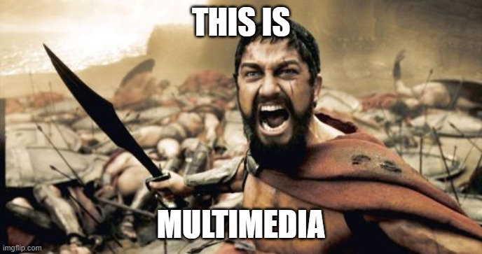
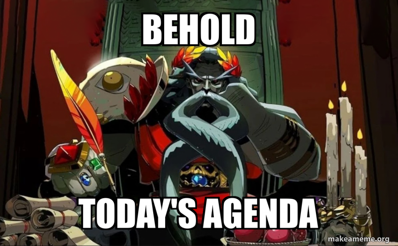
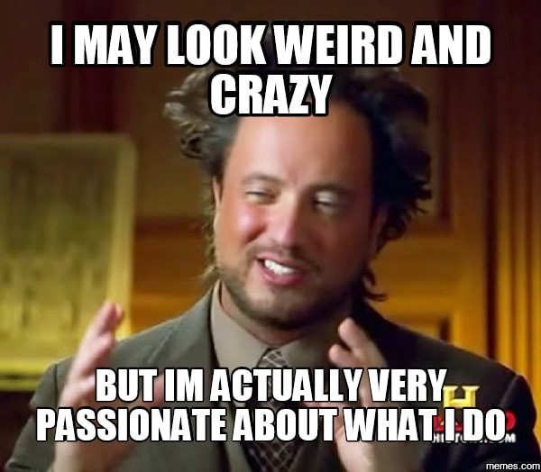

# Cours 1 – Embauche

## Ordre du jour 

- Tour de classe et présentation de l'enseignant 
- Présentation de l'activité brise-glace
- Bienvenue à l'agence du Domaine : la logique du cours
- Guide étudiant et calendrier
- Contrat d'embauche
- Teams et les outils de l'agence

## Tour de classe

Prenons un moment pour vous présenter en répondant aux questions suivantes :  
  
- Quel est ton jeu préféré?
- Quel est ton film (ou série) préféré?
- Quel style de musique aimes-tu?

## Présentation de l'enseignant

J'ai commencé mes études au DEP en électromécanique. Puis, j'ai fait un DEC en cinéma à St-Jérôme et un BAC en science de la communication à l'Université de Montréal. J'ai finalement commencé une maîtrise en recherche-création, que je n'ai pas terminée, mais que j'aimerais terminer un jour.

Ma plus grande passion est l'entretien d'une architecture informatique pour soutenir mes parties de jeux de rôles en ligne de Pathfinder 2e et Starfinder 2e avec Foundry VTT.

Je suis vraiment passionné par le game design, les nouvelles formes médiatiques (mapping vidéo, réalité virtuelle et réalité augmentée) le making (FabLab, impression 3D, découpe laser, CNC automatisée, cosplay, etc.).

Je suis ici pour vous aider à trouver vos forces dans le domaine numérique.

## Attitude de réussite

- Avoir l'esprit ouvert
- Apprendre à se connaître (forces et faiblesses)
- [Apprendre de ses erreurs](https://www.youtube.com/watch?v=wCsO56kWwTc)
- Qui a vu le film La Matrice?

<video controls src="assets/matrix.mp4" style="max-height: 400px;"></video>

## Bienvenue à l'agence du Domaine

Vous vous êtes distingués par vos choix de vie et probablement votre détermination. Vous voulez prendre votre avenir en main et nous allons travailler ensemble pour vous rendre compétitif, mais critique. Pour y arriver, nous allons faire de ce cours une simulation de votre première expérience professionnelle dans le domaine. 

- Vous allez traverser une période de **mise en poste** (semaines 2-3)
- Vous allez passer un **test d'embauche** pour confirmer votre poste (semaine 4)
- Vous allez recevoir des **mandats clients**, et constituer un **dossier de référence** (semaines 5 à 9)
- Vous allez construire une **portfolio** sous forme de feuille de personnage et la présenter (semaines 10-11)
- Vous allez produire et livrer un **mandat final** et le présenter (semaines 12 à 15)

### Pourquoi cette logique?

Pour reproduire les conditions du marché du travail avec des mandats concrets, des contraintes réelles, une clientèle et des échéances. Le tout dans un climat *fun*, qui vous permettra de vous découvrir ainsi que d'exercer votre savoir-faire créatif et technique.  

### La feuille de suivi

Bien que nous y reviendrons au prochain cours, j'aimerais prendre un moment pour faire la démonstration du projet sur lequel j'ai travaillé cet été et que nous allons intégrer dans le cadre du cours. 

Il s'agit d'une feuille de suivi de compétences et de projets à la manière d'une feuille de personnage de jeu de rôle. L'objectif est de vous donner un cadre théorique pour vous auto-évaluer et stocker vos projets. La feuille de suivi vous sera utile en fin de parcours si vous l'entretenez tout au long des sessions. Nous l'utiliserons dans le cadre du cours pour suivre votre progression et vous situer à travers les différents aspects du domaine. [Voici un aperçu](https://gabchrichard.github.io/character-sheet/) 

Pour l'instant, vous ne pouvez pas y avoir accès. Au prochain cours, nous travaillerons pour y remédier. Pour l'instant, nous allons nous concentrer sur le cadre du cours et les outils du collège.

## Les compétences visées

Le cours de domaines du multimédia sert essentiellement à atteindre 3 compétences :

- Explorer les aspects du métier d'intégrateur multimédia et s'y repérer
- Maîtriser les outils informatiques et logiciels pour traverser la formation
- Apprendre à réaliser des présentations numériques

### Les sous-compétences

Pour aller plus loin, nous allons apprendre également à :

- Enrichir notre sensibilité artistique et articuler notre pensée critique
- Utiliser un logiciel de contrôle de version (Git) et de synchronisation/hébergement en ligne (GitHub)
- Comprendre l'actualité du domaine et se positionner pour être compétitif, mais critique

## Le plan de cours

Nous allons maintenant regarder le calendrier complet de la session : les mandats, les évaluations, la sortie et les conférences.

## Guide étudiant

Nous allons maintenant regarder [le guide étudiant](assets/guide_etudiants.docx) et nous intéresser à son contenu.

## Le contrat d'embauche

Avant de commencer, chaque « employé » signe symboliquement son contrat d'embauche : un engagement à respecter les échéances, à collaborer avec ses collègues et à soigner la qualité de ses livrables — les mêmes attentes qu'en agence réelle.

### Exercice

Signature du contrat d'embauche et consultation d'anciens dossiers de mandats (projets d'ex-élèves) pour voir le niveau attendu.

## Les outils de l'agence

À travers votre formation, vous allez utiliser de très nombreux logiciels, mais vous allez certainement utiliser Teams, OneDrive, Word et Outlook de Microsoft en particulier.

- **Teams** — logiciel de communication et collaboration numérique (semblable à Discord, mais pour le travail). Principalement utilisé comme outil de communication, mais aussi pour la remise de travaux.
- **OneDrive** — logiciel de stockage infonuagique (cloud). Utilisé pour stocker des notes et des projets, mais surtout pour avoir des copies de sauvegarde (backup).
- **Word** — logiciel de traitement de texte, utilisé pour prendre des notes, rédiger des travaux et partager du contenu écrit.
- **Outlook** — service de messagerie numérique (e-mail), utilisé pour les communications externes et pour être informé des évènements importants du collège. C'est certainement le meilleur moyen de communiquer avec moi.

## Introduction à Teams

Teams est une plateforme de collaboration qui permet de communiquer en temps réel (clavardage), de collaborer (co-édition) ainsi que de faire la gestion d'équipes et de projets.

Nous allons faire un survol de l'interface pour repérer les éléments suivants :

- Menu de gauche : Activités, Chat, Équipes, Réunions, Fichiers et Calendrier
- Interface des équipes
- Interface d'une équipe : Liste, canaux et espace de remise

Quelques astuces importantes :

- Ajouter des onglets pour vos éléments favoris
- Utiliser la fonction @mention pour interpeller quelqu'un (moi en particulier)
- Planifiez vos cours et remises dans le calendrier

## Exercice

- Vous allez commencer par installer Teams comme application sur vos téléphones.
- Ensuite, vous allez vous authentifier sur vos PC avec votre matricule.
- Vous allez ensuite vous rendre dans l'équipe Teams du cours et télécharger le fichier : « Exercice cours 1 »
- Répondez aux questions puis sauvegardez le fichier.
- Remettez ensuite votre fichier dans l'espace de remise.

## Devoir — préparation pour la mise en poste

Pour votre première semaine « au bureau », procurez-vous :

- Un disque dur externe
- Une clé USB
- Une carte SD

## Merci et à la semaine prochaine!

Commentaires ou questions?
