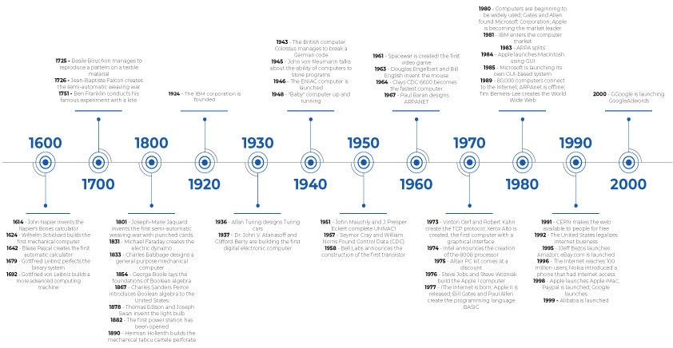

# Cours 2 – Mise en poste : le poste de travail

## Ordre du jour

- [Rencontre avec les TTP](#rencontre-avec-les-ttp)
- [Sondage sur la population étudiante](#sondage-sur-la-population-etudiante-20-mins)
- [Sondage sur la sortie](#sondage-sur-la-sortie)
- [Navigation et gestion de fichiers](#navigation-et-gestion-de-fichiers)
- [Les outils du programme](#les-outils-du-programme)
- [Introduction à l'informatique](#introduction-a-linformatique)
- [Les composantes d'un ordinateur](#les-composantes-dun-ordinateur)
- [Données et préfixes de mémoire](#donnees-et-prefixes-de-memoire)
- [Les logiciels d'un ordinateur](#les-logiciels-dun-ordinateur)
- [Les formats de fichiers](#les-formats-de-fichiers)
- [Formatage de disques durs](#formatage-de-disques-durs)
- [Atelier — Aménagement du poste de travail](#atelier-amenagement-du-poste-de-travail)
- [Actualités](#actualites)

## Rencontre avec les TTP

Avant d'aménager votre poste, rencontrez les techniciens en travaux pratiques (TTP) responsables du matériel : procédure de réservation de local et de matériel, règles de l'atelier.

## Sondage sur la population étudiante (20 mins)

Nous allons maintenant prendre un moment pour répondre à un sondage pour aider le département à obtenir un portrait global de la nouvelle population étudiante. 

[Lien pour le sondage](https://sondage-spec.com/sondage/c443a486fa27e5e3058ef15920ad37a8)

## Sondage sur la sortie 

Nous allons également prendre un moment pour confirmer votre présence à la sortie prévue le 20 octobre à 20h. Le coût du billet est de 36$ (il est possible que le coût soit moindre considérant que nous serons un grand groupe).

Le sondage sera à remplir sur Teams. 

## Navigation et gestion de fichiers

Avant de commencer avec les outils du programme, nous allons valider quelques éléments de navigation :

- Navigation dans l'explorateur de fichiers, menus
- Sélectionner plusieurs fichiers ou tous les fichiers (Ctrl + A)
- Dossier parent vs précédent/suivant
- Renommer un fichier, afficher les extensions
- Propriétés d'un fichier, chemins d'accès
- Copier/coller/couper, presse-papier (Windows + V)
- Capture d'écran (Windows + Maj + S)

## Les outils du programme 

Nous pouvons maintenant faire le tour des outils du programme :

- Col.net
- Outlook
- Teams
- One Drive

### Col.net

Col.net c'est le portail étudiant du Collège. Vous vous en servirez surtout pour accéder à votre dossier scolaire (horaire, notes, facturation, etc.).

### Outlook

Outlook c'est la messagerie courriel de Microsoft utilisée par le Collège. C'est votre adresse officielle par laquelle le collège communique avec vous. Vous pouvez également vous en servir pour créer des comptes étudiants (chaîne Youtube, GitHub, etc.). Je vous invite à les consulter au moins une fois par semaine. 

### Teams

Teams est certainement la plateforme que vous allez le plus utiliser. On y retrouve :

- Une messagerie pour les membres du Collège
- Un système de gestion d'équipe sous forme de groupe pour chaque cours
- Un système de remise de devoir et de notes
- Un calendrier
- Un accès à OneDrive 
- Un accès aux applications Microsoft

#### Une messagerie pour les membres du Collège

Une fonction de chat qui permet d'écrire directement à un ou plusieurs membres du Collège. Très pratique pour former des groupes de travail, c'est sans doute la méthode la plus rapide pour joindre un enseignant ou un coéquipier.

#### Un système de gestion d'équipe sous forme de groupe pour chaque cours

Chaque cours possède son propre groupe (équipe) réunissant tous les étudiants et l'enseignant. C'est l'endroit où on retrouve les annonces, les discussions et les documents partagés du cours.

#### Un système de remise de devoir et de notes

Un onglet Devoirs dans chaque équipe permet de consulter les travaux à remettre, d'y déposer vos fichiers avant l'échéance et de voir la note et les commentaires une fois le travail corrigé (Attention, certains enseignant remettent les notes directement sur Col.Net).

#### Un calendrier

Un calendrier intégré qui vous permet d'organiser des réunions, vos cours et les échéances de devoirs de toutes vos équipes Teams au même endroit.

##### Exercice de Calendrier

Nous allons ajouter vos cours et les dates importantes à votre calendrier. 

#### Un accès à OneDrive

Chaque fichier partagé dans une équipe est en fait stocké sur OneDrive : vous pouvez donc l'ouvrir, le modifier ou le télécharger directement depuis Teams.

#### Un accès aux applications Microsoft

Teams permet d'ouvrir et de modifier des fichiers Word, Excel ou PowerPoint directement dans le navigateur, sans avoir à installer les logiciels.

### OneDrive

L'espace de stockage infonuagique (cloud) de Microsoft, lié à votre compte du collège. Il permet de sauvegarder et de synchroniser vos fichiers entre plusieurs appareils (maison, école, téléphone, etc.) et de les partager facilement.

##### Exercice de OneDrive

Nous allons créer des dossiers pour tout vos cours et faire une démonstration de synchronisation. 

### Microsoft 365

La suite Microsoft 365 regroupe tous les logiciels bureautiques de Microsoft (Word, Excel, PowerPoint, etc.). Ces logiciels sont  accessibles en ligne avec votre compte du Collège. Vos fichiers sera automatiquement enregistrés sur vous OneDrive, ce qui permet de les retrouver sur n'importe quel appareil et de collaborer en temps réel avec d'autres personnes.

##### Exercice de partage de fichier

Placez vous en équipe de deux, chacun créé un fichier Word : le premier avec son groupe de musique favori, le second avec son plat favori. Partagez chacun à votre tour votre fichier en lui donnant les droits de modification. Ensuite modifiez le fichier de l'un et l'autre ensemble pour observer la collaboration en temps réel.

## Introduction à l'informatique

### Le concept

Lorsqu'on parle d'informatique au sens large, on désigne la science du traitement numérique de l'information. Essentiellement, on utilise des signaux électroniques pour collecter, stocker, traiter, transmettre ou représenter des données à l'aide de systèmes programmables.

Bien que son implémentation ait été progressive, il est difficile d'imaginer un secteur d'activité professionnel qui n'utilise pas l'informatique aujourd'hui.

Discussion rapide : où utilise-tu l'informatique dans ton quotidien?

### Exercice sur l'histoire de l'informatique

En sous-groupes, à partir de la ligne du temps ci-dessous, identifiez rapidement 2-3 avancées qui vous semblent les plus marquantes et pourquoi. Retour rapide en grand groupe.

### La ligne du temps

Image tirée de [Stackup Timeline – important points in computer history](https://www.stackup.ro/en/timeline-important-points-in-computer-history/)

## Les composantes d'un ordinateur

Comme dans toute bureau, votre poste de travail doit être bien équipé. Voici les composantes principales :

- CPU (processeur central)
- RAM (mémoire vive)
- Disques de stockage
- Carte mère
- Carte graphique (GPU)
- PSU (boîtier d'alimentation) : fournit l'énergie nécessaire aux composantes
- Boîtier : caisson protecteur qui contient et organise tous les éléments internes

### Le processeur central (CPU)

Le cerveau principal qui exécute les instructions et les gros calculs. Composé de :

- **Cœurs (Cores)** : unités indépendantes qui exécutent des tâches en parallèle (aujourd'hui, entre 4 et 12)
- **Cœurs virtuels (Threads)** : sous-division logicielle des tâches (aujourd'hui, entre 8 et 24)
- **Cadence (Clock Speed)** : nombre d'instructions par seconde, mesurée en GHz (aujourd'hui, entre 2.4 et 5 GHz)
- **Cache** : petite mémoire ultra rapide intégrée au CPU, divisée en niveaux (jusqu'à 3) et mesurée en Mo (jusqu'à 32 Mo)

### La mémoire vive (RAM)

Mémoire à court terme qui stocke les résultats des calculs des programmes en cours d'utilisation. Son contenu est effacé à l'extinction de l'ordinateur.

- Mesurée en capacité (Go) et en vitesse (MHz)
- Vitesse souhaitable : entre 1600 et 3200 MHz
- Capacité recommandée : au moins 8 Go, idéalement 16 Go (un serveur peut avoir 128 Go ou plus)

### Les disques de stockage (HDD et SSD)

Mémoire à long terme, où les données sont stockées de façon permanente.

- **HDD** (Hard Disk Drive) : disque mécanique, plus lent, mais plus grande capacité (jusqu'à 16 To)
- **SSD** (Solid State Drive) : disque électronique, accès plus rapide, capacité moindre (jusqu'à 4 To)
- **NVMe** : type de SSD offrant des vitesses de transfert encore plus rapides

### La carte mère et la carte graphique

**Carte mère (Motherboard)** : plateforme centrale qui permet à toutes les composantes de communiquer. Une bonne carte mère offre plus d'emplacements RAM (entre 2 et 4), un meilleur chipset, davantage de connecteurs de stockage (entre 4 et 8), ainsi qu'un meilleur refroidissement et de meilleures composantes électroniques.

**Carte graphique (GPU)** : responsable de l'affichage des images. Contrairement au CPU (peu de cœurs puissants), elle possède des centaines, voire des milliers, de cœurs simples optimisés pour le calcul en parallèle, ainsi que sa propre mémoire vive et cadence. Les cartes modernes intègrent des logiciels dédiés à des opérations particulières (Ray-Tracing, Machine Learning). Cruciale pour le gaming, le montage vidéo, la modélisation 3D et le calcul scientifique (intelligence artificielle).

### Le boîtier 

De base, le boîtier sert deux fonctions : 

- Avoir un **espace** suffisant pour accueillir toutes les composantes 
- Optimiser la **circulation d'air**

Pour aller plus loin le boîtier peut être esthétique :

- Par sa conception 
- Par l'ajout de lumière RGB 

### Le boîtier d'alimentation 

Le boîtier d'alimentation (*power supply*) permet simplement d'alimenter en électricité les différentes pièces. Le seul critère à respecter est la demande en wattage (il est toujours conseillé d’excéder la demande).

## Données et préfixes de mémoire

De manière générale, une donnée correspond à une information factuelle (fait) ou une mesure. En informatique, cette information peut prendre plusieurs formes (chiffres, textes, sons ou images) traduites en courant électrique et sauvegardées dans la mémoire sous forme de **bits** (0 ou 1).

Un bit seul ne contient pas beaucoup d'information. On les assemble donc généralement en série de 8, qu'on appelle un **octet** (8 bits = 1 octet, *bits and bytes* en anglais). La capacité d'une composante de mémoire — comme la RAM ou les disques vus plus haut — se calcule en nombre d'octets.

Puisque la quantité de mémoire nécessaire ne cesse d'augmenter, on utilise des préfixes métriques pour garder un suivi précis :

- **Kilo-octet** : 1 000 octets (mille)
- **Méga-octet** : 1 000 000 octets (million)
- **Giga-octet** : 1 000 000 000 octets (milliard)
- **Téra-octet** : 1 000 000 000 000 octets (trillion)

## Les logiciels d'un ordinateur

Pour qu'un ordinateur fonctionne, il a besoin de logiciels. Ces programmes envoient des instructions aux composantes pour exécuter des opérations. Trois grandes catégories :

- **Système d'exploitation** : gère les composantes, les processus, les fichiers et l'interaction avec l'utilisateur via une interface. Les plus connus : Windows, MacOS, Linux, Android, iOS.
- **Pilotes** : petits programmes qui permettent au système d'exploitation de communiquer avec un périphérique matériel. Chaque pièce physique a besoin de son pilote.
- **Applications** : programmes utilisés pour accomplir des tâches précises, exécutés « sur » le système d'exploitation (traitement de texte, traitement d'images, navigateur web, jeux vidéo, logiciels de programmation, moteurs de jeux, logiciels de montage, etc.)

## Les formats de fichiers

Un format de fichier représente la façon dont l'information est structurée et/ou encodée pour le stockage. Il communique au logiciel les procédures d'encodage/décodage nécessaires.

### Textes et documents

- **.txt** : texte brut, universellement reconnu
- **.doc/.docx** : texte avec mise en forme (Microsoft Word)
- **.pdf** : format propriétaire d'Adobe, conserve les fonctionnalités entre plateformes
- **.csv** : données en tableau (Excel)

### Images

- **.jpg** : compressé, petit fichier, perte de qualité
- **.gif** : couleurs limitées, permet l'animation, volumineux
- **.tif** : meilleure qualité, très volumineux
- **.png** : qualité moyenne à bonne, permet la transparence
- **.webp** : format récent (Google), petit et transparent

### Audio, vidéo, web

- **.mp3** : compressé, perte de qualité — **.wav** : meilleure qualité, volumineux — **.flac** : qualité moyenne
- **.mp4** : conteneur multimédia (vidéo, audio, sous-titres)
- **.html / .css / .js** : structure, style et interactivité web
- **.md** : Markdown (balisage simplifié) — **.json** : notation d'objets (clé/valeur)

### Zip et archives

Un fichier ou dossier archivé est compressé pour prendre moins d'espace (idéal pour les transferts).

- Formats courants : .zip, .rar, .7z, .iso
- Extraire : clic droit → Extraire
- Compresser : sélectionner les fichiers → clic droit → Compresser

### Démonstration 

- Classer des fichiers de votre poste par format
- Les mettre dans une archive et la remettre sur Teams

## Formatage de disques durs

Il est possible de travailler sur le disque interne, mais pour circuler entre plusieurs ordinateurs, un disque externe (idéalement SSD) est préférable. Certains logiciels (After Effects, DaVinci) exigent un format précis — mal formaté, vous risquez de perdre vos projets.

- **Mac** : Mac OS étendu journalisé
- **PC** : exFAT ou NTFS (exFAT recommandé, lisible aussi sur Mac)
- **Clé USB** : exFAT pour plus de 4 Go, FAT32 pour moins de 4 Go
- Ne jamais travailler directement sur une clé USB — toujours garder une sauvegarde (ex. OneDrive)

### Formater et partitionner

Formater prépare un disque à être utilisé par le système d'exploitation. Une partition est une division du disque, réservée au système ou au stockage.

- Formats les plus connus : exFAT, FAT32, NTFS, Mac OS étendu journalisé
- **NTFS** : idéal pour un disque uniquement Windows
- **Mac OS étendu journalisé** : idéal pour un disque uniquement Mac
- **exFAT** : disques de plus de 4 Go, multiplateforme
- **FAT32** : disques de moins de 4 Go, multiplateforme

### Comment formater?

Pour un formatage rapide dans windows, il suffit de se rendre sur le disque dur de son choix à partir de Ce Pc, de cliquer sur le bouton droit de la souris, puis de choisir formater. De là, un wizard apparaît et on peut choisir le format ainsi que le volume de nos partitions.  

Pour une vue détaillée, on peut aller dans le gestionnaire de disques, néanmoins ce menu n’est pas accessible avec les ordinateurs de l’école.  

Pour le montrer, nous allons faire une [petite démonstration](https://www.youtube.com/watch?v=g4yr_jI9NTs)

## Actualités

Quoi de neuf cette semaine? 

## Préparation pour la semaine prochaine

La semaine prochaine : branchements, réseaux, introduction au web et à l'IA générative, ainsi qu'un survol de la programmation. Apportez votre disque dur externe si vous l'avez, votre clé USB et votre carte SD.

## Merci et à la semaine prochaine!

Commentaires ou questions?
