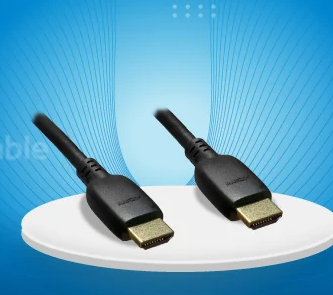
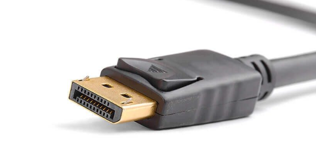
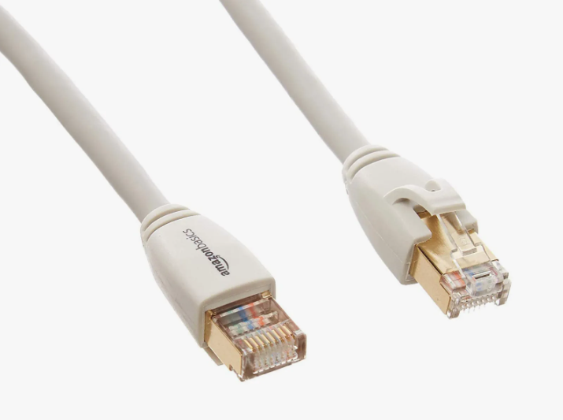
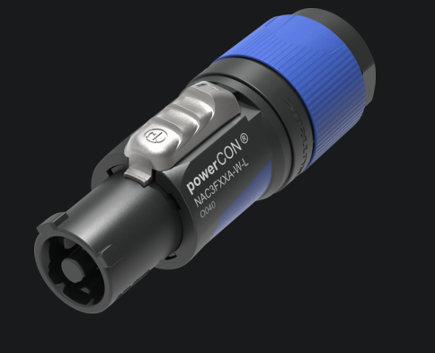
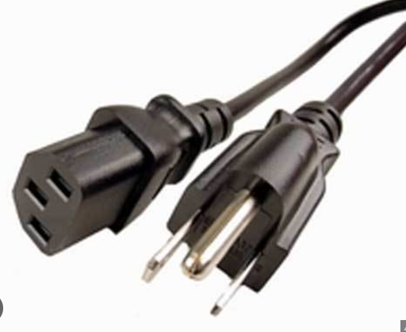
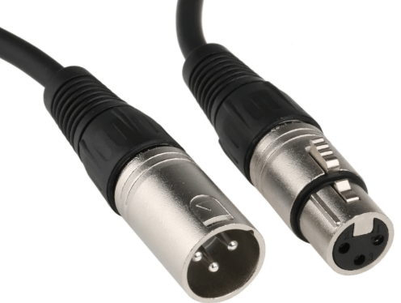
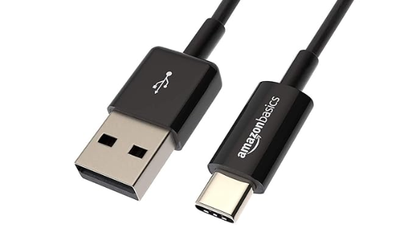

# Cours 3 – Mise en poste : branchements et réseaux

## Ordre du jour

*Durée totale estimée : ~2h50 sur 4h (inclut une bonne marge — les réseaux et le web sont maintenant vus au cours 4).*

- Rappel — Réservation de matériel (10 mins)
- Branchements et câblage (25 mins)
- Atelier — Branchement et rangement (20 mins)
- Installation de périphériques Bluetooth (5 mins)
- Mise à jour de pilotes (5 mins)
- Introduction à l'IA générative (25 mins)
- Les branches de l'informatique (15 mins)
- Introduction à la programmation (30 mins)
- Atelier Scratch (35 mins)

## Rappel — Réservation de matériel (10 mins)

Un rappel rapide de la procédure de réservation de local et de matériel auprès des TTP, avant de plonger dans les branchements.

### Exercice

Faire une réservation de local et une réservation de matériel avec le formulaire officiel.

## Branchements (25 mins)

Au cours de votre parcours à l'agence, vous allez très certainement utiliser beaucoup de câbles. Il devient donc important d'apprendre à les connaître, mais aussi à les ranger.

### HDMI

Transmet des signaux audio et vidéo dans un seul fil compact. Supporte des résolutions jusqu'à 8K, des taux de rafraîchissement jusqu'à 240 Hz, le HDR et le VRR. Utilisé pour brancher moniteurs, consoles et téléviseurs. Il existe plusieurs standards (1.0, 2.0, 2.1…) et types (Standard, mini, micro).

### DisplayPort

Très semblable au HDMI — transmet audio et vidéo dans un seul fil. Offre généralement de meilleures résolutions et taux de rafraîchissement, mais les différences avec le HDMI sont aujourd'hui minimes.

### Ethernet (RJ45)

Le câble réseau « par défaut », utilisé pour connecter des périphériques entre eux ou à des appareils réseau (routeur, commutateur). Il existe plusieurs catégories, qui permettent des vitesses de transfert plus élevées ou un blindage contre le bruit électronique (*shield*) — un câble de catégorie 5 permet une vitesse de transfert de 1 Go/s.

### PowerCon et adaptateur AC

Deux câbles d'alimentation. Le PowerCon se distingue par le fait qu'il peut être verrouillé.

### XLR et prises audio

Le **XLR** est un connecteur robuste pour les signaux audio, utilisé pour les consoles, instruments et micros. Les prises audio se distinguent par leur taille : la grande prise (1/4 po) sert à l'équipement professionnel, la petite (mini-jack) aux produits grand public.

### USB

Connecteur standardisé qui permet l'alimentation et le transfert de données entre périphériques (clavier, souris, caméra, clé USB…). Le USB4 permet des vitesses de 40 Go/s. Connecteurs les plus courants aujourd'hui : USB-A et USB-C.

### Comment bien ranger un câble?

Rouler le fil en suivant le sens des brins (avec une légère torsion) pour éviter de l'endommager, puis utiliser une attache pour le conserver en place.

## Atelier — Branchement et rangement (20 mins)

Démonstration et classification des câbles de l'agence, méthode de rangement.

## Installation de périphériques Bluetooth (5 mins)

Certains périphériques doivent être ajoutés manuellement via le menu Bluetooth et autres paramètres du système. Il suffit de mettre l'appareil en mode découvrable, puis de l'ajouter et de le mettre en pair.

## Mise à jour des pilotes (5 mins)

La plupart des périphériques sont détectés et installés automatiquement par Windows, mais certains (comme les cartes graphiques) nécessitent une mise à jour manuelle plus fréquente.

- Identifier le modèle dans le gestionnaire de périphériques
- Se rendre sur le site du fabricant, télécharger le pilote pour le modèle
- Lancer l'installation
- Une fois le logiciel de la carte graphique installé (GeForce Experience, AMD Software), la mise à jour peut se faire directement de là

## Introduction à l'IA générative (25 mins)

Un grand modèle de langage (LLM) est un type d'intelligence artificielle entraîné sur de larges corpus de contenu, capable de générer du contenu spécifique à une demande.

### À considérer

- Les résultats sont basés sur des probabilités : erreurs et hallucinations possibles
- Les résultats sont biaisés selon l'entraînement du modèle
- Un LLM demande énormément de calcul et d'électricité

### Pour une utilisation efficace et éthique

- Définir le rôle demandé (« agis en tant que… »)
- Demander un format précis, encourager le raisonnement étape par étape
- Raffiner de manière itérative, éviter les questions vagues ou multiples
- Ne jamais transmettre de données confidentielles, toujours vérifier l'information
- Toujours citer l'utilisation d'un LLM, ne jamais faire passer son travail pour le vôtre

### Exercice

En petite équipe, discutez de la manière dont un outil d'IA générative pourrait vous aider (ou nuire) dans un mandat client, sans jamais remplacer votre jugement professionnel.

## Les branches de l'informatique (15 mins)

Dans le monde professionnel, l'informatique s'étend sur de nombreuses branches. Chacune d'entre elles représente un domaine en soi et donc de nombreuses possibilités de carrière pour vous.

D'après vous, quelles sont ces branches? Vous aurez 2 minutes individuellement, 4 minutes en équipe de deux, puis nous ferons un retour en grand groupe.

- **Technicien** : dépannage et gestion du matériel
- **La programmation** : création d'algorithmes et de logiciels (ex. : applications, jeux, scripts)
- **Réseaux et télécommunication** : gestion de serveurs, branchement et communication
- **Cybersécurité** : protection des données, des systèmes et des communications
- **Base de données** : stockage, organisation et gestion de données
- **Électromécanique** : automatisation et intégration informatique (voitures, télévision, etc.)
- **Intelligence artificielle** : conception d'apprentissage machine et réseaux neuronaux
- **Informatique quantique** : développement informatique par physique quantique

## Introduction à la programmation (30 mins)

La programmation est sans doute un des plus grands aspects de l'informatique. Certains diront que ceux qui ne savent pas programmer seront les illettrés du monde de demain, d'autres diront que la programmation sera inutile puisque l'IA le fera à notre place.

Quoi qu'il en soit, il sera pertinent pour nous aujourd'hui de survoler les concepts de base.

Pour aller au plus simple, on pourrait dire que la programmation c'est de parler le langage de la machine pour communiquer et exécuter des instructions. Ainsi, c'est un langage entre l'humain et la machine qui permet de donner vie aux applications, jeux vidéo, sites web et autres logiciels.

### Les principaux langages

Quels langages connaissez-vous et à quoi servent-ils principalement? Vous aurez 2 minutes individuellement, 4 minutes en équipe de deux, puis nous ferons un retour en grand groupe.

Bien qu'il existe des milliers de langages, certains sont universellement reconnus et utilisés :

- **Python** : utilisation générale, IA et data science
- **JavaScript** : très populaire, principalement pour faire du web
- **HTML/CSS** : structure et design de sites web
- **C** : langage machine avec peu de niveau d'abstraction, principalement utilisé pour les systèmes d'exploitation et l'électronique
- **C++ / C#** : langage près de la machine, mais avec un niveau d'abstraction plus élevé, principalement utilisé pour les applications exigeantes comme les jeux vidéo
- **PHP** : opérations de serveur, surtout utilisé en web
- **SQL** : gestion de base de données

### Certains concepts de base en programmation

- **Algorithmes** : suite logique d'instructions pour résoudre un problème
- **Variables** : conteneurs d'information (textes, chiffres, etc.)
- **Conditions** : décisions à prendre selon une situation (si... alors)
- **Boucles** : répétitions d'actions (tant que, pour chaque)
- **Fonctions** : blocs de code réutilisables
- **Événements** : interactions déclenchées par l'utilisateur (clic, mouvement, etc.)

### Un YouTuber à suivre : Fireship

[Fireship](https://www.youtube.com/watch?v=-uleG_Vecis)

## Atelier Scratch (35 mins)

Nous allons maintenant mettre les notions d'aujourd'hui en pratique avec une petite interface de programmation simple : Scratch.

Scratch est un environnement développé par le MIT qui permet de programmer des animations et des jeux par le moyen d'une interface simple. C'est l'environnement idéal pour découvrir les notions de programmation de base.

Nous allons donc nous rendre sur le site web et construire un petit jeu où il faut ramasser des objets pour augmenter son score. Ce petit exercice nous permettra de mettre en pratique les notions d'évènements, boucles, conditions et variables.

### Exercice

Allez dans l'équipe Teams du cours et téléchargez le fichier « Exercice cours 2 ». Répondez aux questions puis sauvegardez le fichier. Remettez ensuite votre fichier dans l'espace de remise.

## Préparation pour la semaine prochaine

Le mandat client 1 (Web) débute la semaine prochaine. Créez-vous un compte GitHub si ce n'est pas déjà fait.

## Merci et à la semaine prochaine!

Commentaires ou questions?
