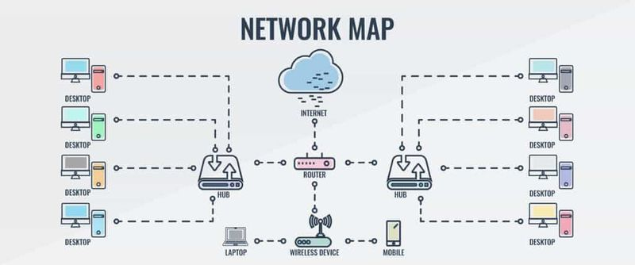

# Cours 4 – Mandat client 1 : Web

## Ordre du jour

*Durée totale estimée : ~4h05 sur 4h (le reste est absorbé par l'atelier de production, qui se termine à la maison au besoin).*

- Présentation du mandat Web (10 mins)
- Réseaux locaux et Internet (20 mins)
- Introduction au web (15 mins)
- Étude de cas : le domaine web (20 mins)
- Markdown (15 mins)
- Git et GitHub (25 mins)
- GitHub Pages (10 mins)
- Atelier de production (120 mins)
- Mise à jour de la feuille de suivi (5 mins)

## Le mandat : Café Lunaire (10 mins)

**Client fictif :** Café Lunaire, un café-librairie de quartier qui n'a aucune présence en ligne et veut une page simple pour annoncer ses heures, son menu et ses événements.

**Livrable attendu :** une page web statique publiée sur GitHub Pages, avec une section d'accueil, un menu, une section événements et une façon de contacter le café.

Consultez la grille de correction complète (10 points) dans le plan de cours.

## Les réseaux (10 mins)

Connecter plusieurs périphériques informatiques (ordinateurs, imprimantes, serveurs) pour communiquer, partager des ressources ou échanger des données, selon des protocoles définis.

- **Réseau local (LAN)** : périphériques reliés par un routeur ou un commutateur
- **Réseau large (WAN)** : couvre de grandes zones géographiques via les infrastructures de télécommunication — c'est ce qui forme Internet

## Introduction à Internet (10 mins)

Internet est un réseau de réseaux qui connecte de nombreux dispositifs par le moyen de routeurs. Il permet le partage de contenu (courriels, pages web, fichiers, jeu en ligne, streaming) en reliant des appareils entre eux — un peu comme un système routier.

La quantité de dispositifs connectés dépasse les calculs simples, mais reste représentable : [mapping the internet](https://torontocreatives.com/graphic-design/mapping-the-internet/)

## Introduction au web (15 mins)

Le web (World Wide Web) est le service qui rend le partage de ressources possible par le moyen d'un fureteur (browser), via une adresse url et un cycle de requête/réponse. Le contenu d'un site doit être hébergé; les entreprises qui gèrent cet hébergement sont des **hébergeurs**. Une page web est constituée de HTML, CSS et JavaScript.

### Quelques définitions

- **Internet** — l'infrastructure globale (réseau de réseaux)
- **Réseau local** — périphériques connectés par un routeur/commutateur
- **Web** — service qui permet d'afficher des pages web
- **Site web** — ensemble de pages web
- **Domaine** — adresse qui permet d'accéder à une page/un fichier web
- **Hébergement** — espace privé (serveur) qui stocke des fichiers accessibles par le web
- **Fureteur (Browser)** — logiciel qui affiche des pages web à partir d'une adresse

## Étude de cas : le domaine web (20 mins)

En termes professionnels, le domaine web réfère au personnel impliqué dans la construction et le maintien des pages, services et applications web.

- **Front-end** : la façade du site (interface, couleurs, textes, images) et l'expérience utilisateur
- **Back-end** : la logique côté serveur (requêtes, bases de données, routes)
- Une personne qui fait les deux est dite **full-stack**

### Quelques spécialisations

- **Designer** : conçoit le plan du site, son agencement (layout) et ses éléments visuels
- **Designer UX/UI** : se concentre sur l'expérience utilisateur et la conception d'interface
- **Opérateur web (webmaster)** : gère le site, le domaine, les performances et les mises à jour
- **Expert en accessibilité** : s'assure que le site est utilisable par tous
- **Créateur de contenu** : produit du contenu écrit/visuel optimisé pour la recherche

## Markdown (15 mins)

Le Markdown est un langage de balisage (comme le HTML) pour rédiger du texte formaté simplement, sans logiciel de mise en page.

- Extension de fichier : `.md`
- Utilisé pour la documentation sur GitHub, mais compatible avec Notion, Discord, Obsidian, etc.
- Feuille de référence : [markdownguide.org/cheat-sheet](https://www.markdownguide.org/cheat-sheet/)

### Démo

Avant de travailler dans GitHub, un tour d'horizon rapide avec un éditeur Markdown en ligne : [stackedit.io](https://stackedit.io/)

## Git (10 mins)

Git est un logiciel local de contrôle de versions : il permet de suivre les changements d'un projet dans le temps, de collaborer et de revenir à une version antérieure si nécessaire.

- Fonctionne sans connexion réseau — pas besoin de compte pour l'utiliser localement
- Chaque sauvegarde d'une version s'appelle un **commit**
- Git garde l'historique de tous les commits et permet de comparer les versions

## GitHub (15 mins)

GitHub est un service d'hébergement infonuagique pour des dépôts Git — un peu comme Google Drive, mais pensé pour le code et la collaboration.

- Héberger un projet et son historique en ligne
- Collaborer via un historique de modifications
- Suivre qui a modifié quoi et corriger des erreurs en revenant en arrière
- Publier un projet en le rendant public

### Vocabulaire GitHub

- **Repository (repo)** : le dépôt du projet
- **Commit** : sauvegarde de l'état du projet
- **Push** : envoie les commits sur GitHub
- **Pull** : récupère les mises à jour du dépôt
- **Branche** : copie parallèle du projet
- **Pull request** : requête pour fusionner une contribution
- **Fork** : copie personnelle d'un dépôt existant

## GitHub Pages (10 mins)

Service gratuit de GitHub qui permet de publier un site web statique directement à partir d'un dépôt. On peut y mettre du code HTML/CSS ou du Markdown — GitHub le transforme en site public accessible par une adresse.

### Publier sur GitHub Pages

1. Aller dans son dépôt → onglet **Settings**
2. Dans le menu de gauche, choisir **Pages**
3. Sous *Branch*, choisir **Main** puis **Root**
4. Cliquer sur **Save**, rafraîchir après 1-2 minutes
5. GitHub affiche l'adresse du site publié

## Atelier — Création du dépôt Café Lunaire (120 mins)

- Créer un compte GitHub (si ce n'est pas déjà fait)
- Créer un dépôt avec un fichier README.md
- Rédiger le contenu de la page en Markdown : accueil, menu, événements, contact
- Publier sur GitHub Pages
- Vérifier que le site est en ligne

## Mise à jour de la feuille de suivi (5 mins)

Après ce premier mandat, évaluez-vous sur « Caractériser les domaines en multimédia » et « Utiliser un ordinateur, ses périphériques et les réseaux » (0 à 4).

## Préparation pour la semaine prochaine

Révisez les notions des semaines 2 à 4 (composantes, données, logiciels, formats, branchements, réseaux, web, programmation, Markdown, Git et GitHub) : le test d'embauche est la semaine prochaine.

## Merci et à la semaine prochaine!

Commentaires ou questions?
