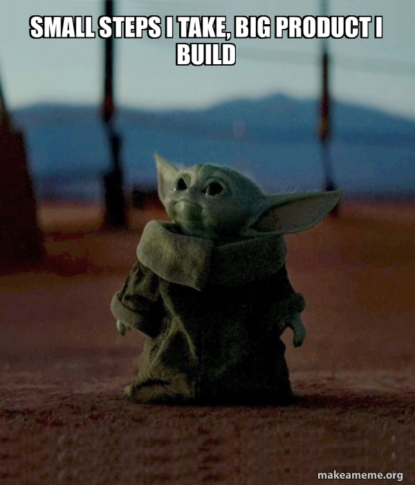
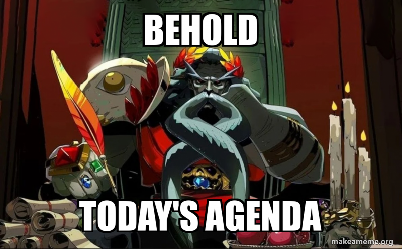

# Cours 7 – Étapes de production 



## Ordre du jour



- Retour sur l'examen
- La feuille de suivi
- Étapes de production d'un projet multimédia
- Retour sur l'exercice de création d'application
- Éléments importants en audiovisuel
- Introduction à OBS Studio
- Atelier de production

## Retour sur l'examen


L'examen c'est très bien déroulé dans l'ensemble. La correction est terminée et les notes sont disponible sur [Col.net](https://enligne.cmontmorency.qc.ca/colnet/login.asp) dans la section cahier de notes. Je vous invite à lire les commentaires et à m'avise s'il y a une erreur. Autrement, il y a quelques notions importantes sur lesquelles revenir : 

- Retour sur la nomenclature du département 
- Toujours nommer les fichiers à son nom 
- La question 16
- Retour sur les préfixes 
- Le classement des fichiers web (script et style)

## La feuille de suivi 

Maintenant que les accès sont distribués, nous allons finalement accéder à notre feuille de suivi et remplir au moins un projet. 

## Les étapes de production d'un projet multimédia

Pour la plupart des projets, on identifie les grandes phases suivantes :

- **Idéation / recherche** — définir l'idée, le concept, la clientèle
- **Préproduction** — planification, scénarisation, storyboard, moodboard
- **Production** — réalisation, création, captation
- **Postproduction** — montage, retouches, optimisation, livraison
- **Opération** — surveillance, mise à jour, modération

Selon le projet, certaines étapes peuvent être imbriquées, répétées ou partagées.

### Développement logiciel

#### Idéation / recherche

- Recherche utilisateur (entrevues, persona)
- Analyse de la concurrence
- Définition du problème et de la proposition de valeur

#### Préproduction

- Cahier des charges et récits utilisateurs
- Arborescence et maquettes (*wireframes*)
- Choix des technologies et planification des sprints

#### Production

- Design de l'interface (UI)
- Programmation (*front-end* et *back-end*)
- Tests au fil du développement

#### Postproduction

- Tests utilisateurs et correction des bogues
- Optimisation (performance, accessibilité)
- Mise en ligne ou publication sur les magasins d'applications

#### Opération

- Maintenance et mises à jour de sécurité
- Soutien aux utilisateurs
- Analyse des statistiques d'utilisation

### Audiovisuel (cinéma, vidéo, animation)

#### Idéation / recherche

- Concept et public cible
- Recherche documentaire et références visuelles
- Synopsis

#### Préproduction

- Scénario et découpage technique
- Storyboard et moodboard
- Repérage, casting, budget et plan de tournage

#### Production

- Tournage (image, son, éclairage)
- Animation ou captation
- Direction des acteurs

#### Postproduction

- Montage image et son
- Effets visuels et colorisation
- Mixage, générique et rendu final

#### Opération

- Diffusion (festivals, télévision, web)
- Promotion
- Gestion des droits et archivage

### Installation interactive

#### Idéation / recherche

- Concept et expérience recherchée
- Étude du lieu et du public
- Recherche technologique (capteurs, projection)

#### Préproduction

- Scénario d'interaction
- Plans du lieu et schémas techniques
- Prototypes et liste du matériel

#### Production

- Création des contenus (visuels, sons)
- Programmation des interactions
- Fabrication et intégration du matériel

#### Postproduction

- Montage sur place
- Calibrage (projection, capteurs, son)
- Tests avec le public

#### Opération

- Entretien et réparation du matériel
- Surveillance pendant l'exposition
- Démontage et documentation

### Jeux vidéo

#### Idéation / recherche

- Concept et mécaniques de jeu
- Public cible et analyse du marché
- Prototype rapide pour valider le plaisir de jeu

#### Préproduction

- Document de conception (*game design document*)
- Direction artistique
- Prototype jouable et planification

#### Production

- Programmation des mécaniques
- Création des personnages, décors et sons
- Conception des niveaux (*level design*)

#### Postproduction

- Tests (assurance qualité) et correction des bogues
- Optimisation et équilibrage
- Certification et lancement

#### Opération

- Correctifs et mises à jour
- Contenu additionnel
- Gestion de la communauté

## Retour sur l'exercice de création d'application

Nous avons essentiellement fait la recherche et la préprod pour notre application. Nous allons maintenant mettre en commun nos réponses et faire un document de production pour commencer la production.   

## Éléments importants en audiovisuel

- Un concept adapté à l'audience
- Une intrigue complète qui surprend ou amène le suspense
- Des personnages avec des motivations claires et une évolution
- Un univers défini et unique
- Une direction cinématographique cohérente

### Le concept et l'audience

Le concept, c'est l'idée même du projet. Elle est si simple qu'on peut résumer en une phrase. Ensuite, le concept doit être pensé pour un public précis : le ton (léger, sérieux, humoristique), le sujet (de quoi ça parle?), la durée (en temps) et le format (cinéma, télévision, etc.) changent selon à qui l'on s'adresse.

**Quelques trucs pour un concept adapté à l'audience**

- **Définir le public cible** avant d'écrire : âge, intérêts, où et comment il regarde (cinéma, télévision, téléphone)
- Résumer le concept en **une phrase** (*logline*) : un personnage, un objectif, un obstacle
- **Adapter le contenu** : pas de violence pour un projet qui s'adresse aux enfants, un langage qui correspond au public
- **Adapter le format** : une capsule pour les réseaux sociaux doit accrocher dans les 3 premières secondes et se comprendre sans le son
- Garder un **but clair** : divertir, informer, émouvoir ou convaincre
- **Tester l'idée** auprès d'une personne du public cible avant de se lancer dans la production

### L'intrigue (*plot*)

L'intrigue, c'est la suite d'évènements de l'histoire. C'est la partie logique de l'écriture, qui suit un ordre précis.

Plusieurs structures facilitent son écriture : le **schéma narratif**, le **schéma actanciel**, le **monomythe** de Joseph Campbell (le voyage du héros) ou la **structure en cercle** de Dan Harmon. Il n'y a pas de meilleure structure : chacune est mieux adaptée à un média (théâtre, cinéma, télévision, etc.) ou à un style d'écriture.

**Quelques trucs pour une histoire basée sur l'intrigue**

- Miser sur le **suspense** (faire monter la tension autour d'un évènement à venir) et la **surprise** (faire intervenir quelque chose d'inattendu)
- Varier les types de **conflits** (physiques, psychologiques et moraux)
- Ne pas avoir peur des **revirements** (*plot twist*)
- Trouver une tournure unique à une intrigue qui existe déjà (« et si...? »)
- Guider vers de **fausses attentes** (le faux vilain ou le faux allié)
- Terminer les étapes sur du suspense (*cliffhanger*)
- Avoir quelque chose à dire sur un sujet (morale)

### Les personnages

Les personnages font avancer l'intrigue et transmettent l'émotion au spectateur. Le public s'attache à un personnage quand il comprend son point de vue.

**Le désir et le besoin**

- **Le désir** (*want*) : ce que le personnage veut. C'est un objectif extérieur et conscient, qui fait avancer l'intrigue.
- **Le besoin** (*need*) : ce qu'il lui faut vraiment. C'est une leçon intérieure, souvent inconsciente, qui le fait évoluer.

Le désir et le besoin sont souvent en conflit : en poursuivant ce qu'il veut, le personnage découvre ce qui lui faut. Par exemple, dans *Star Wars* le retour du Jedi, Darth Vador **veut** le pouvoir, mais il a **besoin** de se réconcilier avec son fils.

**Quelques trucs additionnels pour des personnages intéressants**

- Leur donner des caractéristiques physiques et psychologiques qui les rendent **uniques**
- Les faire **évoluer** : la poursuite de leur objectif les change (*character arc*)
- Leur donner des **défauts** : un personnage parfait n'est ni crédible ni attachant
- Donner une **fonction précise** à chaque personnage et approfondir seulement les plus importants (héros, antagoniste)
- Rester **cohérent** avec leur définition, sauf pour créer une surprise volontaire

### L'univers (*lore*)

Le folklore, c'est tout ce qui donne l'impression que l'univers a une histoire et qu'il existe en dehors de l'intrigue : géographie, faune, flore, cultures, croyances, rituels, objets, lieux, etc.

**Quelques trucs pour un univers vivant**

- Si l'univers est au cœur du projet, lui laisser de la **place** à l'écran
- **Mettre l'univers en scène** plutôt que de l'expliquer : les décors d'une ruine devraient raconter son passé et celui de son peuple
- Appuyer le folklore par la **direction artistique** (décors, costumes, accessoires)
- Ne pas rendre l'intrigue dépendante des connaissances du folklore, mais y cacher des clins d'œil (*easter eggs*)

### La direction cinématographique

La direction cinématographique, c'est l'ensemble des choix visuels et sonores qui racontent l'histoire : cadrage, mouvements de caméra, éclairage, couleurs, montage et son. Elle est cohérente quand chaque choix sert l'histoire et que le style reste le même du début à la fin.

**Quelques trucs pour une direction cinématographique cohérente**

- Définir une **palette de couleurs** liée à l'ambiance (chaude, froide, désaturée) et la garder tout au long du projet
- Utiliser l'**éclairage** pour créer l'ambiance : doux et clair pour une comédie, contrasté et sombre pour un drame
- Adapter le **rythme du montage** à l'action : coupes rapides pour l'action, plans longs pour l'émotion
- Rassembler ses références dans un **moodboard** et planifier les plans dans un **storyboard** avant le tournage

## Introduction à OBS Studio

OBS Studio est un logiciel de capture vidéo et de streaming en direct, open-source.

- Création de scènes avec différentes sources (audio, vidéo, écran, fureteur)
- Transitions entre scènes
- Mixeur audio pour ajuster les niveaux et ajouter des effets
- Possibilité d'ajouter des widgets et des plugins

## Exercice — Construction d'un exemple : un film

Contraintes :

- Thème moderne (mais pas nécessairement réaliste)
- Action/aventure
- 18+
- Un(e) personnage principal(e)
- Un revirement (*plot-twist*)
- Spin-off d'une franchise connue

### Partie 1 — Le concept sur GitHub Pages

En équipe de 2-3, développez le concept du film en appliquant les éléments importants en audiovisuel. Chaque membre publie ensuite la page sur son propre compte GitHub.

Copiez le modèle ci-dessous dans le `README.md` de votre dépôt, puis remplacez chaque `...`.

```markdown
# Titre du film

Projet conçu en équipe avec : [prénoms des coéquipiers]

## Le concept et l'audience

- Une phrase (logline) : ...
- Le public cible : ...
- La franchise d'origine : ...

## L'intrigue

- Le début : ...
- Le milieu : ...
- Le revirement (plot twist) : ...
- La fin : ...

## Le personnage principal

- Description (physique et psychologique) : ...
- Son désir (ce qu'il veut) : ...
- Son besoin (ce qu'il lui faut) : ...
- Son évolution : ...

## L'univers

- Où et quand se passe l'histoire : ...
- Un élément de folklore qui rend l'univers vivant : ...

## La direction cinématographique

- La palette de couleurs : ...
- L'éclairage : ...
- Le rythme du montage : ...
- Un moodboard (3 à 5 images de référence) :


```

### Partie 2 — Publier sur GitHub Pages

1. Créer un nouveau dépôt **public** nommé `concept-film`, avec un fichier `README.md`.
2. Téléverser l'image du moodboard dans le dépôt : **Add file** → **Upload files**.
3. Coller le modèle dans le `README.md` et le remplir.
4. Aller dans **Settings** → **Pages**.
5. Sous *Branch*, choisir **main** puis **/ (root)**, et cliquer sur **Save**.
6. Rafraîchir la page après une minute : GitHub affiche l'adresse du site publié.

Voir aussi [Publier sur GitHub Pages](cours04.md#publier-sur-github-pages) au cours 4.

### Partie 3 — Présenter le concept avec OBS Studio

Enregistrez une présentation de 2 minutes maximum de votre page GitHub Pages : le concept, le personnage principal (désir et besoin), le revirement et la direction cinématographique.

1. Ouvrir la page GitHub Pages dans le navigateur.
2. Dans OBS, sous **Sources**, cliquer sur **+** → **Capture de fenêtre** et choisir le navigateur.
3. Vérifier que le micro réagit dans le **Mixeur audio**. Les barres doivent rester dans le vert ou le jaune, jamais dans le rouge.
4. Facultatif : ajouter la webcam (**+** → **Périphérique de capture vidéo**) et la placer dans un coin.
5. Dans **Paramètres** → **Sortie**, choisir le format d'enregistrement **mp4**.
6. Cliquer sur **Démarrer l'enregistrement**, présenter, puis cliquer sur **Arrêter l'enregistrement**.
7. Retrouver la vidéo avec **Fichier** → **Afficher les enregistrements**.

**Remise sur Teams** : le lien de votre page GitHub Pages et la vidéo .mp4, nommée à votre nom.

## Devoir

Terminer le concept de film. 
Ajouter des projets dans la feuille de suivi 


