# Cours 2

## Introduction au Design
### Image Matricielle vs. Image Vectoriel
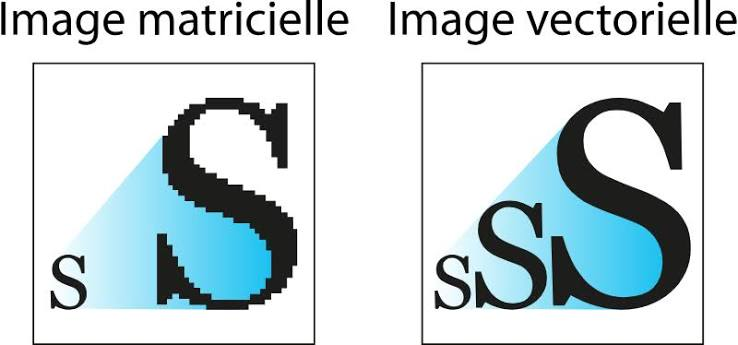

## Concept de composition
### Règle des tiers
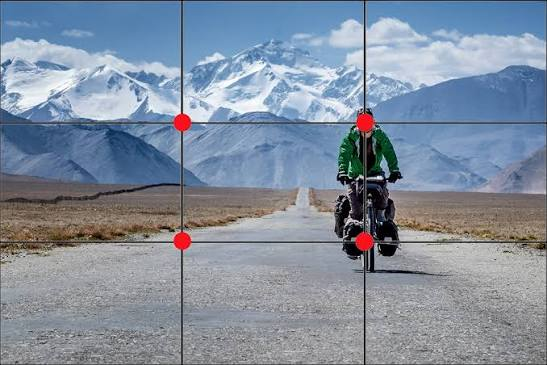
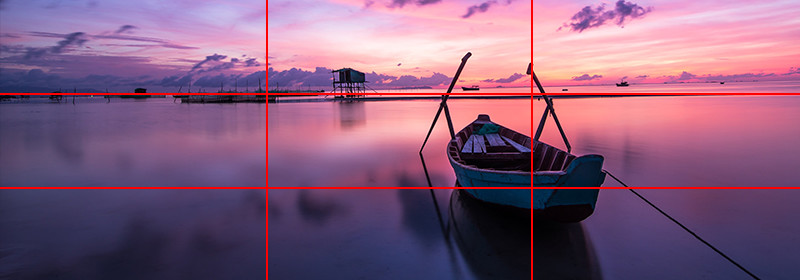
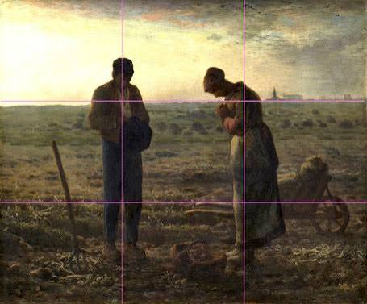

### Lignes de forces

### CRAP
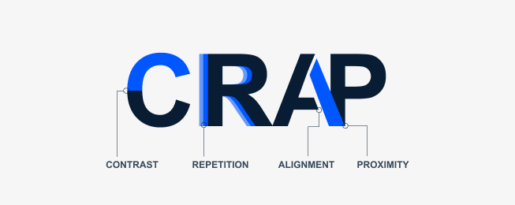

#### Contraste
#### Repetition
#### Alignement
#### Proximité

## Les courants artistiques

### Définition
"Période de l'histoire de l'art ou du design marquée par une idéologie distinctive et des caractéristiques formelles et esthétiques communes."
[Courant Artistique - Vitrine Linguistique](https://vitrinelinguistique.oqlf.gouv.qc.ca/fiche-gdt/fiche/26579335/courant-artistique)

* [Les Courants Artistique](https://cmontmorency365-my.sharepoint.com/:p:/g/personal/dominic_roberts_cmontmorency_qc_ca/IQCUGzybNC7ORqsvXICL5x0xAVMt4fFIDUvmM6Yerb5JrHk?e=gzHX3f)

### L'Art Déco
Le design graphique Art déco est un style de conception graphique qui s'est développé dans les années 1920 et 1930 en Europe et en Amérique du Nord. Il s'inspire de l'art déco, un mouvement artistique et architectural qui a émergé à la fin du XIXe siècle et qui a atteint son apogée dans les années 1920 et 1930.​

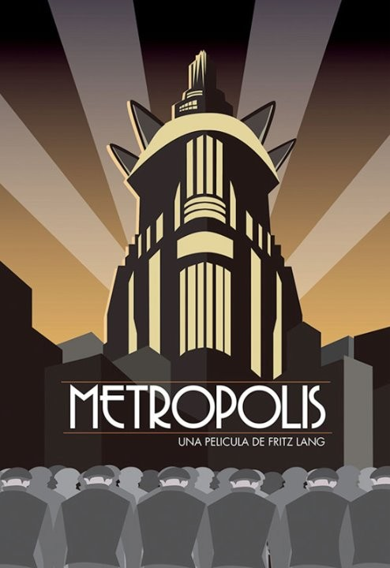

#### Caractéristique de l'art déco
Le style de conception graphique est assez large avec beaucoup de caractéristiques​
Les caractéristiques communes de la conception graphique art déco incluent:​

- Forte utilisation de formes géométriques, en particulier de triangles.​
- De grandes surfaces d’espace inutilisé.​
- Lignes fortes, souvent avec des traits épais et même des zigzags.​
- Palettes de couleurs fortes avec une ou deux teintes saturées.​
- Typographie avec traits épais ou forte ornementation (traits supplémentaires plutôt que fioritures​)
- Bords durs et formes rectangulaires​
- Motifs de chevrons​
- Styles de mosaïque​
- Des images avec un look presque aplati que plus artistique et moins réaliste​
- Fleurs stylisées​

#### A.M. Cassandre
A.M. Cassandre - Cassandre était un designer graphique français qui a créé de nombreuses affiches publicitaires Art Déco pour des marques telles que Dubonnet, Normandie et la Compagnie de chemin de fer du Nord.​

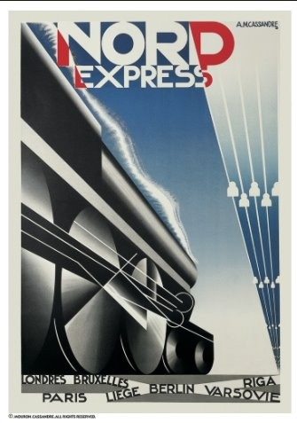

#### Paul Colin
Paul Colin - Colin était un artiste français qui a créé de nombreuses affiches Art Déco pour le théâtre et la danse, notamment pour Josephine Baker.​

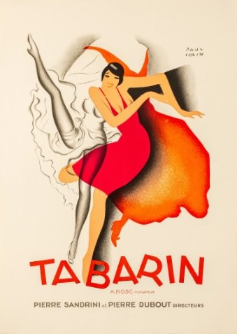

#### Edward McKnight Kauffer
Edward McKnight Kauffer - Kauffer était un designer graphique américain​ qui a travaillé en Europe et qui a créé de nombreuses affiches Art Déco ​pour des marques telles que Shell, London Transport et le Grand Hotel.​

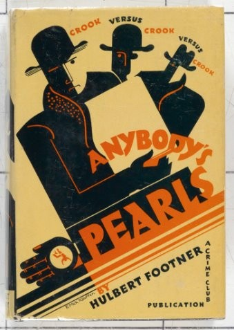

#### Typographie dans l'Art Déco
La typographie Art Déco est un style de typographie qui est apparu dans les années 1920 et 1930, en même temps que le mouvement artistique et architectural du même nom. Ce style de typographie est caractérisé par des formes géométriques, des contours nets, des contrastes prononcés, des motifs décoratifs et des effets de perspective.​

Les caractéristiques principales de la typographie Art Déco sont :​ 

- Formes géométriques : Les lettres sont souvent basées sur des formes géométriques simples telles que des cercles, des triangles et des carrés.​
- Contraste prononcé : Les lettres peuvent être très contrastées, avec des parties fines et épaisses distinctes.​
- Contours nets : Les lettres peuvent avoir des contours nets et des angles droits, donnant un aspect mécanique et moderne.​
- Motifs décoratifs : Les lettres peuvent être décorées avec des motifs tels que des arcs, des rayures, des losanges et des zigzags.​
- Effets de perspective : Les lettres peuvent être inclinées ou étirées pour donner un effet de perspective.​
- Couleurs vives : Les couleurs utilisées sont souvent vives et contrastées, avec des combinaisons audacieuses.​

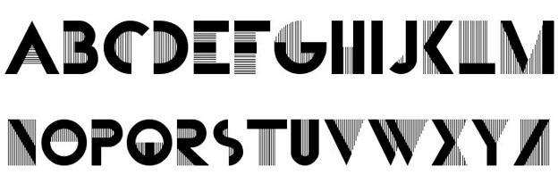
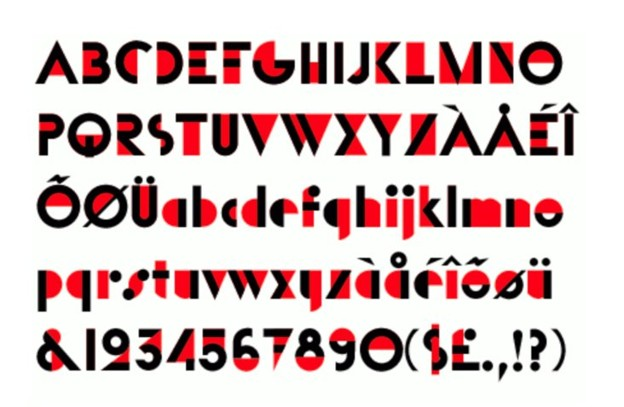
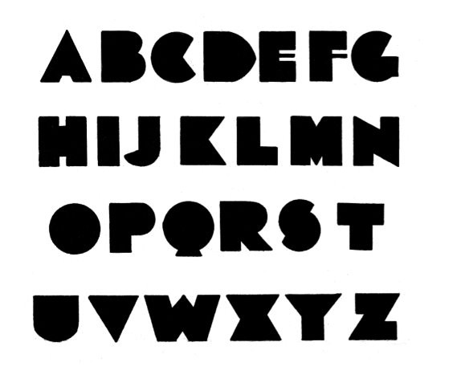

### Le Bauhaus
Le design graphique Bauhaus est un style de design graphique qui a émergé dans les années 1920 en Allemagne, dans le cadre de l'école d'art et de design Bauhaus. Cette école a été fondée par Walter Gropius en 1919 à Weimar et a été active jusqu'en 1933, date à laquelle elle a été fermée par les nazis.​

Le design graphique Bauhaus se caractérise par une approche minimaliste, fonctionnelle et axée sur la typographie. Les designers Bauhaus cherchaient à créer des designs simples, clairs et efficaces, en utilisant des formes géométriques de base, des couleurs primaires et une typographie sans empattement.​

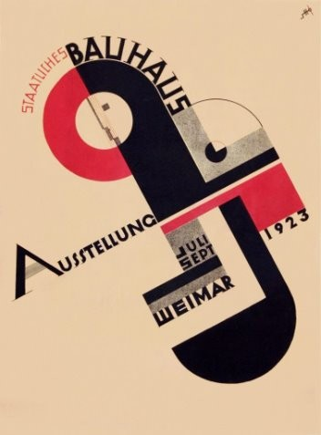

#### László Moholy-Nagy
László Moholy-Nagy était un artiste hongrois et enseignant à Bauhaus. Il a développé de nouvelles idées sur la typographie et l'art publicitaire. Il a également contribué à la théorie de la photographie et a réalisé des photographies expérimentales.​

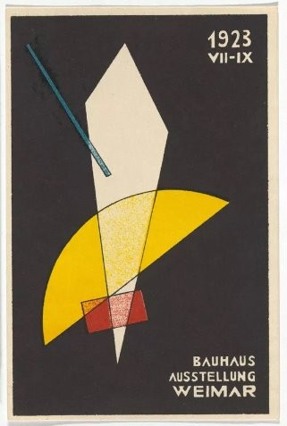

#### Herbert Bayer

Bayer était un designer autrichien qui a étudié à Bauhaus et est devenu plus tard un enseignant dans l'école. Il était responsable du département de typographie et de publicité. Il a créé des affiches, des brochures et des catalogues qui ont été très influents pour le mouvement Bauhaus.​

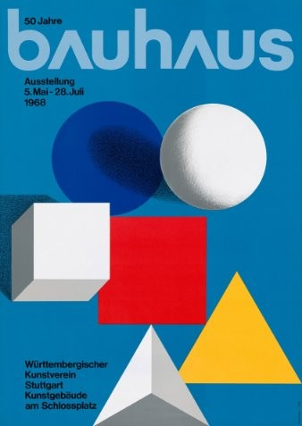

#### Typographie dans le Bauhaus

La typographie Bauhaus est un style de typographie moderne qui a émergé en Allemagne dans les années 1920 et qui est associé au mouvement artistique et architectural Bauhaus. Les caractéristiques principales de la typographie Bauhaus incluent:​

- Clarté: Les lettres sont simples, épurées et géométriques, souvent sans empattements (sans-serif).​
- Fonctionnalité: Les lettres sont conçues pour être facilement lues et comprises, avec une attention particulière portée à la lisibilité.​
- Simplicité: Les formes sont réduites à leur essence la plus simple, sans ornement ni décoration superflus.​
- Géométrie: Les lettres sont basées sur des formes géométriques comme des cercles, des carrés et des triangles.​
- Asymétrie: Les lettres sont souvent disposées de manière asymétrique pour créer une dynamique visuelle.​
- Couleur: Les couleurs utilisées sont souvent vives et contrastées.​

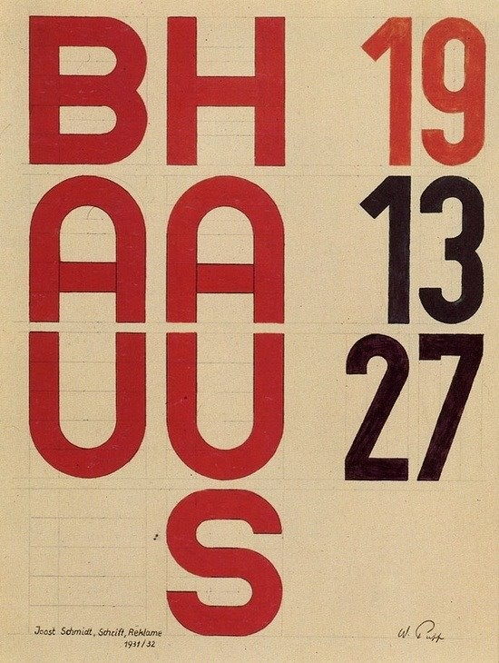

Les typographes les plus célèbres associés à la typographie Bauhaus sont Herbert Bayer, Joost Schmidt, et Jan Tschichold. La typographie Bauhaus a eu une influence majeure sur le développement de la typographie moderne et continue d'être utilisée aujourd'hui dans de nombreux domaines, y compris la publicité, l'édition et la conception graphique.​

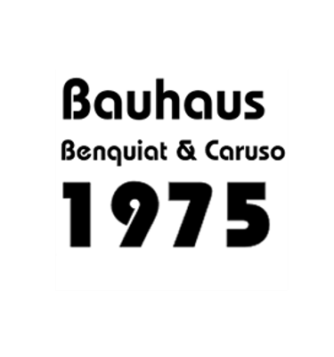

### Le De Stijl
Le De Stijl était un mouvement artistique néerlandais qui a eu une grande influence sur le développement du design graphique moderne.

#### Theo van Doesburg
Theo van Doesburg était un artiste, designer et fondateur du mouvement De Stijl. Il a créé des compositions géométriques simples et épurées qui ont influencé le développement du design moderne.​

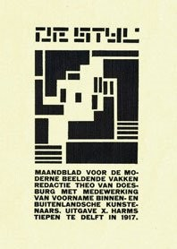

### Le Futurisme
Le design futurisme est un style de conception qui cherche à représenter le futur, la technologie et l'innovation à travers des formes, des couleurs et des motifs dynamiques et futuristes. Le mouvement futuriste est né en Italie au début du XXe siècle et a eu une influence importante sur l'art, l'architecture, la littérature et la conception.​

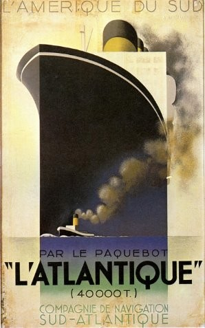

Le design futuriste a été largement utilisé dans des domaines tels que la publicité, la mode, la musique et la technologie. Il est souvent associé à la culture pop et à la fascination pour le futur qui a émergé dans les années 1960 et 1970. Bien que le design futuriste ait évolué au fil du temps, il continue à influencer les designers qui cherchent à créer des designs avant-gardistes et futuristes.​

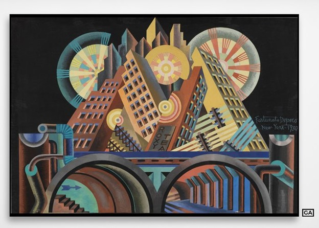

#### Fortunato Depero
 Depero était un artiste italien qui a travaillé dans une variété de médias, y compris la peinture, la sculpture et le design graphique. Il est surtout connu pour son travail en tant que designer graphique pour la revue futuriste "Depero Futurista", qu'il a cofondée avec le poète italien Filippo Tommaso Marinetti.​

 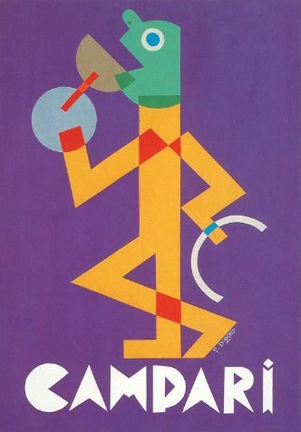

#### Typographie dans le Futurisme
La typographie futuriste est un style de typographie qui est caractérisé par des formes géométriques abstraites, des lignes dynamiques et des couleurs vives. Elle a été influencée par le mouvement futuriste du début du XXe siècle et a été utilisée dans le design graphique et l'art visuel.​

La typographie futuriste cherche à représenter le futur et l'innovation à travers l'utilisation de formes et de couleurs audacieuses. Les designers futuristes ont souvent créé de nouvelles typographies pour exprimer leur vision du futur, en utilisant des formes géométriques et des motifs abstraits pour créer des lettres qui semblent flotter dans l'espace.​

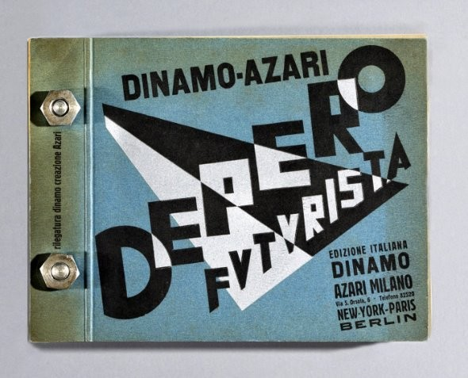

### Le Constructivisme
Avec le déclenchement de la Seconde Guerre mondiale en 1939, le fascisme a commencé à se répandre en Europe et a menacé de s'étendre à l'échelle mondiale au début des années 1940.  Cette nouvelle réalité effrayante a conduit à remplacer l'accent autrefois commercial mis sur le design par la propagande et l'imagerie motivationnelle.​

Certains des dessins les plus intéressants qui ont émergé à cette époque étaient ceux des artistes de propagande soviétique, inspirés par l'Art Déco et le constructivisme (un mouvement artistique russe qui mettait l'accent sur l'art comme ayant un but social) mais qui développait un style unique et direct rendu dans de sombres tons de rouge, noir et gris.​

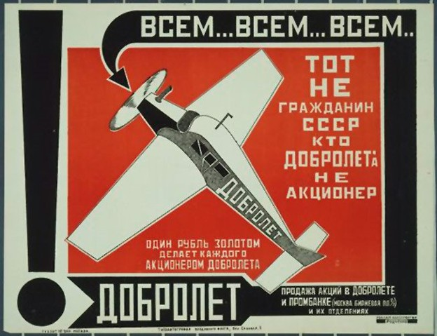

#### El Lissitzky ​
El Lissitzky (1890-1941) était un artiste, designer, architecte et photographe russe, considéré comme l'un des pionniers du mouvement constructiviste. Sa contribution majeure au constructivisme a été son exploration de l'intersection de l'art et de la technologie, en utilisant des techniques de production en série et des matériaux industriels pour créer des œuvres d'art fonctionnelles.​

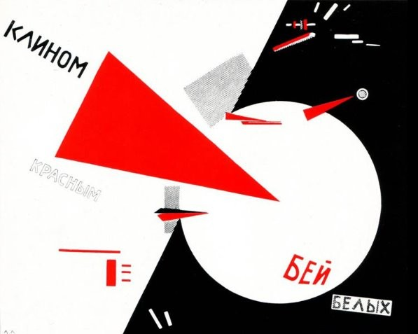

#### Aleksandr Rodchenko
Aleksandr Rodchenko a été l'un des artistes les plus influents du mouvement constructiviste en Russie. En tant que peintre, photographe, designer graphique et typographe, il a travaillé dans une grande variété de médias et a cherché à intégrer l'art dans la vie quotidienne en créant des œuvres fonctionnelles et utiles. Il a été l'un des premiers à appliquer les principes constructivistes de la géométrie abstraite, de l'utilisation de matériaux industriels et de la fonctionnalité dans ses œuvres.​

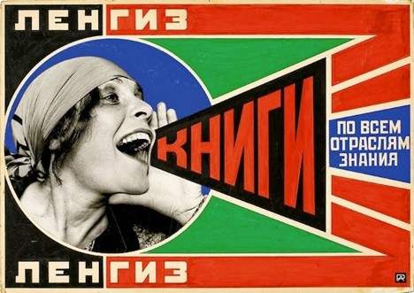

### Le Design Suisse
Aussi connu sous le nom de "design suisse", le style international est un mouvement qui a émergé dans les années 1950 en Suisse. ​

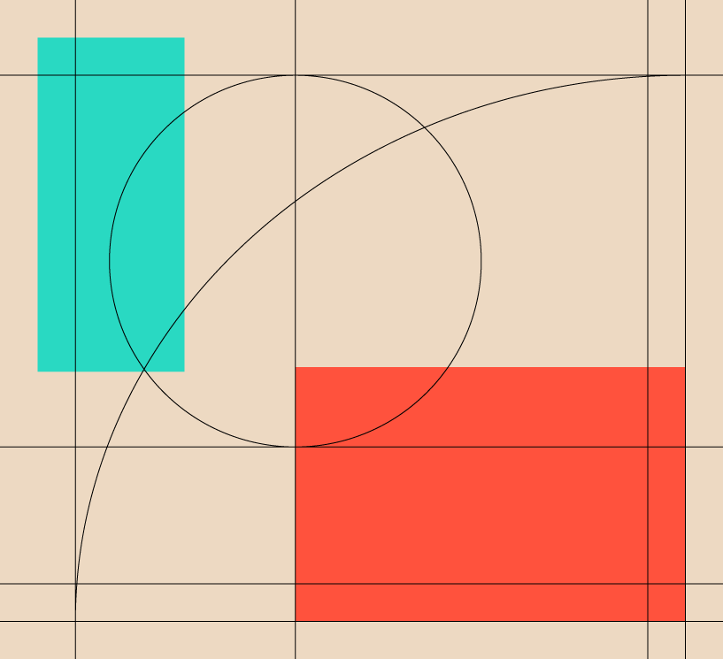

#### Josef Müller-Brockmann
Designer graphique suisse, il était connu pour son utilisation de la grille de composition et son travail dans les domaines de la typographie, de l'affiche et du design de livres.​

#### Max Bill
Artiste suisse, designer graphique et architecte, Max Bill a été l'un des fondateurs du mouvement de design suisse, également connu sous le nom de « style international ».​

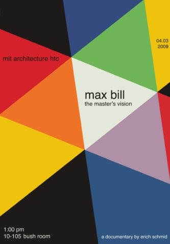

### Le Psychedelique
Le design psychédélique est un style graphique qui a émergé dans les années 1960 et qui était caractérisé par des formes abstraites, des couleurs vives et des motifs hypnotiques. Le design psychédélique est souvent inspiré de l'expérience psychédélique elle-même, qui peut inclure des hallucinations visuelles, des changements de perception, des états de conscience modifiés et des expériences mystiques ou spirituelles. Les artistes qui travaillent dans ce style cherchent souvent à capturer et à transmettre ces expériences à travers leur travail.​

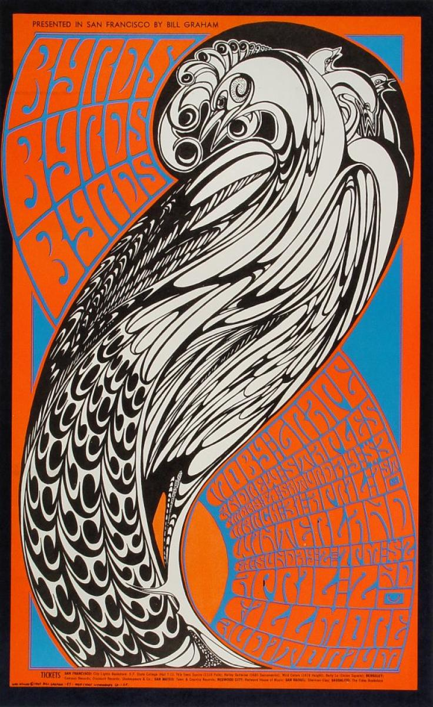

#### Wes Wilson
Designer graphique américain, il est considéré comme l'un des fondateurs du style psychédélique. Il a créé des affiches pour des concerts de rock et a utilisé des lettrages stylisés et des couleurs vibrantes pour créer des designs graphiques hypnotiques.​

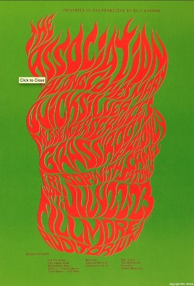

#### Victor Moscoso
Designer graphique américain, il a créé des affiches pour des concerts de rock et a utilisé des couleurs vives, des motifs psychédéliques et des effets optiques pour créer des designs graphiques surréalistes.​

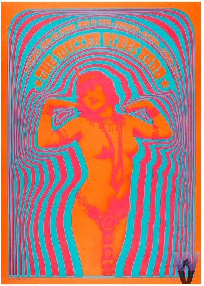

### Le Pop Art
« Pop » était un terme d’abord appliqué à la culture populaire plutôt qu’à l’art, mais ce serait l’un des objectifs du mouvement Pop art de brouiller les frontières entre l’art « haut » et la culture populaire « basse ».​

Le Pop Art était l’un des principaux mouvements artistiques des États-Unis du 20ème siècle. En fait, il a été inventé pour la première fois en Grande-Bretagne en 1955, mais sans surprise, les Américains ont pris fait et cause consumériste avec beaucoup plus d’effet et de conviction, et sont devenus les pionniers du mouvement. Le pop art et la culture pop désignent les produits des médias de masse évoluant à la fin des années 1950 et 60 ainsi que les œuvres d’art qui puisent dans la culture populaire : emballage, télévision, publicités, bandes dessinées, cinéma.

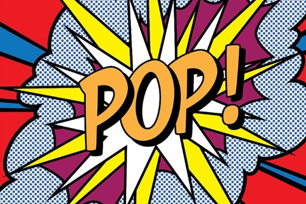

Le Pop Art a mis l’accent sur les éléments kitsch de la culture populaire pour protester contre la culture artistique élitiste et le sérieux qui l’entourait. Il a marqué un retour à la peinture pointue et à l’art figuratif. Il glorifiait des objets non appréciés et des affaires ordinaires. Ce faisant, il visait à rendre l’art plus significatif pour les gens ordinaires et en est venu à cibler un large public. Bien qu’il ait gagné de nombreux partisans pour la façon dont il était facile à comprendre, les critiques ont vu le pop art comme vulgaire.​

Le pop art a fait son chemin aux États-Unis dans les années 1960 avec l’aide des pionniers Jasper Johns et Robert Rauschenberg.​

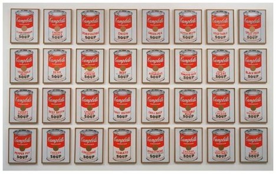

#### Andy Warhol
Andy Warhol est devenu l’artiste pop américain le plus célèbre lorsqu’il a utilisé un procédé de sérigraphie industrielle pour peindre des objets commerciaux tels que les boîtes de soupe Campbell et les bouteilles de Coca-Cola et pour représenter de grandes célébrités comme Liz Taylor, Jackie Kennedy et Marilyn Monroe. Comme Warhol et Lichtenstein ont réuni des éléments de peinture de signes, d’art commercial et d’imagerie littéraire dans leur travail, ils sont devenus célèbres pour effacer les frontières entre la culture populaire et la haute culture.​

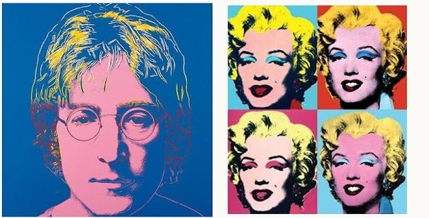

#### Roy Lichtenstein 
Il est un autre artiste important du mouvement pop art, connu pour ses peintures et ses sérigraphies qui utilisent des techniques de bandes dessinées, y compris des points Benday pour créer des images lumineuses et saturées.

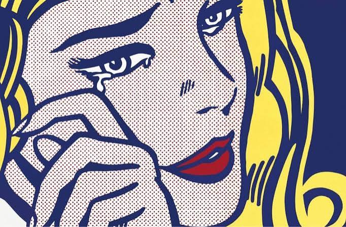

#### Peter Blake
Il est un artiste britannique qui a été associé au mouvement pop art dans les années 1960. Il est connu pour ses collages colorés de célébrités, de musiciens et d'autres icônes de la culture populaire.

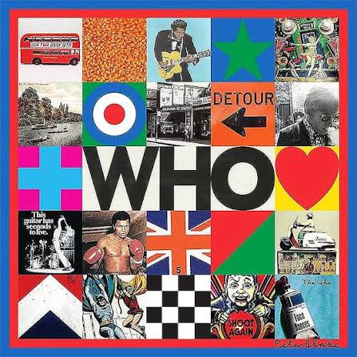

### Le Punk
Le design graphique punk est un style de design graphique qui a émergé dans les années 1970 et 1980 avec la montée du mouvement punk. Ce style est caractérisé par son approche bricolée, sa liberté de forme et sa tendance à faire passer des messages subversifs.​

Le design graphique punk utilise souvent des éléments tels que des images grungy, des polices de caractère griffonnées, des couleurs vives et des collages pour créer une esthétique punk. Ce style peut également utiliser des images choquantes ou politiques pour véhiculer des messages puissants.​

Le design graphique punk est souvent associé à la musique punk, mais il peut être utilisé dans de nombreux autres domaines, tels que la mode, l'art et la littérature. Ce style est souvent utilisé pour transmettre une attitude rebelle et anticonformiste et pour remettre en question les normes établies de la société et de l'art.​

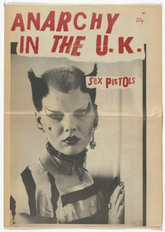

#### Jamie Reid
Designer graphique britannique, il est considéré comme l'un des fondateurs du style punk. Il a créé des affiches pour les Sex Pistols et a utilisé des images provocatrices et des typographies en lettres découpées pour créer des designs graphiques politiques et contestataires.​

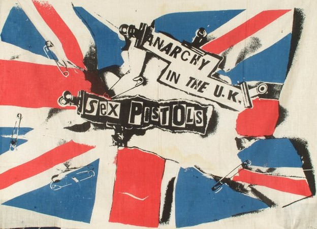

#### Vaughan Oliver
Designer graphique britannique, il a travaillé avec de nombreux groupes de punk et de post-punk, notamment Cocteau Twins et Pixies. Il a utilisé des images évocatrices et des typographies élaborées pour créer des designs graphiques mystérieux et souvent inquiétants.​

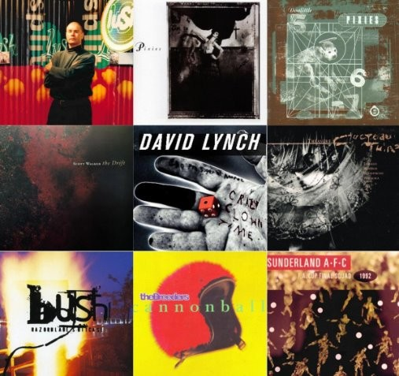

### Le Cyberpunk
Le design graphique cyberpunk est un style de conception qui s'inspire de l'esthétique dystopique et futuriste de la science-fiction cyberpunk. Ce style de conception graphique est souvent associé aux années 80 et 90, qui ont vu la montée en popularité du genre cyberpunk dans les romans, les films et les jeux vidéo.​

Le design graphique cyberpunk se caractérise par l'utilisation de couleurs vives et contrastées, de formes géométriques complexes, de typographies futuristes et de motifs inspirés de la technologie et de l'architecture futuriste. Il peut également incorporer des éléments tels que des circuits électroniques, des images robotiques et des symboles de la culture populaire.​

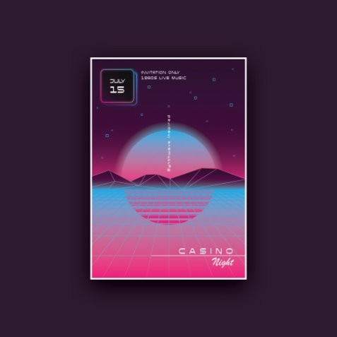

#### ​Hiroshi Nagai 
Illustrateur japonais, il a créé de nombreuses œuvres d'art dans le style cyberpunk dans les années 1980 et 1990. Ses designs graphiques présentent souvent des scènes urbaines futuristes et des néons lumineux.​

​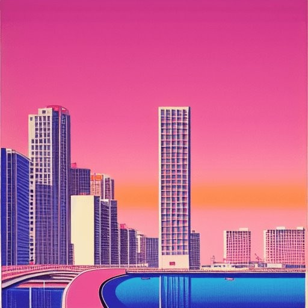

### Le Post-Modernisme
caractérisé par l'utilisation de références historiques, d'éléments de la culture populaire et de couleurs vives. Les designers ont expérimenté avec des typographies et des mises en page non conventionnelles pour créer des designs innovants.​

#### April Greiman
Elle est une designer graphique américaine qui a été l'une des premières à utiliser les ordinateurs dans la conception graphique. Elle est connue pour son utilisation du postmodernisme, y compris l'utilisation de typographies expérimentales et l'utilisation de couleurs audacieuses. on travail dans la conception de caractères.

​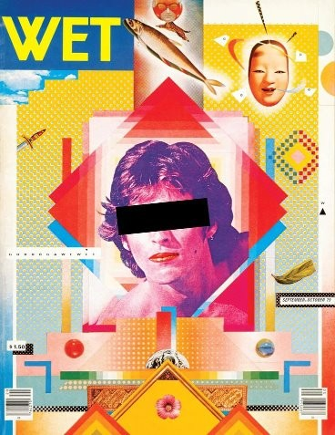

#### Paula Scher
Elle est une designer graphique américaine qui a travaillé sur de nombreux projets pour des clients prestigieux tels que Microsoft, Coca-Cola et The New York Times. Elle est connue pour son utilisation du postmodernisme, notamment l'utilisation de typographies audacieuses, de couleurs vives et de formes géométriques.

​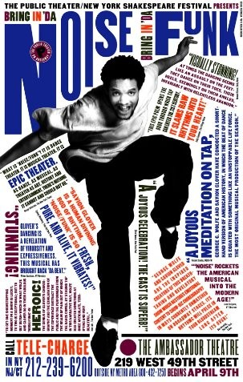

#### David Carson
Il est un designer graphique américain qui a travaillé sur de nombreux projets pour des clients tels que Nike, Microsoft et Ray-Ban. ​

​​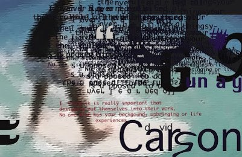

#### Wolfgang Weingart
Il est un designer graphique suisse qui est considéré comme l'un des pionniers du mouvement postmoderne en design graphique. Il est connu pour son utilisation de typographies expérimentales et de mises en page non conventionnelles, ainsi que pour son travail dans la conception de caractères.​

​​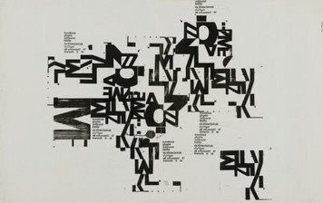

### Le Grunge
Le style de design grunge est souvent associé à la scène musicale alternative des années 1990 et se caractérise par une esthétique brute, déchirée, écorchée et texturée. Voici quelques-uns des artistes en design graphique qui ont créé des œuvres dans le style grunge.
Le style de design grunge est souvent associé à la scène musicale alternative des années 1990 et se caractérise par une esthétique brute, déchirée, écorchée et texturée. Voici quelques-uns des artistes en design graphique qui ont créé des œuvres dans le style grunge.

​​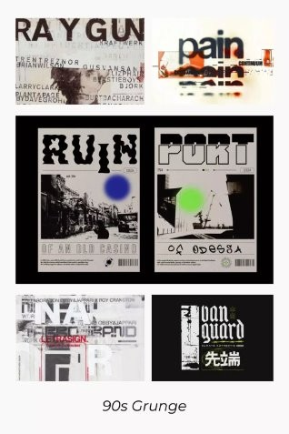

#### Neville Brody
Designer britannique, il est connu pour son travail dans le domaine de la typographie. Ses designs graphiques dans le style grunge se caractérisent par des typographies expérimentales, des couleurs vives et des motifs chaotiques.

​​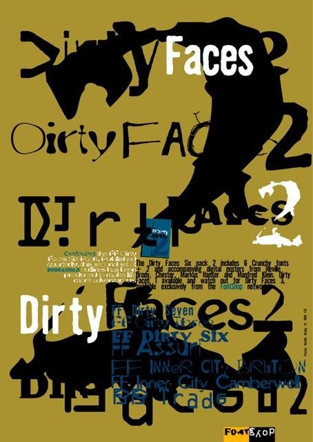

### Le Minimalisme
caractérisé par des formes simples, des couleurs monochromes et l'utilisation d'un espace négatif. Ce style a été influencé par le mouvement de design suisse des années 1960.​
Le design graphique minimaliste est caractérisé par un usage restreint des éléments graphiques, des couleurs limitées et une typographie simple et élégante.

​​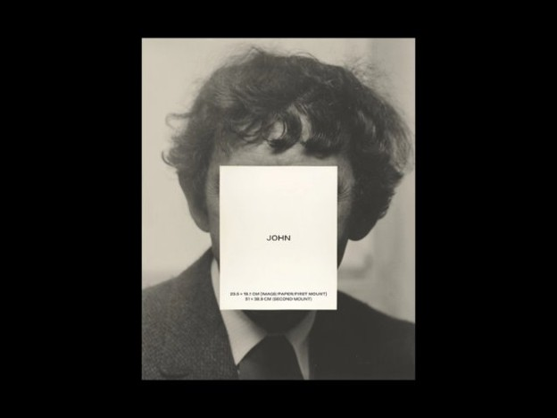

#### Massimo Vignelli
Designer italien, il est connu pour son travail dans les domaines de l'identité de marque et de la typographie. Ses designs graphiques dans le style minimaliste se caractérisent par l'utilisation de typographies simples, de couleurs limitées et de mises en page épurées.

​​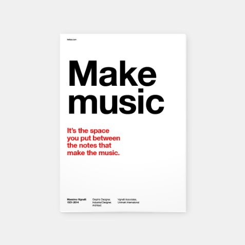

#### Dieter Rams
Designer allemand, il est connu pour son travail dans le domaine du design industriel et pour son influence sur le design minimaliste. Ses designs graphiques dans le style minimaliste se caractérisent par l'utilisation de typographies simples, de couleurs limitées et de formes géométriques épurées.

​​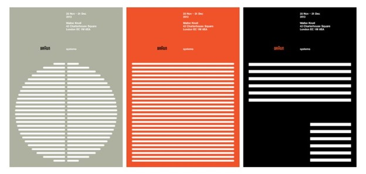

#### Ikko Tanaka
Designer japonais, il est connu pour son travail dans les domaines de l'identité de marque et du design d'affiches. Ses designs graphiques dans le style minimaliste se caractérisent par l'utilisation de formes géométriques épurées, de typographies simples et de couleurs limitées.

​​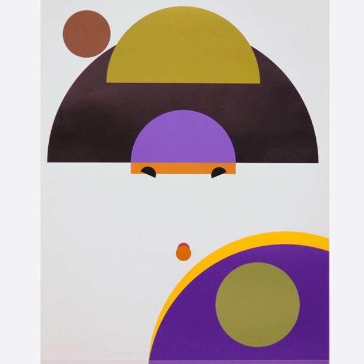

### Le Néon
caractérisé par l'utilisation de couleurs vives et saturées, de typographies sans serif et de motifs géométriques. Ce style a été influencé par la culture populaire des années 1980 et était populaire dans les discothèques et les bars de l'époque.​

​​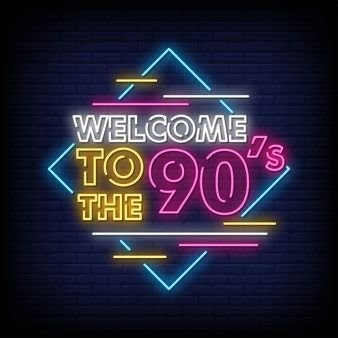

### Le Rétro-Futurisme
### Le Brutalisme
### Le Flat 2.0
### Le Vintage
### Le Néo-Minimalisme

## Tendances 2026

<!-- ## La composition 
### Atelier
À tour de rôle, chaque personne pige une carte et nous explique commment l'oeuvre présenté exprime le concept de la carte.

#### Oeuvre 1 : La Nuit Étoilé - Vincent Van Gogh

#### Oeuvre 2 : L'école d'Athene - Raphael
 -->

## Photoshop

### Notions
  [🛠️ Créer un compte Adobe](https://helpx.adobe.com/ca_fr/manage-account/using/create-update-adobe-id.html#email-address){ .md-button }      
* [▶️ Nomenclature](https://cmontmorency365-my.sharepoint.com/:f:/g/personal/flpilote_cmontmorency_qc_ca/EtTOCPWMaspFh1mZfR3pQdkBnuwrvNMDu4M49-V-qh56jg?e=rZfdd6)  
### Notions: création et gestion de projet
* [▶️ Créer un projet: resolution / bit / profil / safe title ](https://cmontmorency365-my.sharepoint.com/:v:/g/personal/flpilote_cmontmorency_qc_ca/EXVIr3_1hmJGuKBg15q3YnQByaVHJOQN97epCasGV-Tn0A?nav=eyJyZWZlcnJhbEluZm8iOnsicmVmZXJyYWxBcHAiOiJPbmVEcml2ZUZvckJ1c2luZXNzIiwicmVmZXJyYWxBcHBQbGF0Zm9ybSI6IldlYiIsInJlZmVycmFsTW9kZSI6InZpZXciLCJyZWZlcnJhbFZpZXciOiJNeUZpbGVzTGlua0NvcHkifX0&e=vqTuvd)  /  [📑 Powerpoint](https://cmontmorency365-my.sharepoint.com/:p:/g/personal/flpilote_cmontmorency_qc_ca/EcWfT_2It2ZHnBGBeZDYkaYBvRr-Ckm7Zr9Qjbb1hKPWZw?e=dn5k2t)   
* [▶️ Modifier le nombre de bits et du rvb](https://cmontmorency365-my.sharepoint.com/:v:/g/personal/flpilote_cmontmorency_qc_ca/EWTmszzhgURGpLkDseroGo8Bw_Ohp9BSfRxiimFAw0jVBg?nav=eyJyZWZlcnJhbEluZm8iOnsicmVmZXJyYWxBcHAiOiJPbmVEcml2ZUZvckJ1c2luZXNzIiwicmVmZXJyYWxBcHBQbGF0Zm9ybSI6IldlYiIsInJlZmVycmFsTW9kZSI6InZpZXciLCJyZWZlcnJhbFZpZXciOiJNeUZpbGVzTGlua0NvcHkifX0&e=oTEWGj)   
### Notions: raccourcis et productivité
* [▶️ Raccourcis clavier](https://cmontmorency365-my.sharepoint.com/:v:/g/personal/flpilote_cmontmorency_qc_ca/EQUADFGtiGBNtLoOnaTdb_IBOmNvV0p6JCe9GrEUefls5g?nav=eyJyZWZlcnJhbEluZm8iOnsicmVmZXJyYWxBcHAiOiJPbmVEcml2ZUZvckJ1c2luZXNzIiwicmVmZXJyYWxBcHBQbGF0Zm9ybSI6IldlYiIsInJlZmVycmFsTW9kZSI6InZpZXciLCJyZWZlcnJhbFZpZXciOiJNeUZpbGVzTGlua0NvcHkifX0&e=KJKjNt)   
### Notions: interface et outils
* [▶️ Présentation de l'interface : outils, panneau d'option, menu, fenêtre, calques.](https://cmontmorency365-my.sharepoint.com/:v:/g/personal/flpilote_cmontmorency_qc_ca/EaWZefFDQdxHoDTp56vcNy4BLmvEYTnW7YpFFtLOmm-NMQ?nav=eyJyZWZlcnJhbEluZm8iOnsicmVmZXJyYWxBcHAiOiJPbmVEcml2ZUZvckJ1c2luZXNzIiwicmVmZXJyYWxBcHBQbGF0Zm9ybSI6IldlYiIsInJlZmVycmFsTW9kZSI6InZpZXciLCJyZWZlcnJhbFZpZXciOiJNeUZpbGVzTGlua0NvcHkifX0&e=hnrmW4)   
* [▶️ Créer un dossier dans Photoshop](https://cmontmorency365-my.sharepoint.com/personal/flpilote_cmontmorency_qc_ca/_layouts/15/stream.aspx?id=%2Fpersonal%2Fflpilote%5Fcmontmorency%5Fqc%5Fca%2FDocuments%2F01%5Fcours%2F01%5Fcollege%2Fcours%5Fillustration%2Fcours%5F04%5F06%5Fphotoshop%2F19%5Fcreation%5Fdossier%2F01%5Fcreation%5Fdossier%2Emp4&referrer=StreamWebApp%2EWeb&referrerScenario=AddressBarCopied%2Eview%2Eed5d7231%2Dc654%2D46e7%2D8446%2Ddc9a62e9ec1b)   

### Notions: outils de déplacement et transformation
* [▶️ Outil de déplacement](https://cmontmorency365-my.sharepoint.com/:v:/g/personal/flpilote_cmontmorency_qc_ca/EXTHpLTfSCtBg5qT3TA3JNgBamh1ZfrfnF2408RhUJspMQ?nav=eyJyZWZlcnJhbEluZm8iOnsicmVmZXJyYWxBcHAiOiJPbmVEcml2ZUZvckJ1c2luZXNzIiwicmVmZXJyYWxBcHBQbGF0Zm9ybSI6IldlYiIsInJlZmVycmFsTW9kZSI6InZpZXciLCJyZWZlcnJhbFZpZXciOiJNeUZpbGVzTGlua0NvcHkifX0&e=PNBr6z)   
* [▶️ Transformations d'un calque ou d'image](https://cmontmorency365-my.sharepoint.com/:v:/g/personal/flpilote_cmontmorency_qc_ca/EcdAqDGXjx1Iq6sfj6U6c1YBmEAb3fkLS0I5JUIlqlNIYg?nav=eyJyZWZlcnJhbEluZm8iOnsicmVmZXJyYWxBcHAiOiJPbmVEcml2ZUZvckJ1c2luZXNzIiwicmVmZXJyYWxBcHBQbGF0Zm9ybSI6IldlYiIsInJlZmVycmFsTW9kZSI6InZpZXciLCJyZWZlcnJhbFZpZXciOiJNeUZpbGVzTGlua0NvcHkifX0&e=6I4L6Z)      
  [🛠️ 06_Déplacer, transformer des calques, dossier](./exercices_photoshop/06_Déplacer_et_transformer_des_calques.md){ .md-button }       

  
### Notions: enregistrement des images  
* [▶️ Enregistrer des images](https://cmontmorency365-my.sharepoint.com/:v:/g/personal/flpilote_cmontmorency_qc_ca/EUHqTCjYyMVCkeIahHqiHHQBQ07BrCDjnLlFiHMkZadSIA?nav=eyJyZWZlcnJhbEluZm8iOnsicmVmZXJyYWxBcHAiOiJPbmVEcml2ZUZvckJ1c2luZXNzIiwicmVmZXJyYWxBcHBQbGF0Zm9ybSI6IldlYiIsInJlZmVycmFsTW9kZSI6InZpZXciLCJyZWZlcnJhbFZpZXciOiJNeUZpbGVzTGlua0NvcHkifX0&e=bqiSFG)  /  [Powerpoint](https://cmontmorency365-my.sharepoint.com/:p:/g/personal/flpilote_cmontmorency_qc_ca/EcWfT_2It2ZHnBGBeZDYkaYBvRr-Ckm7Zr9Qjbb1hKPWZw?e=dn5k2t)   
  
  [🛠️ 05_Enregistrer un PSD.md](./exercices_photoshop/05_Enregistrer_un_psd.md){ .md-button }       
  [🛠️ 05_Enregistrer un JPG.md](./exercices_photoshop/05_Enregistrer_un_jpg.md){ .md-button }       
  [🛠️ 05_Enregistrer un GIF.md](./exercices_photoshop/05_Enregistrer_un_gif.md){ .md-button }       

### Notions: recadrage d'images 
* [▶️ Importer les images du web et recadrer](https://cmontmorency365-my.sharepoint.com/:v:/g/personal/flpilote_cmontmorency_qc_ca/EW-j3aga9SFBiAtC8gBjViUBmZ2HR9NZiCIdAyUKekTCsA?nav=eyJyZWZlcnJhbEluZm8iOnsicmVmZXJyYWxBcHAiOiJPbmVEcml2ZUZvckJ1c2luZXNzIiwicmVmZXJyYWxBcHBQbGF0Zm9ybSI6IldlYiIsInJlZmVycmFsTW9kZSI6InZpZXciLCJyZWZlcnJhbFZpZXciOiJNeUZpbGVzTGlua0NvcHkifX0&e=M0ZDtZ)   
* [▶️ Recadrer et désinclinez](https://cmontmorency365-my.sharepoint.com/:v:/g/personal/flpilote_cmontmorency_qc_ca/Ee3Gmwbq6xFCjD5qV47wwKYBtD_Fjw86v87ejTjPlIOnXQ?nav=eyJyZWZlcnJhbEluZm8iOnsicmVmZXJyYWxBcHAiOiJPbmVEcml2ZUZvckJ1c2luZXNzIiwicmVmZXJyYWxBcHBQbGF0Zm9ybSI6IldlYiIsInJlZmVycmFsTW9kZSI6InZpZXciLCJyZWZlcnJhbFZpZXciOiJNeUZpbGVzTGlua0NvcHkifX0&e=gafjhl)    
* [▶️ Recadrer avec du génératif ou du contenu](https://cmontmorency365-my.sharepoint.com/:v:/g/personal/flpilote_cmontmorency_qc_ca/EbnE68gSWHpBnmw4AvG4CTUB__EffVCs-eea_Ui6xUEorw?nav=eyJyZWZlcnJhbEluZm8iOnsicmVmZXJyYWxBcHAiOiJPbmVEcml2ZUZvckJ1c2luZXNzIiwicmVmZXJyYWxBcHBQbGF0Zm9ybSI6IldlYiIsInJlZmVycmFsTW9kZSI6InZpZXciLCJyZWZlcnJhbFZpZXciOiJNeUZpbGVzTGlua0NvcHkifX0&e=07tIXr)    
* [▶️ Recadrer avec la perspective](https://cmontmorency365-my.sharepoint.com/:v:/g/personal/flpilote_cmontmorency_qc_ca/Ed5u2tgMxG9GjtowaJFYfRMBw5tWVHH6PC09k3UYEGk2Vg?nav=eyJyZWZlcnJhbEluZm8iOnsicmVmZXJyYWxBcHAiOiJPbmVEcml2ZUZvckJ1c2luZXNzIiwicmVmZXJyYWxBcHBQbGF0Zm9ybSI6IldlYiIsInJlZmVycmFsTW9kZSI6InZpZXciLCJyZWZlcnJhbFZpZXciOiJNeUZpbGVzTGlua0NvcHkifX0&e=zqXIwr)   
* [▶️ Recadrer avec l'outil image](https://cmontmorency365-my.sharepoint.com/:v:/g/personal/flpilote_cmontmorency_qc_ca/EZ06CjTduu5CsIMX2EfSKM8BqeXMRjVvM7BbWHB1wXwz3A?nav=eyJyZWZlcnJhbEluZm8iOnsicmVmZXJyYWxBcHAiOiJPbmVEcml2ZUZvckJ1c2luZXNzIiwicmVmZXJyYWxBcHBQbGF0Zm9ybSI6IldlYiIsInJlZmVycmFsTW9kZSI6InZpZXciLCJyZWZlcnJhbFZpZXciOiJNeUZpbGVzTGlua0NvcHkifX0&e=s8vQ9X)   
* Ne pas utiliser les outils de tranche 🔪    

  [🛠️ 04_Recadrer une grande image](./exercices_photoshop/04_Recadrer_une_grande_image.md){ .md-button }     
  [🛠️ 04_Recadrer une petite image](./exercices_photoshop/04_Recadrer_une_petite_image.md){ .md-button }       
  [🛠️ 07_Recadrer et désinclinez](./exercices_photoshop/07_Recadrer_et_désinscliner.md){ .md-button }       
  [🛠️ 07_Recadrer avec du génératif ou du contenu](./exercices_photoshop/07_Recadrer_avec_du_génératif_ou_du_contenu.md){ .md-button }       
  [🛠️ 07_Recadrer avec la perspective](./exercices_photoshop/07_Recadrer_avec_la_perspective.md){ .md-button }       
  [🛠️ 07_Recadrer avec l'outil image](./exercices_photoshop/07_Recadrer_avec_l'outil_image.md){ .md-button }       

## Devoir
* [ ] Choisisser votre [courant artistique](https://cmontmorency365-my.sharepoint.com/:p:/g/personal/flpilote_cmontmorency_qc_ca/EbWlYrtLqN1Mlf0xWOwJArEB92yLuuZ_LoN2-32pD9rcwQ?e=d63kE3) pour votre autoportrait. Il est possible que votre courant artisque ne soit pas répertorié dans le Powerpoint. 
* [ ] Noter le nom des artistes qui ont réalisé les illustrations et notez le courant artistique auquel appartiennent ces artistes.
* [ ] Créer un moodboard dans [Pinterest](https://ca.pinterest.com/flavoiepilote/portrait_coll%C3%A8ge/?request_params=%7B%221%22%3A%20130%2C%20%227%22%3A%203214319777322870628%2C%20%228%22%3A%20390124455160979770%2C%20%2230%22%3A%20%22Portrait_coll%5Cu00e8ge%22%2C%20%2232%22%3A%2045%2C%20%2233%22%3A%20%5B390124386492954096%2C%20390124386490390898%2C%20390124386490390895%2C%20390124386490390893%2C%20390124386490390891%2C%20390124386490390887%2C%20390124386490390885%2C%20390124386490386849%2C%20390124386490386847%2C%20390124386490386845%2C%20390124386490386844%2C%20390124386490386843%2C%20390124386490386842%2C%20390124386490386841%2C%20390124386490386835%2C%20390124386490386834%2C%20390124386490386833%2C%20390124386490386831%2C%20390124386490386829%2C%20390124386490386828%5D%2C%20%2236%22%3A%20%5B390124455160979770%5D%2C%20%2237%22%3A%20%22Portrait_coll%5Cu00e8ge%22%2C%20%2234%22%3A%200%2C%20%22102%22%3A%204%7D&full_feed_title=Portrait_coll%C3%A8ge&view_parameter_type=3069&pins_display=3) l'autoportrait (matriciel).
* [ ] Choisisser l'effet pour votre signature.
* [ ] Créer un moodboard dans [Pinterest](https://ca.pinterest.com/flavoiepilote/typographie/?request_params=%7B%221%22%3A%20130%2C%20%227%22%3A%207794363679555245846%2C%20%228%22%3A%20390124455160989818%2C%20%2230%22%3A%20%22Typographie%22%2C%20%2232%22%3A%2045%2C%20%2233%22%3A%20%5B390124386493073639%2C%20390124386493073637%2C%20390124386493073634%2C%20390124386493073633%2C%20390124386493073630%2C%20390124386493073552%2C%20390124386493073549%2C%20390124386493073545%2C%20390124386493073539%2C%20390124386493073538%2C%20390124386493073537%2C%20390124386493073536%2C%20390124386493073535%2C%20390124386493073534%2C%20390124386493073533%2C%20390124386493073532%2C%20390124386493073531%2C%20390124386493073529%2C%20390124386493073528%2C%20390124386493073503%5D%2C%20%2236%22%3A%20%5B390124455160989818%5D%2C%20%2237%22%3A%20%22Typographie%22%2C%20%2234%22%3A%200%2C%20%22102%22%3A%204%7D&full_feed_title=Typographie&view_parameter_type=3069&pins_display=3) pour la signature (vectoriel).
* [ ] Explorer pour votre fun la création d'images par [Klingai](https://klingai.com/)

