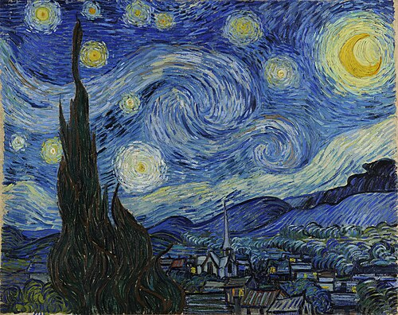
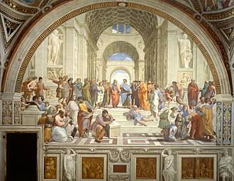

# Cours 2

## Les bases du design
### La composition 
#### Atelier
À tour de rôle, chaque personne pige une carte et nous explique commment l'oeuvre présenté exprime le concept de la carte.

##### Oeuvre 1 : La nuit Étoilé - Vincent Van Gogh

##### Oeuvre 2 : L'école d'Athene - Raphael

### Les courants artistiques

#### Définition
"Période de l'histoire de l'art ou du design marquée par une idéologie distinctive et des caractéristiques formelles et esthétiques communes."
[Courant Artistique - Vitrine Linguistique](https://vitrinelinguistique.oqlf.gouv.qc.ca/fiche-gdt/fiche/26579335/courant-artistique)

* [Les Courants Artistique](https://cmontmorency365-my.sharepoint.com/:p:/g/personal/dominic_roberts_cmontmorency_qc_ca/IQCUGzybNC7ORqsvXICL5x0xAVMt4fFIDUvmM6Yerb5JrHk?e=gzHX3f)
### La composition
### Le 

## Photoshop

### Notions
  [🛠️ Créer un compte Adobe](https://helpx.adobe.com/ca_fr/manage-account/using/create-update-adobe-id.html#email-address){ .md-button }      
* [▶️ Nomenclature](https://cmontmorency365-my.sharepoint.com/:f:/g/personal/flpilote_cmontmorency_qc_ca/EtTOCPWMaspFh1mZfR3pQdkBnuwrvNMDu4M49-V-qh56jg?e=rZfdd6)  
### Notions: création et gestion de projet
* [▶️ Créer un projet: resolution / bit / profil / safe title ](https://cmontmorency365-my.sharepoint.com/:v:/g/personal/flpilote_cmontmorency_qc_ca/EXVIr3_1hmJGuKBg15q3YnQByaVHJOQN97epCasGV-Tn0A?nav=eyJyZWZlcnJhbEluZm8iOnsicmVmZXJyYWxBcHAiOiJPbmVEcml2ZUZvckJ1c2luZXNzIiwicmVmZXJyYWxBcHBQbGF0Zm9ybSI6IldlYiIsInJlZmVycmFsTW9kZSI6InZpZXciLCJyZWZlcnJhbFZpZXciOiJNeUZpbGVzTGlua0NvcHkifX0&e=vqTuvd)  /  [📑 Powerpoint](https://cmontmorency365-my.sharepoint.com/:p:/g/personal/flpilote_cmontmorency_qc_ca/EcWfT_2It2ZHnBGBeZDYkaYBvRr-Ckm7Zr9Qjbb1hKPWZw?e=dn5k2t)   
* [▶️ Modifier le nombre de bits et du rvb](https://cmontmorency365-my.sharepoint.com/:v:/g/personal/flpilote_cmontmorency_qc_ca/EWTmszzhgURGpLkDseroGo8Bw_Ohp9BSfRxiimFAw0jVBg?nav=eyJyZWZlcnJhbEluZm8iOnsicmVmZXJyYWxBcHAiOiJPbmVEcml2ZUZvckJ1c2luZXNzIiwicmVmZXJyYWxBcHBQbGF0Zm9ybSI6IldlYiIsInJlZmVycmFsTW9kZSI6InZpZXciLCJyZWZlcnJhbFZpZXciOiJNeUZpbGVzTGlua0NvcHkifX0&e=oTEWGj)   
### Notions: raccourcis et productivité
* [▶️ Raccourcis clavier](https://cmontmorency365-my.sharepoint.com/:v:/g/personal/flpilote_cmontmorency_qc_ca/EQUADFGtiGBNtLoOnaTdb_IBOmNvV0p6JCe9GrEUefls5g?nav=eyJyZWZlcnJhbEluZm8iOnsicmVmZXJyYWxBcHAiOiJPbmVEcml2ZUZvckJ1c2luZXNzIiwicmVmZXJyYWxBcHBQbGF0Zm9ybSI6IldlYiIsInJlZmVycmFsTW9kZSI6InZpZXciLCJyZWZlcnJhbFZpZXciOiJNeUZpbGVzTGlua0NvcHkifX0&e=KJKjNt)   
### Notions: interface et outils
* [▶️ Présentation de l'interface : outils, panneau d'option, menu, fenêtre, calques.](https://cmontmorency365-my.sharepoint.com/:v:/g/personal/flpilote_cmontmorency_qc_ca/EaWZefFDQdxHoDTp56vcNy4BLmvEYTnW7YpFFtLOmm-NMQ?nav=eyJyZWZlcnJhbEluZm8iOnsicmVmZXJyYWxBcHAiOiJPbmVEcml2ZUZvckJ1c2luZXNzIiwicmVmZXJyYWxBcHBQbGF0Zm9ybSI6IldlYiIsInJlZmVycmFsTW9kZSI6InZpZXciLCJyZWZlcnJhbFZpZXciOiJNeUZpbGVzTGlua0NvcHkifX0&e=hnrmW4)   
* [▶️ Créer un dossier dans Photoshop](https://cmontmorency365-my.sharepoint.com/personal/flpilote_cmontmorency_qc_ca/_layouts/15/stream.aspx?id=%2Fpersonal%2Fflpilote%5Fcmontmorency%5Fqc%5Fca%2FDocuments%2F01%5Fcours%2F01%5Fcollege%2Fcours%5Fillustration%2Fcours%5F04%5F06%5Fphotoshop%2F19%5Fcreation%5Fdossier%2F01%5Fcreation%5Fdossier%2Emp4&referrer=StreamWebApp%2EWeb&referrerScenario=AddressBarCopied%2Eview%2Eed5d7231%2Dc654%2D46e7%2D8446%2Ddc9a62e9ec1b)   

### Notions: outils de déplacement et transformation
* [▶️ Outil de déplacement](https://cmontmorency365-my.sharepoint.com/:v:/g/personal/flpilote_cmontmorency_qc_ca/EXTHpLTfSCtBg5qT3TA3JNgBamh1ZfrfnF2408RhUJspMQ?nav=eyJyZWZlcnJhbEluZm8iOnsicmVmZXJyYWxBcHAiOiJPbmVEcml2ZUZvckJ1c2luZXNzIiwicmVmZXJyYWxBcHBQbGF0Zm9ybSI6IldlYiIsInJlZmVycmFsTW9kZSI6InZpZXciLCJyZWZlcnJhbFZpZXciOiJNeUZpbGVzTGlua0NvcHkifX0&e=PNBr6z)   
* [▶️ Transformations d'un calque ou d'image](https://cmontmorency365-my.sharepoint.com/:v:/g/personal/flpilote_cmontmorency_qc_ca/EcdAqDGXjx1Iq6sfj6U6c1YBmEAb3fkLS0I5JUIlqlNIYg?nav=eyJyZWZlcnJhbEluZm8iOnsicmVmZXJyYWxBcHAiOiJPbmVEcml2ZUZvckJ1c2luZXNzIiwicmVmZXJyYWxBcHBQbGF0Zm9ybSI6IldlYiIsInJlZmVycmFsTW9kZSI6InZpZXciLCJyZWZlcnJhbFZpZXciOiJNeUZpbGVzTGlua0NvcHkifX0&e=6I4L6Z)      
  [🛠️ 06_Déplacer, transformer des calques, dossier](./exercices_photoshop/06_Déplacer_et_transformer_des_calques.md){ .md-button }       

  
### Notions: enregistrement des images  
* [▶️ Enregistrer des images](https://cmontmorency365-my.sharepoint.com/:v:/g/personal/flpilote_cmontmorency_qc_ca/EUHqTCjYyMVCkeIahHqiHHQBQ07BrCDjnLlFiHMkZadSIA?nav=eyJyZWZlcnJhbEluZm8iOnsicmVmZXJyYWxBcHAiOiJPbmVEcml2ZUZvckJ1c2luZXNzIiwicmVmZXJyYWxBcHBQbGF0Zm9ybSI6IldlYiIsInJlZmVycmFsTW9kZSI6InZpZXciLCJyZWZlcnJhbFZpZXciOiJNeUZpbGVzTGlua0NvcHkifX0&e=bqiSFG)  /  [Powerpoint](https://cmontmorency365-my.sharepoint.com/:p:/g/personal/flpilote_cmontmorency_qc_ca/EcWfT_2It2ZHnBGBeZDYkaYBvRr-Ckm7Zr9Qjbb1hKPWZw?e=dn5k2t)   
  
  [🛠️ 05_Enregistrer un PSD.md](./exercices_photoshop/05_Enregistrer_un_psd.md){ .md-button }       
  [🛠️ 05_Enregistrer un JPG.md](./exercices_photoshop/05_Enregistrer_un_jpg.md){ .md-button }       
  [🛠️ 05_Enregistrer un GIF.md](./exercices_photoshop/05_Enregistrer_un_gif.md){ .md-button }       

### Notions: recadrage d'images 
* [▶️ Importer les images du web et recadrer](https://cmontmorency365-my.sharepoint.com/:v:/g/personal/flpilote_cmontmorency_qc_ca/EW-j3aga9SFBiAtC8gBjViUBmZ2HR9NZiCIdAyUKekTCsA?nav=eyJyZWZlcnJhbEluZm8iOnsicmVmZXJyYWxBcHAiOiJPbmVEcml2ZUZvckJ1c2luZXNzIiwicmVmZXJyYWxBcHBQbGF0Zm9ybSI6IldlYiIsInJlZmVycmFsTW9kZSI6InZpZXciLCJyZWZlcnJhbFZpZXciOiJNeUZpbGVzTGlua0NvcHkifX0&e=M0ZDtZ)   
* [▶️ Recadrer et désinclinez](https://cmontmorency365-my.sharepoint.com/:v:/g/personal/flpilote_cmontmorency_qc_ca/Ee3Gmwbq6xFCjD5qV47wwKYBtD_Fjw86v87ejTjPlIOnXQ?nav=eyJyZWZlcnJhbEluZm8iOnsicmVmZXJyYWxBcHAiOiJPbmVEcml2ZUZvckJ1c2luZXNzIiwicmVmZXJyYWxBcHBQbGF0Zm9ybSI6IldlYiIsInJlZmVycmFsTW9kZSI6InZpZXciLCJyZWZlcnJhbFZpZXciOiJNeUZpbGVzTGlua0NvcHkifX0&e=gafjhl)    
* [▶️ Recadrer avec du génératif ou du contenu](https://cmontmorency365-my.sharepoint.com/:v:/g/personal/flpilote_cmontmorency_qc_ca/EbnE68gSWHpBnmw4AvG4CTUB__EffVCs-eea_Ui6xUEorw?nav=eyJyZWZlcnJhbEluZm8iOnsicmVmZXJyYWxBcHAiOiJPbmVEcml2ZUZvckJ1c2luZXNzIiwicmVmZXJyYWxBcHBQbGF0Zm9ybSI6IldlYiIsInJlZmVycmFsTW9kZSI6InZpZXciLCJyZWZlcnJhbFZpZXciOiJNeUZpbGVzTGlua0NvcHkifX0&e=07tIXr)    
* [▶️ Recadrer avec la perspective](https://cmontmorency365-my.sharepoint.com/:v:/g/personal/flpilote_cmontmorency_qc_ca/Ed5u2tgMxG9GjtowaJFYfRMBw5tWVHH6PC09k3UYEGk2Vg?nav=eyJyZWZlcnJhbEluZm8iOnsicmVmZXJyYWxBcHAiOiJPbmVEcml2ZUZvckJ1c2luZXNzIiwicmVmZXJyYWxBcHBQbGF0Zm9ybSI6IldlYiIsInJlZmVycmFsTW9kZSI6InZpZXciLCJyZWZlcnJhbFZpZXciOiJNeUZpbGVzTGlua0NvcHkifX0&e=zqXIwr)   
* [▶️ Recadrer avec l'outil image](https://cmontmorency365-my.sharepoint.com/:v:/g/personal/flpilote_cmontmorency_qc_ca/EZ06CjTduu5CsIMX2EfSKM8BqeXMRjVvM7BbWHB1wXwz3A?nav=eyJyZWZlcnJhbEluZm8iOnsicmVmZXJyYWxBcHAiOiJPbmVEcml2ZUZvckJ1c2luZXNzIiwicmVmZXJyYWxBcHBQbGF0Zm9ybSI6IldlYiIsInJlZmVycmFsTW9kZSI6InZpZXciLCJyZWZlcnJhbFZpZXciOiJNeUZpbGVzTGlua0NvcHkifX0&e=s8vQ9X)   
* Ne pas utiliser les outils de tranche 🔪    

  [🛠️ 04_Recadrer une grande image](./exercices_photoshop/04_Recadrer_une_grande_image.md){ .md-button }     
  [🛠️ 04_Recadrer une petite image](./exercices_photoshop/04_Recadrer_une_petite_image.md){ .md-button }       
  [🛠️ 07_Recadrer et désinclinez](./exercices_photoshop/07_Recadrer_et_désinscliner.md){ .md-button }       
  [🛠️ 07_Recadrer avec du génératif ou du contenu](./exercices_photoshop/07_Recadrer_avec_du_génératif_ou_du_contenu.md){ .md-button }       
  [🛠️ 07_Recadrer avec la perspective](./exercices_photoshop/07_Recadrer_avec_la_perspective.md){ .md-button }       
  [🛠️ 07_Recadrer avec l'outil image](./exercices_photoshop/07_Recadrer_avec_l'outil_image.md){ .md-button }       

## Devoir
* [ ] Choisisser votre [courant artistique](https://cmontmorency365-my.sharepoint.com/:p:/g/personal/flpilote_cmontmorency_qc_ca/EbWlYrtLqN1Mlf0xWOwJArEB92yLuuZ_LoN2-32pD9rcwQ?e=d63kE3) pour votre autoportrait. Il est possible que votre courant artisque ne soit pas répertorié dans le Powerpoint. 
* [ ] Noter le nom des artistes qui ont réalisé les illustrations et notez le courant artistique auquel appartiennent ces artistes.
* [ ] Créer un moodboard dans [Pinterest](https://ca.pinterest.com/flavoiepilote/portrait_coll%C3%A8ge/?request_params=%7B%221%22%3A%20130%2C%20%227%22%3A%203214319777322870628%2C%20%228%22%3A%20390124455160979770%2C%20%2230%22%3A%20%22Portrait_coll%5Cu00e8ge%22%2C%20%2232%22%3A%2045%2C%20%2233%22%3A%20%5B390124386492954096%2C%20390124386490390898%2C%20390124386490390895%2C%20390124386490390893%2C%20390124386490390891%2C%20390124386490390887%2C%20390124386490390885%2C%20390124386490386849%2C%20390124386490386847%2C%20390124386490386845%2C%20390124386490386844%2C%20390124386490386843%2C%20390124386490386842%2C%20390124386490386841%2C%20390124386490386835%2C%20390124386490386834%2C%20390124386490386833%2C%20390124386490386831%2C%20390124386490386829%2C%20390124386490386828%5D%2C%20%2236%22%3A%20%5B390124455160979770%5D%2C%20%2237%22%3A%20%22Portrait_coll%5Cu00e8ge%22%2C%20%2234%22%3A%200%2C%20%22102%22%3A%204%7D&full_feed_title=Portrait_coll%C3%A8ge&view_parameter_type=3069&pins_display=3) l'autoportrait (matriciel).
* [ ] Choisisser l'effet pour votre signature.
* [ ] Créer un moodboard dans [Pinterest](https://ca.pinterest.com/flavoiepilote/typographie/?request_params=%7B%221%22%3A%20130%2C%20%227%22%3A%207794363679555245846%2C%20%228%22%3A%20390124455160989818%2C%20%2230%22%3A%20%22Typographie%22%2C%20%2232%22%3A%2045%2C%20%2233%22%3A%20%5B390124386493073639%2C%20390124386493073637%2C%20390124386493073634%2C%20390124386493073633%2C%20390124386493073630%2C%20390124386493073552%2C%20390124386493073549%2C%20390124386493073545%2C%20390124386493073539%2C%20390124386493073538%2C%20390124386493073537%2C%20390124386493073536%2C%20390124386493073535%2C%20390124386493073534%2C%20390124386493073533%2C%20390124386493073532%2C%20390124386493073531%2C%20390124386493073529%2C%20390124386493073528%2C%20390124386493073503%5D%2C%20%2236%22%3A%20%5B390124455160989818%5D%2C%20%2237%22%3A%20%22Typographie%22%2C%20%2234%22%3A%200%2C%20%22102%22%3A%204%7D&full_feed_title=Typographie&view_parameter_type=3069&pins_display=3) pour la signature (vectoriel).
* [ ] Explorer pour votre fun la création d'images par [Klingai](https://klingai.com/)

