# Cours 3
14 - 8 septembre

[📁 Plan de cours](https://cmontmorency365-my.sharepoint.com/:b:/g/personal/dominic_roberts_cmontmorency_qc_ca/IQC6pqzd3FtqTbsiE_AmQkYVAbR1Wa-iEJhAQrFbLbUFROs?e=vX5U0c){ .md-button }    

## Retour sur la Composition

### Caractéristique formelle et esthétique

- **Caractéristique** : Particularité qui constitue un élément distinctif et reconnaissable, propre à un phénomène. 
( [Vitrine Linguistique](https://vitrinelinguistique.oqlf.gouv.qc.ca/fiche-gdt/fiche/8358691/caracteristique) )

- **Formelle** : Qui concerne la forme.
( [Larousse](https://www.larousse.fr/dictionnaires/francais/formel/34649) )

- **Esthétique** : Qui a rapport au sentiment du beau. 
( [Larousse](https://www.larousse.fr/dictionnaires/francais/esth%C3%A9tique/31173) )

### Un Peu De Vocabulaire

- Organique - Géométrique

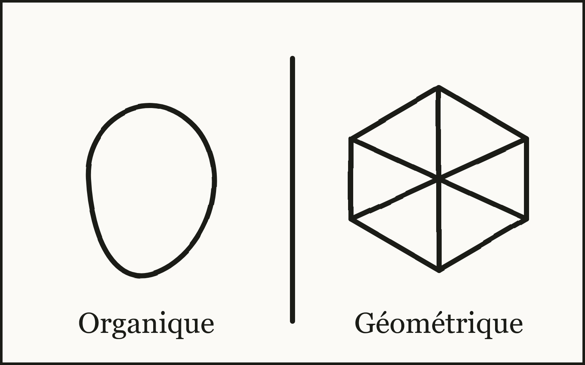

- Figuratif - Abstrait

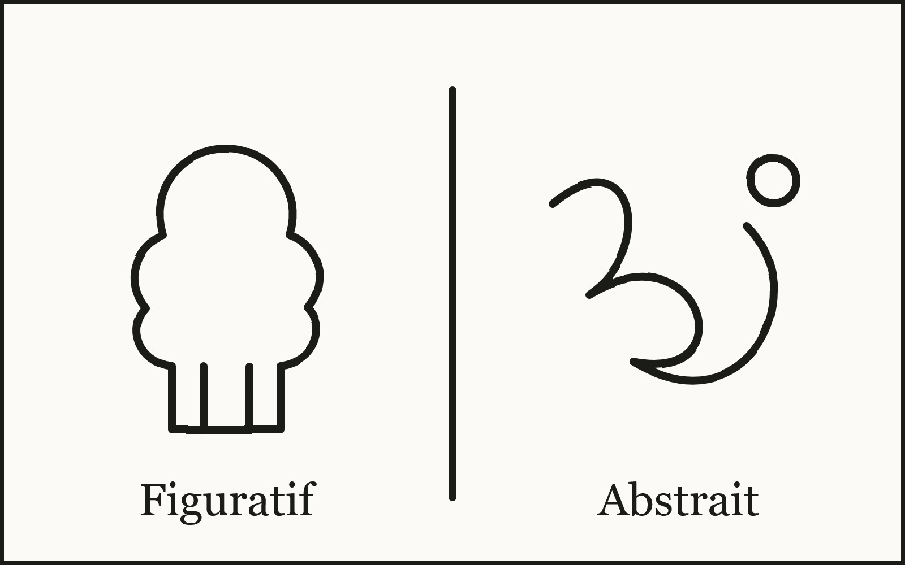

- Figure - Fond

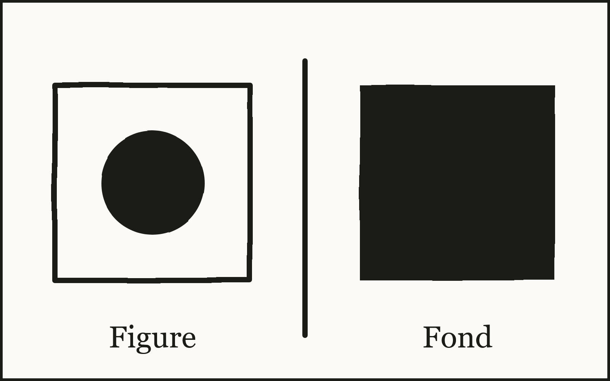

- Plein - Vide

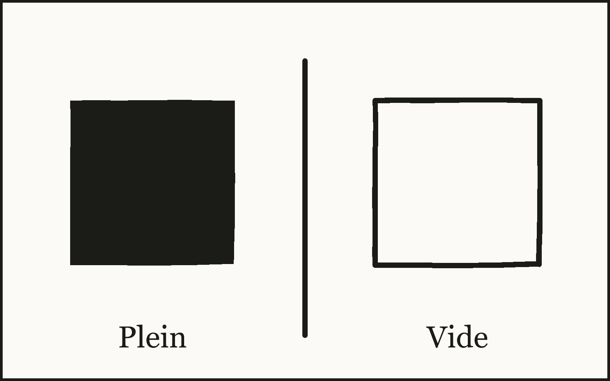

- Lisse - Rugueux

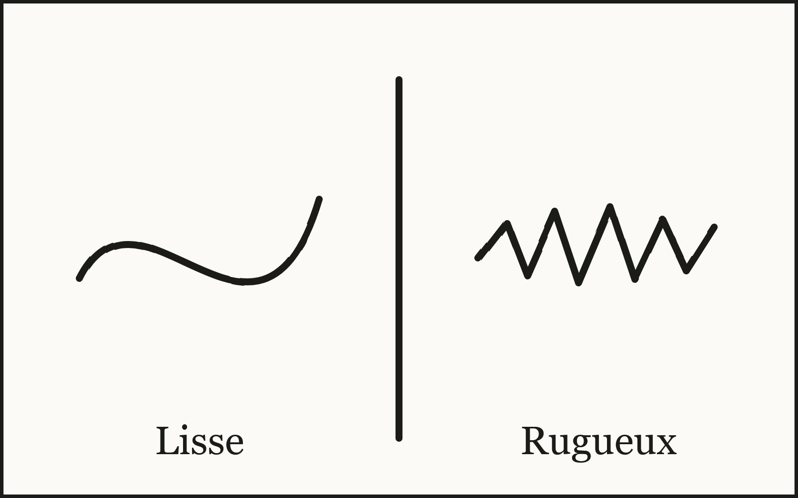

- Cadré - Débordant

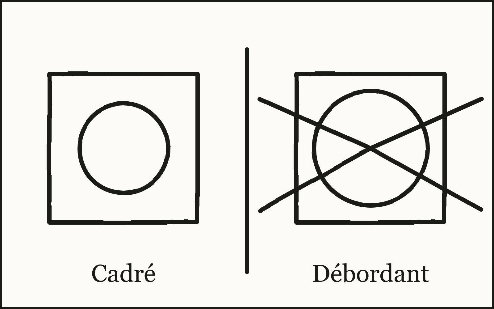

- Simple - Complexe

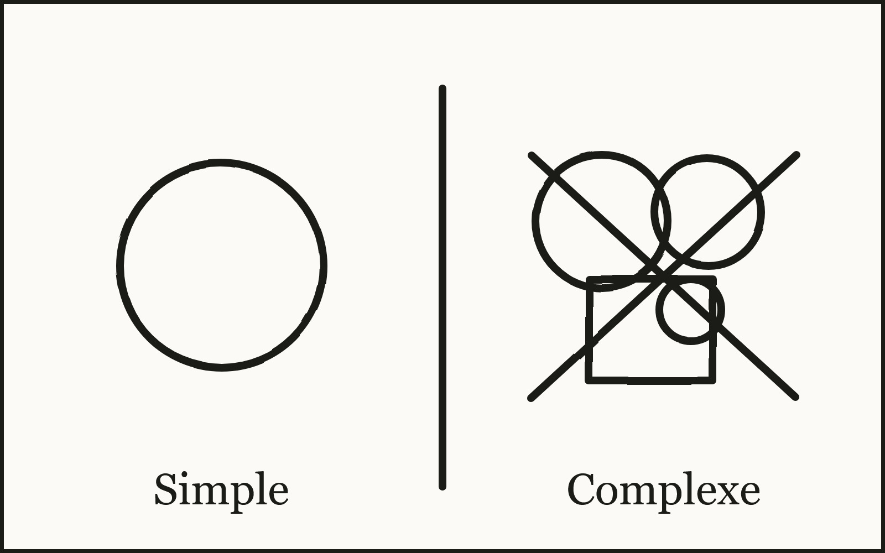

- Précis - Intuitif

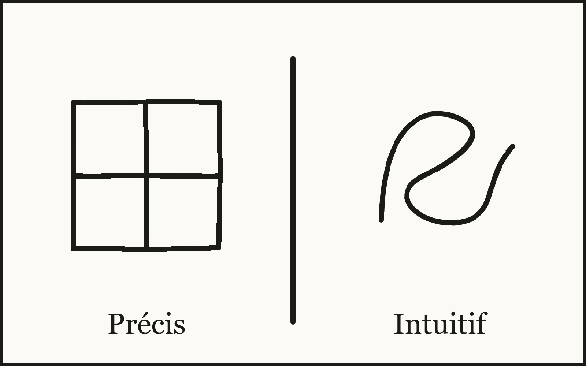

- Épais - Fin

- Profond - Plat

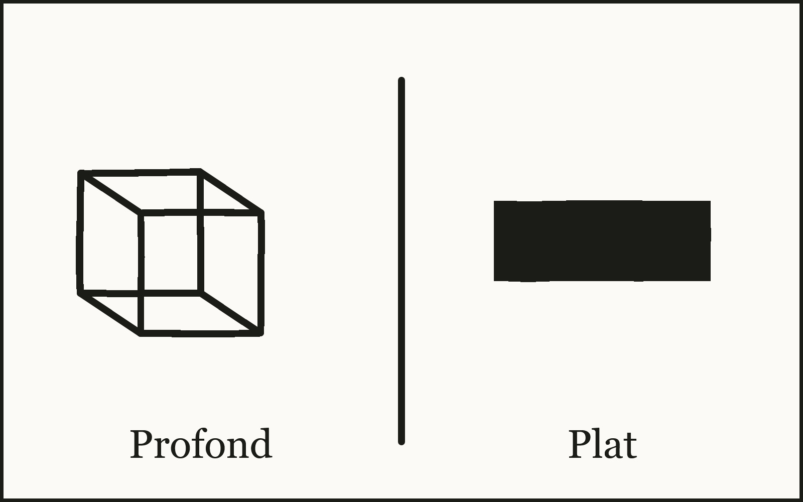

- Fragmenté - Unifié

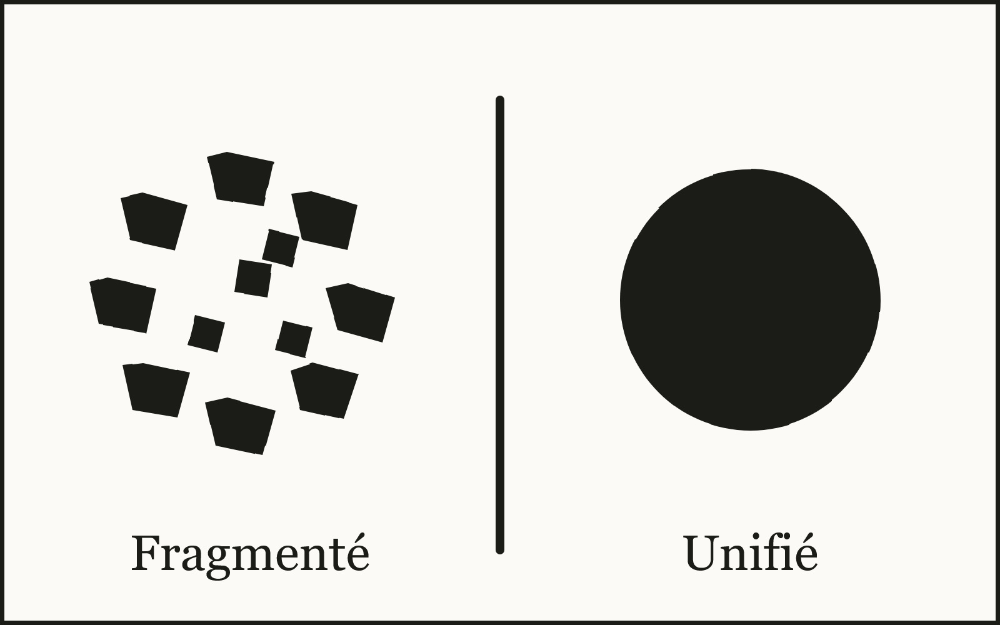

- Ouvert - Fermé

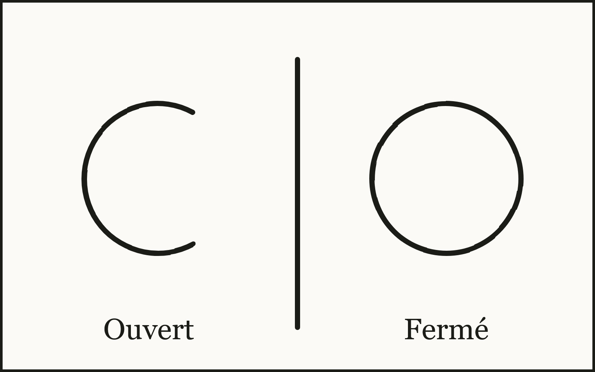

- Massif - Léger

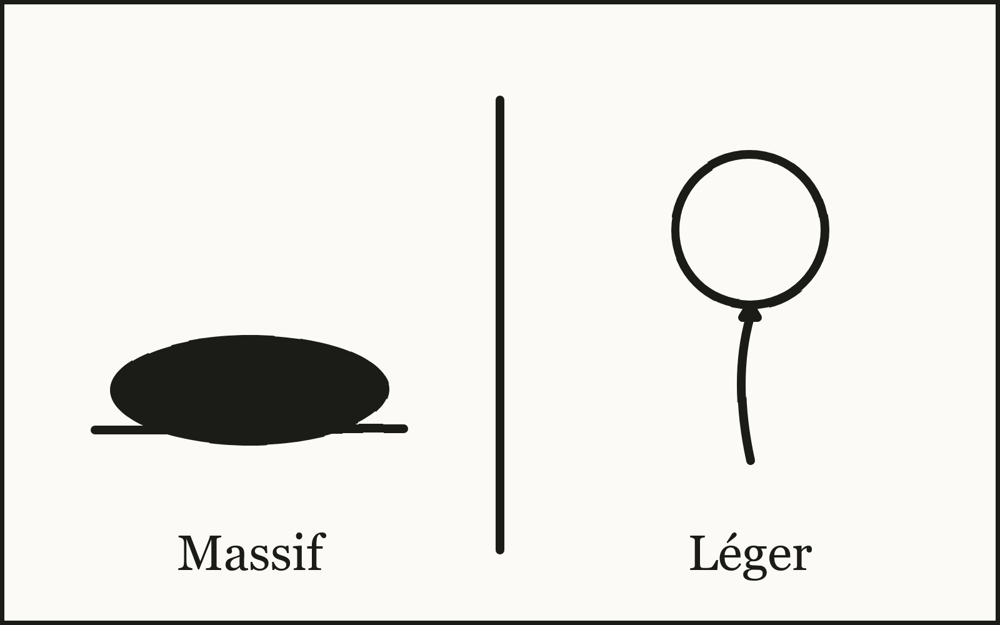

- Anguleux - Arrondi

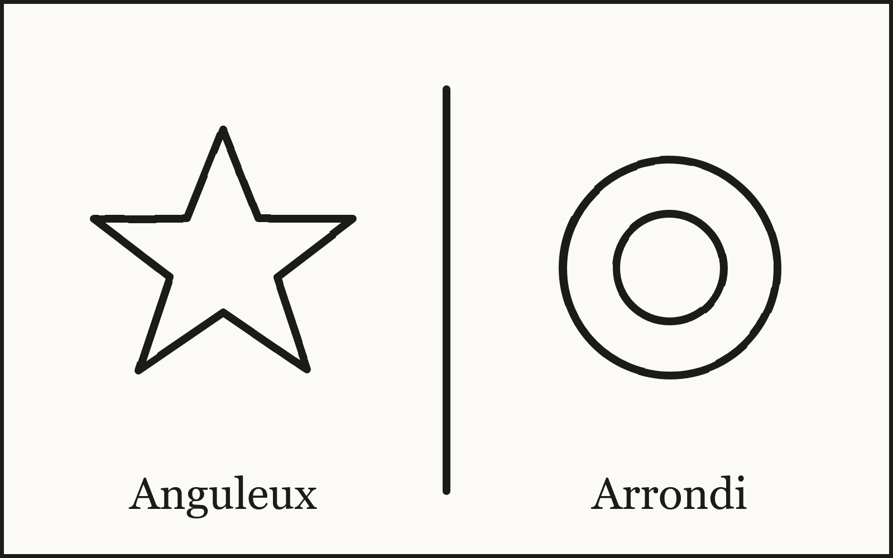

- Bidimensionnel - Tridimensionnel

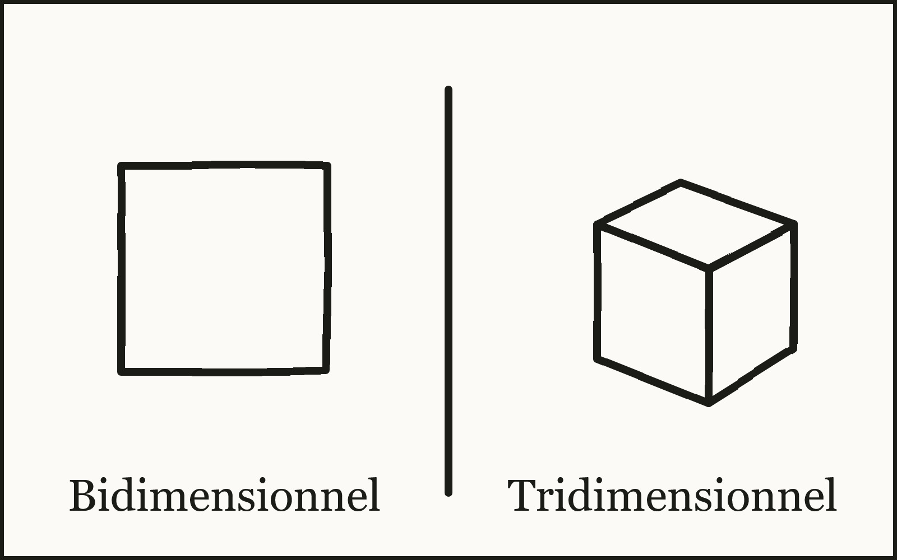

### Les Courants (suite)
[📑 Courants Artistiques](https://cmontmorency365-my.sharepoint.com/:p:/g/personal/dominic_roberts_cmontmorency_qc_ca/IQCUGzybNC7ORqsvXICL5x0xAVMt4fFIDUvmM6Yerb5JrHk?e=0jbY18)

### Atelier 1

En équipe de deux, trouvez deux oeuvres et lister au moins trois caractéristiques formelles ou esthétiques similaire. 

### Atelier 2

En équipe de deux, trouvez deux oeuvres et lister au moins trois caractéristiques formelles ou esthétiques qui les différencie. 

## Photoshop
### Notions : outils de typographie

[Image tirée de figma.com ](https://www.figma.com/resource-library/typography-anatomy/)

* [▶️ Les bases de la typographie](https://www.youtube.com/watch?v=7jmrsrRL6FA)  /  [📑 Powerpoint](https://cmontmorency365-my.sharepoint.com/:p:/g/personal/flpilote_cmontmorency_qc_ca/EdiVzwl-4CVPqGD9EM5Xe5IBgpcSI58BI6Dj8Vybwal3sg?e=ZBDYag)   
* [▶️ Installer une typographie](https://cmontmorency365-my.sharepoint.com/:v:/g/personal/flpilote_cmontmorency_qc_ca/EY9E_od0N_RAkXPuA25134QB1Md_l5bCWuzIIHh7N-I7fw?nav=eyJyZWZlcnJhbEluZm8iOnsicmVmZXJyYWxBcHAiOiJPbmVEcml2ZUZvckJ1c2luZXNzIiwicmVmZXJyYWxBcHBQbGF0Zm9ybSI6IldlYiIsInJlZmVycmFsTW9kZSI6InZpZXciLCJyZWZlcnJhbFZpZXciOiJNeUZpbGVzTGlua0NvcHkifX0&e=gXAay8)   
* [▶️ Formater du texte avec une typographie](https://cmontmorency365-my.sharepoint.com/:v:/g/personal/flpilote_cmontmorency_qc_ca/EcDOsZrLm2RLs9sElLYQaGkBTOMTfZS7uAs0s5ofUORH0A?nav=eyJyZWZlcnJhbEluZm8iOnsicmVmZXJyYWxBcHAiOiJPbmVEcml2ZUZvckJ1c2luZXNzIiwicmVmZXJyYWxBcHBQbGF0Zm9ybSI6IldlYiIsInJlZmVycmFsTW9kZSI6InZpZXciLCJyZWZlcnJhbFZpZXciOiJNeUZpbGVzTGlua0NvcHkifX0&e=c0BSza)   
* [▶️ Formater du texte sur un path](https://cmontmorency365-my.sharepoint.com/:v:/g/personal/flpilote_cmontmorency_qc_ca/EZPWW1J0wQBIsHyKJMhDY7wBbyCRmuQ_JYAJMfgcek0qFQ?nav=eyJyZWZlcnJhbEluZm8iOnsicmVmZXJyYWxBcHAiOiJPbmVEcml2ZUZvckJ1c2luZXNzIiwicmVmZXJyYWxBcHBQbGF0Zm9ybSI6IldlYiIsInJlZmVycmFsTW9kZSI6InZpZXciLCJyZWZlcnJhbFZpZXciOiJNeUZpbGVzTGlua0NvcHkifX0&e=1EPWSV)  
* [🌐 Banque de typographies](https://cmontmorency365-my.sharepoint.com/:f:/g/personal/flpilote_cmontmorency_qc_ca/EjI_vOcd3nNJoxX-YMvtzr0BvAJGrpnArev0RWH74MjVwQ?e=a4AuuF)  
* [🌐 Typographies Creative Cloud](https://fonts.adobe.com/)  
* [🌐 Awwward free font](https://www.awwwards.com/awwwards/collections/free-fonts/)   

  [🛠️ 15_Installer une typographie](./exercices_photoshop/15_Installer_une_typographie.md){ .md-button }       
  [🛠️ 15_Installer une typographie Adobe](./exercices_photoshop/15_Installer_une_typographie_Adobe.md){ .md-button }       
  [🛠️ 15_Formater du texte avec une typographie](./exercices_photoshop/15_Formater_du_texte_avec_une_typographie.md){ .md-button }       
  [🛠️ 15_Formater du texte sur un path](./exercices_photoshop/15_Formater_du_texte_sur_un_path.md){ .md-button }       

### Notions: outils de sélection
* [▶️ Outil de sélection rectangulaire](https://cmontmorency365-my.sharepoint.com/:v:/g/personal/flpilote_cmontmorency_qc_ca/EUIRW4pQSMpBtjKbTmMVQukBEivertajTWLyRGHdfiU5GA?nav=eyJyZWZlcnJhbEluZm8iOnsicmVmZXJyYWxBcHAiOiJPbmVEcml2ZUZvckJ1c2luZXNzIiwicmVmZXJyYWxBcHBQbGF0Zm9ybSI6IldlYiIsInJlZmVycmFsTW9kZSI6InZpZXciLCJyZWZlcnJhbFZpZXciOiJNeUZpbGVzTGlua0NvcHkifX0&e=tnT6zj)  
* [▶️ Outil de sélection elliptique (circulaire)](https://cmontmorency365-my.sharepoint.com/:v:/g/personal/flpilote_cmontmorency_qc_ca/EZd7q9svWmpBiU4DtveYlq8B7jew9aOFR7vlbAEC5c9Evg?nav=eyJyZWZlcnJhbEluZm8iOnsicmVmZXJyYWxBcHAiOiJPbmVEcml2ZUZvckJ1c2luZXNzIiwicmVmZXJyYWxBcHBQbGF0Zm9ybSI6IldlYiIsInJlZmVycmFsTW9kZSI6InZpZXciLCJyZWZlcnJhbFZpZXciOiJNeUZpbGVzTGlua0NvcHkifX0&e=0rhfqg)  
* [▶️ Outil lasso pour sélections libres](https://cmontmorency365-my.sharepoint.com/:v:/g/personal/flpilote_cmontmorency_qc_ca/EcpIxiMY4SpIjD-g9N90958BWt1JmWKD9XGZdHKmIrmW4A?nav=eyJyZWZlcnJhbEluZm8iOnsicmVmZXJyYWxBcHAiOiJPbmVEcml2ZUZvckJ1c2luZXNzIiwicmVmZXJyYWxBcHBQbGF0Zm9ybSI6IldlYiIsInJlZmVycmFsTW9kZSI6InZpZXciLCJyZWZlcnJhbFZpZXciOiJNeUZpbGVzTGlua0NvcHkifX0&e=37E5MN)     
  [🛠️ 08_Sélectionner grâce à l'outil circulaire](./exercices_photoshop/08_Sélectionner_grâce_à_l'outil_circulaire.md){ .md-button }   

## Le Moodboard
### Gabarit
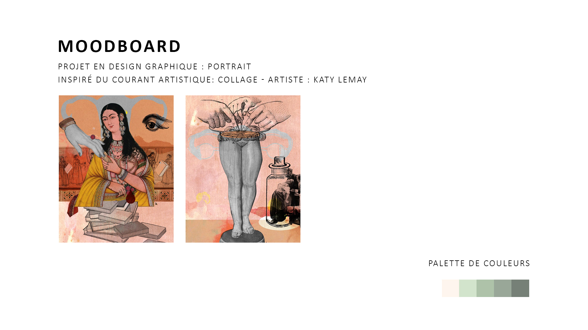

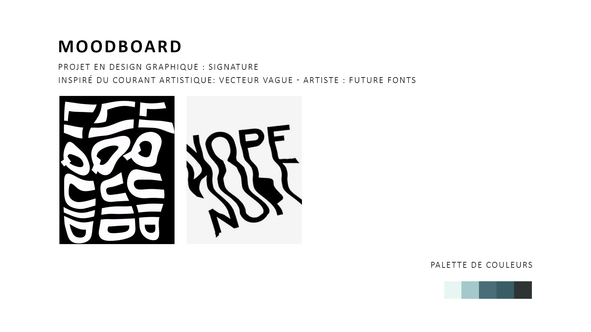

[Coolors.com](Coolors.com)

* Ouverture des Pinterest   

## Travail en classe
[📁 Projet 1/partie 1](./projets/projet01.md){ .md-button }    
* Travailler avec la grille et les règles 
* Travailler avec les alignements
* Faire des rectangles

## Devoir
[📁 Projet 1/partie 1](./projets/projet01.md){ .md-button }    

Faire [le devoir 1 / partie 1](https://cmontmorency365-my.sharepoint.com/:f:/g/personal/flpilote_cmontmorency_qc_ca/Ev3sg_u6lPhJrOXz_YBdIYMBXUVSAP7yQXQFNX5oDif8DQ?e=x3VgU0) suivant pour la semaine prochaine.

  
