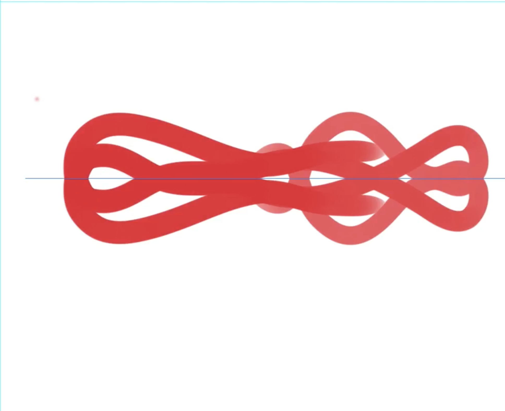

Le but de cet exercice est de recréer l'image suivante.

***

## Matériel

Télécharger et ouvrer le fichier suivant:
[📁 Document de départ](../assets/image/10_symetrie.png){ .md-button }    

## Étapes

- [ ] Sélectionner l'outil Pinceau (B).
- [ ] Aller dans la barre des options en haut et cliquer sur l'icône de papillon (Symétrie).
- [ ] Choisir un type de symétrie (verticale, horizontale, circulaire, etc.) dans le menu déroulant.
- [ ] Ajuster la ligne de symétrie sur votre document selon vos besoins.
- [ ] Aller dans le panneau des Paramètres de Pinceau (Fenêtre > Paramètres de Pinceau).
- [ ] Cocher l'option Dynamique de forme.
- [ ] Cocher Transfert et activer la variation de l’opacité basée sur la pression de la tablette.
- [ ] Dessiner avec votre tablette graphique en variant la pression pour ajuster l'opacité du pinceau tout en utilisant l'outil Symétrie.

***

## Tutoriel 📚

[📖 Pour en savoir plus](https://cmontmorency365-my.sharepoint.com/:v:/g/personal/flpilote_cmontmorency_qc_ca/EZiKTTn-Z9dHvvI5T-1GIMgBm_pILoS2DkEk1yslklws9w?nav=eyJyZWZlcnJhbEluZm8iOnsicmVmZXJyYWxBcHAiOiJPbmVEcml2ZUZvckJ1c2luZXNzIiwicmVmZXJyYWxBcHBQbGF0Zm9ybSI6IldlYiIsInJlZmVycmFsTW9kZSI6InZpZXciLCJyZWZlcnJhbFZpZXciOiJNeUZpbGVzTGlua0NvcHkifX0&e=7eD3WG){ .md-button }    
