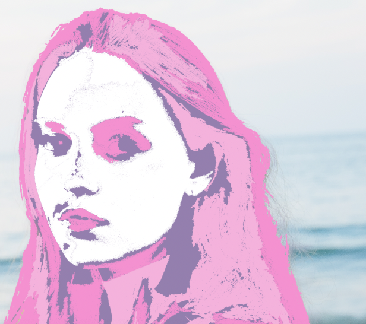

Le but de cet exercice est de peinturer une image grâce à un pot de peinture.

***

## Matériel

Téléchargez et ouvrez les fichiers suivants:

[📁 Document de départ_01](../assets/image/12_andy_visage_femme.jpg){ .md-button }    

## Étapes

- [ ] Sélectionner l'outil Pot de peinture (G).
- [ ] Remplir chaque zone sélectionnée avec une couleur distincte en cliquant dans les zones désirées.
- [ ] Continuer à peindre les différentes parties du visage avec des couleurs pop jusqu'à obtenir le résultat souhaité.
- [ ] Une fois satisfait, enregistrer le fichier.

***

## Tutoriel 📚

[📖 Pour en savoir plus](https://cmontmorency365-my.sharepoint.com/:v:/g/personal/flpilote_cmontmorency_qc_ca/EWX7DvXI8zJAo3tnzJWORoUBs5s1s5lqi3_KBjniY0LHjQ?nav=eyJyZWZlcnJhbEluZm8iOnsicmVmZXJyYWxBcHAiOiJPbmVEcml2ZUZvckJ1c2luZXNzIiwicmVmZXJyYWxBcHBQbGF0Zm9ybSI6IldlYiIsInJlZmVycmFsTW9kZSI6InZpZXciLCJyZWZlcnJhbFZpZXciOiJNeUZpbGVzTGlua0NvcHkifX0&e=f8aeS0){ .md-button }    
