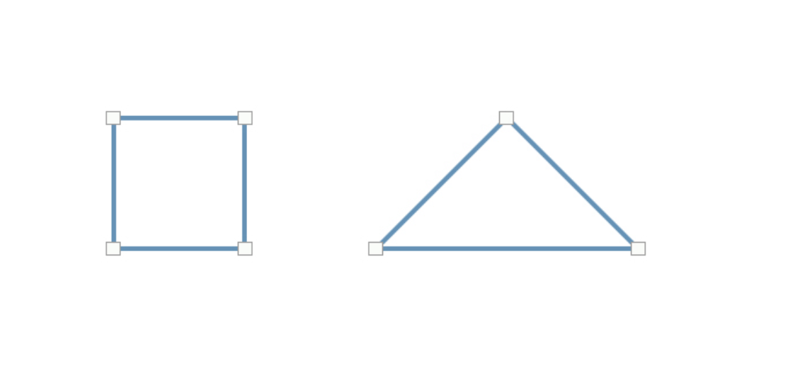

Le but de cet exercice est de recréer un carré et un triangle avec l'outil plume (P).

***

## Matériel

Télécharger et ouvrer les fichiers suivants:

[📁 Document de départ_01](../assets/image/14_vecteur_angle_droit.jpg){ .md-button }       

## Étapes

# Étapes à suivre :

- [ ] **Sélectionner l'outil Plume (P)** dans la barre d'outils.

### 1. Créer le Carré
- [ ] Cliquez quatre fois pour créer un carré, en maintenant **Shift** pour des lignes droites :
  - Premier point (coin supérieur gauche).
  - Deuxième point (coin supérieur droit, en maintenant **Shift**).
  - Troisième point (coin inférieur droit, en maintenant **Shift**).
  - Quatrième point (coin inférieur gauche).
- [ ] Cliquez sur le premier point pour fermer la forme.

### 2. Créer le Triangle
- [ ] Cliquez trois fois pour créer un triangle :
  - Premier point (coin inférieur gauche).
  - Deuxième point (coin inférieur droit, en maintenant **Shift**).
  - Troisième point (sommet du triangle en haut au centre).
- [ ] Cliquez sur le premier point pour fermer la forme.

### 3. Appliquer le Contour et la Couleur
- [ ] Sélectionner la forme (Ctrl+clic ou Cmd+clic sur le calque).
- [ ] Régler le **Contour** à **4 points**.
- [ ] Appliquer la couleur du contour : `#5791b9`.
- [ ] Définir le **Remplissage** sur **Aucun** (case blanche barrée de rouge).

### 4. Répéter pour le Triangle
- [ ] Répéter les mêmes étapes pour le triangle en ajustant le contour et la couleur.

## Tutoriel 📚

[📖 Pour en savoir plus](https://cmontmorency365-my.sharepoint.com/:v:/g/personal/dominic_roberts_cmontmorency_qc_ca/IQAZRzL5zyg_TqTpNY54ID4zAXga3FDEEiLktCfAq5YC6tI?nav=eyJyZWZlcnJhbEluZm8iOnsicmVmZXJyYWxBcHAiOiJPbmVEcml2ZUZvckJ1c2luZXNzIiwicmVmZXJyYWxBcHBQbGF0Zm9ybSI6IldlYiIsInJlZmVycmFsTW9kZSI6InZpZXciLCJyZWZlcnJhbFZpZXciOiJNeUZpbGVzTGlua0NvcHkifX0&e=IUDyCc){ .md-button }    
