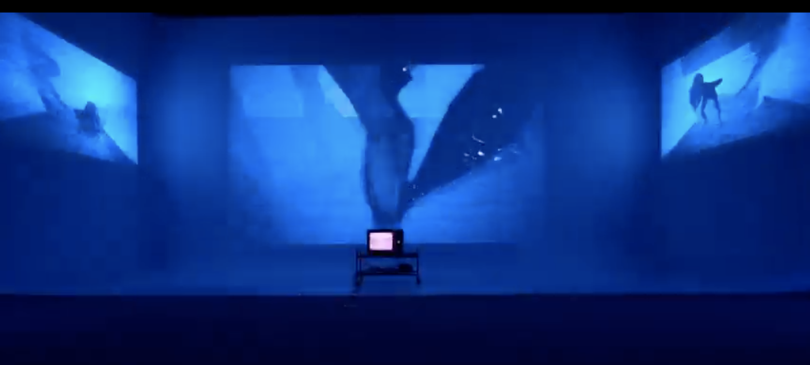

# Projet 2 : Installation Immersive et Vidéo Mosaïque - Partie 1 : la préproduction

> Le devis du TP est sujet à changement d'ici sa distribution officielle

## Consignes
Créer une expérience immersive en utilisant des éléments visuels et sonores pour raconter une histoire. Le travail est en équipe (4 personnes). 
Pour réaliser ce projet, nous vous suggerons les thèmes suivant :  

- Anomalie

- Passage

- Rupture

- Amalgamme 

Exemples:  
[Projets artistes ](https://cmontmorency365-my.sharepoint.com/:w:/g/personal/flpilote_cmontmorency_qc_ca/EdWLzr5Q0PdOnqxowv9_kBYBJzHbx4gT3zch9B2hIO3jzw?e=84Ld9o)

---

### Contraintes Techniques

#### **Installation Immersive**
Cette version combine trois écrans sur un cyclorama, une télévision au sol, des haut-parleurs et des lumières interactives pour une expérience narrative multisensorielle.

- **Éléments requis :**
  - **Trois écrans sur le cyclorama :**  
    Tournez des séquences originales pour les projeter de manière synchronisée sur les écrans. Intégrez des perspectives variées pour enrichir la narration.
  - **Télévision au sol :**  
    Présentez des vidéos complémentaires aux projections des écrans (gros plans, détails narratifs, angles alternatifs).
  - **Lumières interactives :**  
    Programmez des lumières pour réagir à la bande sonore et aux vidéos, amplifiant les moments clés de votre récit.
  - **Synchronisation audio-vidéo :**  
    Créez une bande sonore originale, et synchronisez-la avec vos séquences vidéo.

- **Critères de réussite pour la version Installation :**
  1. **Cohérence visuelle et sonore :** Tous les éléments (écrans, télévision, lumières, son) doivent fonctionner ensemble pour raconter une histoire immersive.

  2. **Synchronisation précise :** Les vidéos et le son doivent être parfaitement synchronisés pour maximiser l'impact narratif.

  3. **Interaction des lumières :** Les lumières doivent renforcer l’immersion en réagissant de manière cohérente avec les vidéos et le son.

### Consignes additionnelles 

- La vidéo doit durer environ cinq (5) minutes

## Le document (dans une présentation Powerpoint ou Canva) de préproduction doit comprendre :

- Le synopsis de votre vidéo.

- Un scénario ainsi qu'un scénarimage.

- Des croquis illustrant les positions ainsi que les mouvements de caméra et les cadrages.

- Des images de lieu de tournage ainsi qu'une liste d'accessoires ou meubles potentiels.

- Une liste complète du matériel nécessaire.

- La planification de la séance (durée estimée, horaire)

- La liste du matériel d'éclairage avec le type, la couleur et le nombre de sources lumineuses ainsi qu'un schéma avec la position des sources.