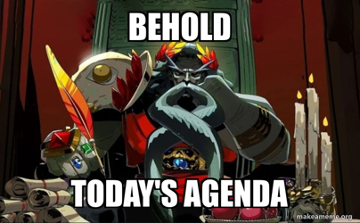

# Cours 4 - Montage, raccord, transitions et logiciel de montage

[📁 Plan de cours](https://cmontmorency365-my.sharepoint.com/:b:/g/personal/dominic_roberts_cmontmorency_qc_ca/IQC3M-UHBqpMSKpo0h5SywmFATJXHgk7OoHtBoQb_500pjY?e=W8n97j){ .md-button }    

<!--  -->

## Ordre du jour

- Le montage vidéo
- Type de coupe
- Type de raccords
- Davinci

<!-- En classe :  -->

## Le montage vidéo

Le montage vidéo est une pratique qui consiste à assembler des plans tournés dans un ordre logique et cohérent à une démarche artistique.
Autrefois exécuté sur les tables de montage, le montage s’exécute aujourd’hui généralement à l’aide d’un logiciel d’édition numérique. En ce qui nous concerne, nous allons utiliser le logiciel Première d’Adobe
Il est important de comprendre que les piste vidéos se chevauchent et que les pistes audio s’additionnent.

### La fonction du montage

Organiser (ou désorganiser) un récit
https://www.youtube.com/watch?v=5Jcm4Ukep7o
Amener du sens ou une idée (même là où il n’y en a pas) Effet Koulechov
https://www.youtube.com/watch?v=1qWlIYKeqPc
Le montage peut aussi avoir une fonction esthétique ou rythmique (comme dans un vidéoclip par exemple)

### Les types de montage

* Montage chronologique/non-chronologique

* Montage rapide

* Montage alterné/parallèle

* Le plan séquence (absence de coupe)

### Type de coupe

* Coupe franche – équivalent de trancher la pellicule avec une lame de rasoir. Cette coupe passe directement d’un photogramme à un autre.

* Plan de coupe (insert) – Coupe qui permet l’insertion d’un plan pour mettre l’emphase sur un détail ou pour faire diversion

* Jump cut – Coupe qui permet de faire un saut dans le temps

* Smash cut – Coupe qui fait ressortir le contraste entre deux plans

* Coupe invisible – Coupe qu’on ne remarque par (caché par un mouvement de caméra ou un objet placé devant la lentille)
https://www.youtube.com/watch?v=Op8KgCcoqn8

### Type de raccords

* Raccord de mouvement – transition du mouvement sur 2 plans

* Raccord de direction – même direction d’un objet/sujet

* Raccord de position – objets au même endroit dans le cadre

* Raccord auditif – transition basée sur un son entendu dans 2 plans

* Fondu - fondu sur couleur, fond enchaîné, etc.

* Balayage – horizontal ou vertical

* Forme – Iris, losange, étoile, etc.
https://www.youtube.com/watch?v=OAH0MoAv2CI

### Inspiration

[Vidéos d'inspiration](https://cmontmorency365-my.sharepoint.com/:f:/g/personal/dominic_roberts_cmontmorency_qc_ca/IgACoSyCcZwtTY4jE2JBg3xrARg9zAxGAPtBVTKyYqz2asM?e=T0bekh)

## Da Vinci

### La base

#### Problèmes récurrents
* [▶️ Da vinci ne démarre pas](https://cmontmorency365-my.sharepoint.com/:v:/g/personal/flpilote_cmontmorency_qc_ca/Edc8DZlqyYpGtlMv4nGarKMB-YhNINWUdcySlZIDBYFjmA?nav=eyJyZWZlcnJhbEluZm8iOnsicmVmZXJyYWxBcHAiOiJPbmVEcml2ZUZvckJ1c2luZXNzIiwicmVmZXJyYWxBcHBQbGF0Zm9ybSI6IldlYiIsInJlZmVycmFsTW9kZSI6InZpZXciLCJyZWZlcnJhbFZpZXciOiJNeUZpbGVzTGlua0NvcHkifX0&e=3R2X6v)

* [▶️ Fichier offline](https://cmontmorency365-my.sharepoint.com/:v:/g/personal/flpilote_cmontmorency_qc_ca/EW2J-fmP-iJOieDLP4yeCS8Bu1-XG1Jy802qdL2MB0Nz_A?nav=eyJyZWZlcnJhbEluZm8iOnsicmVmZXJyYWxBcHAiOiJPbmVEcml2ZUZvckJ1c2luZXNzIiwicmVmZXJyYWxBcHBQbGF0Zm9ybSI6IldlYiIsInJlZmVycmFsTW9kZSI6InZpZXciLCJyZWZlcnJhbFZpZXciOiJNeUZpbGVzTGlua0NvcHkifX0&e=Xro85z)

* [▶️ Waveform audio](https://cmontmorency365-my.sharepoint.com/:v:/g/personal/flpilote_cmontmorency_qc_ca/EWB4hNZoc9NHrO0yV381K24B1CCVcIS2kmUTJAQ_CApAvg?nav=eyJyZWZlcnJhbEluZm8iOnsicmVmZXJyYWxBcHAiOiJPbmVEcml2ZUZvckJ1c2luZXNzIiwicmVmZXJyYWxBcHBQbGF0Zm9ybSI6IldlYiIsInJlZmVycmFsTW9kZSI6InZpZXciLCJyZWZlcnJhbFZpZXciOiJNeUZpbGVzTGlua0NvcHkifX0&e=I0b2Od
)

* [▶️ Espace disque](https://cmontmorency365-my.sharepoint.com/:v:/g/personal/flpilote_cmontmorency_qc_ca/Eb8XpQnGDXFPoXNXPEzGxHsBFSNi0CnqFRFFOG-zW4u_Rw?nav=eyJyZWZlcnJhbEluZm8iOnsicmVmZXJyYWxBcHAiOiJPbmVEcml2ZUZvckJ1c2luZXNzIiwicmVmZXJyYWxBcHBQbGF0Zm9ybSI6IldlYiIsInJlZmVycmFsTW9kZSI6InZpZXciLCJyZWZlcnJhbFZpZXciOiJNeUZpbGVzTGlua0NvcHkifX0&e=ZQQ5Po)

* [▶️ Full screen window](https://cmontmorency365-my.sharepoint.com/:v:/g/personal/flpilote_cmontmorency_qc_ca/EZsEcO_ZyGBDuXvV5oj8rt8BbHiHjTT3mWoR6v3Zpi8FwA?nav=eyJyZWZlcnJhbEluZm8iOnsicmVmZXJyYWxBcHAiOiJPbmVEcml2ZUZvckJ1c2luZXNzIiwicmVmZXJyYWxBcHBQbGF0Zm9ybSI6IldlYiIsInJlZmVycmFsTW9kZSI6InZpZXciLCJyZWZlcnJhbFZpZXciOiJNeUZpbGVzTGlua0NvcHkifX0&e=Jou1RD)

#### Notions: la base sur la vidéo

* [📑 Notions de base sur la vidéo](https://cmontmorency365-my.sharepoint.com/:p:/g/personal/flpilote_cmontmorency_qc_ca/EcBqBM3-BDVMkUkaBlcHtZEBP-BVzWQBfZb-4mQt8ZEm4A?e=VdaTsS)

* [▶️ Images par seconde (fps)](https://cmontmorency365-my.sharepoint.com/:v:/g/personal/flpilote_cmontmorency_qc_ca/EYu_BgcpGjNIta_c1cCdTRABQyFr-2t7FwjqaWhc--ClPQ?nav=eyJyZWZlcnJhbEluZm8iOnsicmVmZXJyYWxBcHAiOiJPbmVEcml2ZUZvckJ1c2luZXNzIiwicmVmZXJyYWxBcHBQbGF0Zm9ybSI6IldlYiIsInJlZmVycmFsTW9kZSI6InZpZXciLCJyZWZlcnJhbFZpZXciOiJNeUZpbGVzTGlua0NvcHkifX0&e=QIzqe4)

* [▶️ Progressif vs Interlacé](https://cmontmorency365-my.sharepoint.com/:v:/g/personal/flpilote_cmontmorency_qc_ca/EU9BzudwcH9Hgh61xbWYPgIBMPZcfGn3ZCGY4VpcE7POtg?nav=eyJyZWZlcnJhbEluZm8iOnsicmVmZXJyYWxBcHAiOiJPbmVEcml2ZUZvckJ1c2luZXNzIiwicmVmZXJyYWxBcHBQbGF0Zm9ybSI6IldlYiIsInJlZmVycmFsTW9kZSI6InZpZXciLCJyZWZlcnJhbFZpZXciOiJNeUZpbGVzTGlua0NvcHkifX0&e=UTTD2E)

* [▶️ Résolution](https://cmontmorency365-my.sharepoint.com/:v:/g/personal/flpilote_cmontmorency_qc_ca/EeaVH-yC7vVEpS3tEGPToIYBafNfn-5anli52Ba7rGCCTQ?nav=eyJyZWZlcnJhbEluZm8iOnsicmVmZXJyYWxBcHAiOiJPbmVEcml2ZUZvckJ1c2luZXNzIiwicmVmZXJyYWxBcHBQbGF0Zm9ybSI6IldlYiIsInJlZmVycmFsTW9kZSI6InZpZXciLCJyZWZlcnJhbFZpZXciOiJNeUZpbGVzTGlua0NvcHkifX0&e=WO7mx5)

* [▶️ Codecs](https://cmontmorency365-my.sharepoint.com/:v:/g/personal/flpilote_cmontmorency_qc_ca/ERj6prqbarJLqjXswYaDkCIBECP3q24cuzQ74biUsfHz6Q?nav=eyJyZWZlcnJhbEluZm8iOnsicmVmZXJyYWxBcHAiOiJPbmVEcml2ZUZvckJ1c2luZXNzIiwicmVmZXJyYWxBcHBQbGF0Zm9ybSI6IldlYiIsInJlZmVycmFsTW9kZSI6InZpZXciLCJyZWZlcnJhbFZpZXciOiJNeUZpbGVzTGlua0NvcHkifX0&e=sxDWqD)

### Les étapes de montage

- Création de la base de données

- Configuration du projet

- Importation des médias

- Ajout à la timeline, coupe et ajustements

- Ajout de la musique

- Rendu

### Le Générique

#### Options pour le générique au départ

Habituellement, on présente le titre du film, les chefs de département et les acteurs principaux sur des cartons dans le générique de début. Le pré-générique n'est pas obligatoire. Cependant, si vous n'avez pas de générique de début, vous devez inclure les informations nécessaires dans le générique de fin (Lavoie-Pilote, 2023).

Voici les options pour le générique de début :

- **Option 1** : Le film commence sans indication. Les informations du générique se retrouveront à la fin du film.

- **Option 2** : Carton 1 - Titre du film et le reste à la fin.

- **Option 3** : Carton 1 - Titre du film, Carton 2 - Comédiens (par ordre d'apparition), Carton 3 - Réalisateur, Carton 4 - Directeur de la photographie, Carton 5 - Directeur artistique et on répète à la fin.

#### Le nom des intervenants dans le générique de fin

Présenter les différents postes sur différents cartons (ne pas présenter s'il n'y avait pas de rôles). Attention, ne pas faire un générique défilant.

- Titre du film (si non mentionné dans le générique de début)

- Comédiens (par ordre d'apparition)

- Scénariste

- Réalisateur

- Assistant réalisateur

- Script (prise de notes lors du tournage)

- Producteur

- Directeur de production

- Directeur de la photographie

- Photographe de plateau

- Assistant de production

- Directeur artistique

- Accessoiriste

- Chef costumier

- Maquilleur / coiffeur

- Preneur de son

- Monteur

- Étalonneur

- Graphiste

- Superviseur des effets visuels

- Compositeur

- Montage sonore

#### Les normes de générique au département

Au département, nous avons une norme particulière pour le générique. Ce dernier doit être organisé de la manière suivante :

1. Nom des intervenants

2. Sources

3. Encadrement

4. Remerciements

5. Logo TIM

## Commencer un projet
* [▶️ Disque dur (Mac et PC, formaté en exFAT)](https://cmontmorency365-my.sharepoint.com/:f:/g/personal/flpilote_cmontmorency_qc_ca/EkkmPlf02DFPksOLkJ3dn3MBPTo2pHYwE3LKOhTQV3OyzQ?e=KKUKa0)

* [▶️ Nomenclature](https://cmontmorency365-my.sharepoint.com/:v:/g/personal/flpilote_cmontmorency_qc_ca/EeVA3XWXEnxHnvPZ2RZxBPUBAH0C6pS_xcWQw0P4Nl4zrg?nav=eyJyZWZlcnJhbEluZm8iOnsicmVmZXJyYWxBcHAiOiJPbmVEcml2ZUZvckJ1c2luZXNzIiwicmVmZXJyYWxBcHBQbGF0Zm9ybSI6IldlYiIsInJlZmVycmFsTW9kZSI6InZpZXciLCJyZWZlcnJhbFZpZXciOiJNeUZpbGVzTGlua0NvcHkifX0&e=16LvMg)

* [📁 Nomenclature à télécharger](https://cmontmorency365-my.sharepoint.com/:f:/g/personal/flpilote_cmontmorency_qc_ca/Egxvu2I7VNZDvAxg55EcdwwBvyNQVrcsSEwzqSNguUPo7Q?e=JvgeIF)

### Création d'une base de données

#### Étapes

- Nous allons commencer par créer un dossier de travail utilisant un modèle.

- Nous allons placer ce dossier à la racine de notre disque de travail (portable pour vous).

- Nous allons maintenant ouvrir DaVinci.

- On ne delete pas la Local Database.

- On va se créer une database personnalisée en cliquant sur Add Project Library. On utilise la nomenclature `database_prenom` puis on va chercher le dossier correspondant dans le dossier de travail créé précédemment.

- On peut maintenant créer des projets qui seront liés à cette database.

#### Capsules
* [▶️ Création d'une database](https://cmontmorency365-my.sharepoint.com/:v:/g/personal/flpilote_cmontmorency_qc_ca/EQ6vYlV3pbBGmQgLuJxCyOcBi_Vwy7V8nnOAPGU85vXJjA?nav=eyJyZWZlcnJhbEluZm8iOnsicmVmZXJyYWxBcHAiOiJPbmVEcml2ZUZvckJ1c2luZXNzIiwicmVmZXJyYWxBcHBQbGF0Zm9ybSI6IldlYiIsInJlZmVycmFsTW9kZSI6InZpZXciLCJyZWZlcnJhbFZpZXciOiJNeUZpbGVzTGlua0NvcHkifX0&e=piKS4A)

* [▶️ Connexion et déconnexion d'une database](https://cmontmorency365-my.sharepoint.com/:v:/g/personal/flpilote_cmontmorency_qc_ca/EbVLIEr3IRdCngno0RspJlQBasMLk89GuZF6Mb6ZUThn8Q?nav=eyJyZWZlcnJhbEluZm8iOnsicmVmZXJyYWxBcHAiOiJPbmVEcml2ZUZvckJ1c2luZXNzIiwicmVmZXJyYWxBcHBQbGF0Zm9ybSI6IldlYiIsInJlZmVycmFsTW9kZSI6InZpZXciLCJyZWZlcnJhbFZpZXciOiJNeUZpbGVzTGlua0NvcHkifX0&e=akxfaN)

* [▶️ Exportation et importation de projets (.drp)](https://cmontmorency365-my.sharepoint.com/:v:/g/personal/flpilote_cmontmorency_qc_ca/EQJ0wbbQv5RNh2o2M_P5IccB-iwg-GhAL079zBIkR3SZ8g?nav=eyJyZWZlcnJhbEluZm8iOnsicmVmZXJyYWxBcHAiOiJPbmVEcml2ZUZvckJ1c2luZXNzIiwicmVmZXJyYWxBcHBQbGF0Zm9ybSI6IldlYiIsInJlZmVycmFsTW9kZSI6InZpZXciLCJyZWZlcnJhbFZpZXciOiJNeUZpbGVzTGlua0NvcHkifX0&e=fFry27)

#### Exercices
* 🛠️ **Création de la database** : Configurer une nouvelle base de données pour organiser et gérer les fichiers de projet de manière efficace.
 

### Connexion/déconnexion à la base de données

- Il est vraiment important de prendre le temps de toujours déconnecter notre database avant de débrancher le disque dur.

- Pour y arriver, on clique droit sur la database puis Remove.

- Pour se connecter à nouveau à la database, il suffit d'aller encore une fois sur Add Project Library puis dans l'onglet Connect et finalement de retrouver son dossier (attention, il est vraiment important de sélectionner le dossier `database_nom` et non un sous-dossier).

### Paramètres du projet

Pour aller régler les paramètres du projet, nous allons aller dans File > Project Settings. Nous allons ensuite changer les paramètres suivants :

- Timeline Resolution : 1920 x 1080 HD

- Timeline frame rate : 30

Puis dans la section Optimized Media and Render Cache :

- Proxy media format : DNxHR SQ

- Optimized media format : DNxHR SQ

- Render cache format : DNxHR SQ

<!-- ### Notions: les settings de davinci
* [▶️ Paramètres du projet](https://cmontmorency365-my.sharepoint.com/:v:/g/personal/flpilote_cmontmorency_qc_ca/EbydqyrRFvNNkNaQBvrkY7IB2M5MMLn8D5E0rqz4B5cO4w?nav=eyJyZWZlcnJhbEluZm8iOnsicmVmZXJyYWxBcHAiOiJPbmVEcml2ZUZvckJ1c2luZXNzIiwicmVmZXJyYWxBcHBQbGF0Zm9ybSI6IldlYiIsInJlZmVycmFsTW9kZSI6InZpZXciLCJyZWZlcnJhbFZpZXciOiJNeUZpbGVzTGlua0NvcHkifX0&e=I0ugbJ)
* Résolution : 1920 x 1080
* Fréquence d’images : 23,976 fps
* Cache et préférences de stockage
* [▶️ Réglages des préférences](https://cmontmorency365-my.sharepoint.com/:v:/g/personal/flpilote_cmontmorency_qc_ca/EWuNLoTg2zhNnTSmYmd2hxwBGzT-gt21y7SSo11xxs3wjA?nav=eyJyZWZlcnJhbEluZm8iOnsicmVmZXJyYWxBcHAiOiJPbmVEcml2ZUZvckJ1c2luZXNzIiwicmVmZXJyYWxBcHBQbGF0Zm9ybSI6IldlYiIsInJlZmVycmFsTW9kZSI6InZpZXciLCJyZWZlcnJhbFZpZXciOiJNeUZpbGVzTGlua0NvcHkifX0&e=GA7c4n)
* Mémoire
* CUDA (NVIDIA) vs OpenCL (AMD, Intel)
* Ajout de disques
* Langue et utilisateur
* Son

* 🛠️ **Configuration des réglages** : Ajuster les paramètres et préférences selon les besoins du projet.
  -->

### Configuration des dossiers de cache

Pour associer un dossier de notre base de données au projet, il sera important d'avoir le chemin d'accès au dossier cache de notre dossier de travail. Ensuite, nous allons l'associer aux éléments suivants :

- Proxy generation location : associer à notre dossier cache du dossier de travail

- Cache files location : associer à notre dossier cache du dossier de travail

- Gallery stills location : associer à notre dossier cache du dossier de travail

Finalement, nous allons aller dans l'onglet Capture and Playback puis changer :

- Save clips to : associer à notre dossier cache du dossier de travail

### Attention

> Ce processus est à refaire pour chaque projet.

## L'interface de Da Vinci

* [▶️ Présentation des différents onglets de Davinci ](https://cmontmorency365-my.sharepoint.com/:v:/g/personal/flpilote_cmontmorency_qc_ca/EROcXiTqDIhCon7AopZhYQ4BkoB8HJSEha37J4jESD_7oA?nav=eyJyZWZlcnJhbEluZm8iOnsicmVmZXJyYWxBcHAiOiJPbmVEcml2ZUZvckJ1c2luZXNzIiwicmVmZXJyYWxBcHBQbGF0Zm9ybSI6IldlYiIsInJlZmVycmFsTW9kZSI6InZpZXciLCJyZWZlcnJhbFZpZXciOiJNeUZpbGVzTGlua0NvcHkifX0&e=yqhvGy)

### Importation et gestion des médias

#### Capsules

* [▶️ Importation de médias](https://cmontmorency365-my.sharepoint.com/:v:/g/personal/flpilote_cmontmorency_qc_ca/ETHBrkb-lF5Jk20s5KzusgMBMke6CZWQ3zWziWYjJXFyng?nav=eyJyZWZlcnJhbEluZm8iOnsicmVmZXJyYWxBcHAiOiJPbmVEcml2ZUZvckJ1c2luZXNzIiwicmVmZXJyYWxBcHBQbGF0Zm9ybSI6IldlYiIsInJlZmVycmFsTW9kZSI6InZpZXciLCJyZWZlcnJhbFZpZXciOiJNeUZpbGVzTGlua0NvcHkifX0&e=c7wycm)

* [▶️ Importation jpg, png, psd](https://cmontmorency365-my.sharepoint.com/:v:/g/personal/flpilote_cmontmorency_qc_ca/EfhqIzbKcUBNvywAbpwLgjQBLgJB9UsXeo_EWYIDuc3l2g?nav=eyJyZWZlcnJhbEluZm8iOnsicmVmZXJyYWxBcHAiOiJPbmVEcml2ZUZvckJ1c2luZXNzIiwicmVmZXJyYWxBcHBQbGF0Zm9ybSI6IldlYiIsInJlZmVycmFsTW9kZSI6InZpZXciLCJyZWZlcnJhbFZpZXciOiJNeUZpbGVzTGlua0NvcHkifX0&e=Kefr8a)

* [▶️ Organisation du chutier](https://cmontmorency365-my.sharepoint.com/:v:/g/personal/flpilote_cmontmorency_qc_ca/EQxK2gc50IBErGjv7uMOMt4BcdTCre62y6ZHD6SAUQkkZA?nav=eyJyZWZlcnJhbEluZm8iOnsicmVmZXJyYWxBcHAiOiJPbmVEcml2ZUZvckJ1c2luZXNzIiwicmVmZXJyYWxBcHBQbGF0Zm9ybSI6IldlYiIsInJlZmVycmFsTW9kZSI6InZpZXciLCJyZWZlcnJhbFZpZXciOiJNeUZpbGVzTGlua0NvcHkifX0&e=yLkAvd)

#### Exercice

* 🛠️ **Importation des clips** : Ajouter les clips nécessaires [dans le projet](https://cmontmorency365-my.sharepoint.com/:f:/g/personal/flpilote_cmontmorency_qc_ca/Eqnaaga_vtdDl9fO4blZMkYBhN1njz7nQtMhFukF-n0TYA?e=47agVn).  

### L'onglet montage

#### Capsules

* [▶️ Création d'un timeline](https://cmontmorency365-my.sharepoint.com/:v:/g/personal/flpilote_cmontmorency_qc_ca/EW0qYkLbAMNAu6i8EwxClcYBW9zMJnLTDJXER8sMKPoiOA?nav=eyJyZWZlcnJhbEluZm8iOnsicmVmZXJyYWxBcHAiOiJPbmVEcml2ZUZvckJ1c2luZXNzIiwicmVmZXJyYWxBcHBQbGF0Zm9ybSI6IldlYiIsInJlZmVycmFsTW9kZSI6InZpZXciLCJyZWZlcnJhbFZpZXciOiJNeUZpbGVzTGlua0NvcHkifX0&e=GOX0og)

* [▶️ Présentation générale de l'onglet montage](https://cmontmorency365-my.sharepoint.com/:v:/g/personal/flpilote_cmontmorency_qc_ca/EZs7YWt7rRpHuanRkNkT53UB5cNBe11p1rU5-Xqi0djMGw?nav=eyJyZWZlcnJhbEluZm8iOnsicmVmZXJyYWxBcHAiOiJPbmVEcml2ZUZvckJ1c2luZXNzIiwicmVmZXJyYWxBcHBQbGF0Zm9ybSI6IldlYiIsInJlZmVycmFsTW9kZSI6InZpZXciLCJyZWZlcnJhbFZpZXciOiJNeUZpbGVzTGlua0NvcHkifX0&e=45smcv)

* [▶️ Présentation de la fenêtre de visionnement et de la fenêtre de montage](https://cmontmorency365-my.sharepoint.com/:v:/g/personal/flpilote_cmontmorency_qc_ca/ESRNqSnOL65GhniwhoRG-w8BOWkrGMWQii1xUAnBh3ev7Q?nav=eyJyZWZlcnJhbEluZm8iOnsicmVmZXJyYWxBcHAiOiJPbmVEcml2ZUZvckJ1c2luZXNzIiwicmVmZXJyYWxBcHBQbGF0Zm9ybSI6IldlYiIsInJlZmVycmFsTW9kZSI6InZpZXciLCJyZWZlcnJhbFZpZXciOiJNeUZpbGVzTGlua0NvcHkifX0&e=LwhmWB)

* [▶️ Création des pistes dans le timeline](https://cmontmorency365-my.sharepoint.com/:v:/g/personal/flpilote_cmontmorency_qc_ca/EWrpQdSULDhNuyQGqvRmrC4BnAWw0YoipOAkCVgiBYq0Sw?nav=eyJyZWZlcnJhbEluZm8iOnsicmVmZXJyYWxBcHAiOiJPbmVEcml2ZUZvckJ1c2luZXNzIiwicmVmZXJyYWxBcHBQbGF0Zm9ybSI6IldlYiIsInJlZmVycmFsTW9kZSI6InZpZXciLCJyZWZlcnJhbFZpZXciOiJNeUZpbGVzTGlua0NvcHkifX0&e=vvmlPd) / [Organisation des pistes sonores](https://cmontmorency365-my.sharepoint.com/:p:/g/personal/flpilote_cmontmorency_qc_ca/EQvzdX1_LGhFmHkGv0k-WVkB7rHpALBZgIeHF74vcgXkXw?e=Gkaj4c)

* [▶️ Présentation du timeline](https://cmontmorency365-my.sharepoint.com/:v:/g/personal/flpilote_cmontmorency_qc_ca/EZ1qkeiCxgBJkcF8f9wHFTEB4fbFQKTsVIEjBBPwVbkHwA?nav=eyJyZWZlcnJhbEluZm8iOnsicmVmZXJyYWxBcHAiOiJPbmVEcml2ZUZvckJ1c2luZXNzIiwicmVmZXJyYWxBcHBQbGF0Zm9ybSI6IldlYiIsInJlZmVycmFsTW9kZSI6InZpZXciLCJyZWZlcnJhbFZpZXciOiJNeUZpbGVzTGlua0NvcHkifX0&e=ZsHfF9)

#### Exercice

* 🛠️ **Création d'une timeline** : Configurer une timeline en définissant les paramètres tels que la résolution, le format d'image, la fréquence d'images, et organiser les pistes pour le montage.  

### Le montage vidéo

#### Capsules

* [▶️ Écraser, remplacer](https://cmontmorency365-my.sharepoint.com/:v:/g/personal/flpilote_cmontmorency_qc_ca/EUrF-tOJ0JBIta4i9wpJ0zcBbwRgya5dXBRhndufKO5UNA?nav=eyJyZWZlcnJhbEluZm8iOnsicmVmZXJyYWxBcHAiOiJPbmVEcml2ZUZvckJ1c2luZXNzIiwicmVmZXJyYWxBcHBQbGF0Zm9ybSI6IldlYiIsInJlZmVycmFsTW9kZSI6InZpZXciLCJyZWZlcnJhbFZpZXciOiJNeUZpbGVzTGlua0NvcHkifX0&e=Ch80HR)

* [▶️ Outil d'édition : sélection, trim, lame (A, B, T)](https://cmontmorency365-my.sharepoint.com/:v:/g/personal/flpilote_cmontmorency_qc_ca/EX6L4KLM8ExBn6zC5EA68BsBt8Re7IpouE72j898a9JfUQ?nav=eyJyZWZlcnJhbEluZm8iOnsicmVmZXJyYWxBcHAiOiJPbmVEcml2ZUZvckJ1c2luZXNzIiwicmVmZXJyYWxBcHBQbGF0Zm9ybSI6IldlYiIsInJlZmVycmFsTW9kZSI6InZpZXciLCJyZWZlcnJhbFZpZXciOiJNeUZpbGVzTGlua0NvcHkifX0&e=VXLcOU)

* [▶️ Sélection de clips avant et après la tête de lecture (Alt+Y, Ctrl+Alt+Y)](https://cmontmorency365-my.sharepoint.com/:v:/g/personal/flpilote_cmontmorency_qc_ca/EQxqDPfGp_pJgtvbv8yLtfwBoB-BJJWE3_wn8S9cO1fCeQ?nav=eyJyZWZlcnJhbEluZm8iOnsicmVmZXJyYWxBcHAiOiJPbmVEcml2ZUZvckJ1c2luZXNzIiwicmVmZXJyYWxBcHBQbGF0Zm9ybSI6IldlYiIsInJlZmVycmFsTW9kZSI6InZpZXciLCJyZWZlcnJhbFZpZXciOiJNeUZpbGVzTGlua0NvcHkifX0&e=UsPOUd)

#### Exercices

* 🛠️ **Utilisation des outils** : Travailler avec les outils Sélection, Trim, et Lame (A, B, T) pour manipuler les clips :
  * A : Sélectionner et déplacer les clips dans la timeline.
  * B : Découper les clips avec précision à l'aide de l'outil lame.
  * T : Ajuster les points d'entrée et de sortie des clips avec l'outil trim.
* 🛠️ **Utilisation de l'outil Trim** : Glissez le clip 10678415-uhd_4096_2160_25fps.mp4 à l'intérieur de sa zone dans la timeline pour ajuster son contenu tout en conservant sa durée et sa position initiales.
* 🛠️ **Sélection de clips** avec la tête de lecture :
  * Alt+Y : Sélectionner tous les clips après la tête de lecture.
  * Ctrl+Alt+Y : Sélectionner tous les clips avant la tête de lecture.

#### L'inspecteur

* [▶️ Utilisation de l'inspecteur 1](https://cmontmorency365-my.sharepoint.com/:v:/r/personal/flpilote_cmontmorency_qc_ca/Documents/01_cours/01_college/cours_video/_capsules_montage/_capsules_da_vinci/01_capsules_da_vinci/01_da_vinci_de_base/16_montage_video/04_onglet_montage_inspecteur_1.mp4?csf=1&web=1&nav=eyJyZWZlcnJhbEluZm8iOnsicmVmZXJyYWxBcHAiOiJPbmVEcml2ZUZvckJ1c2luZXNzIiwicmVmZXJyYWxBcHBQbGF0Zm9ybSI6IldlYiIsInJlZmVycmFsTW9kZSI6InZpZXciLCJyZWZlcnJhbFZpZXciOiJNeUZpbGVzTGlua0NvcHkifX0&e=rN6LMZ)

* [▶️ Utilisation de l'inspecteur 2](https://cmontmorency365-my.sharepoint.com/:v:/g/personal/flpilote_cmontmorency_qc_ca/Ed1bZq74SjtCtb-SpS5RDFEBR5TBonsT9DAi2KvzTG9pYw?nav=eyJyZWZlcnJhbEluZm8iOnsicmVmZXJyYWxBcHAiOiJPbmVEcml2ZUZvckJ1c2luZXNzIiwicmVmZXJyYWxBcHBQbGF0Zm9ybSI6IldlYiIsInJlZmVycmFsTW9kZSI6InZpZXciLCJyZWZlcnJhbFZpZXciOiJNeUZpbGVzTGlua0NvcHkifX0&e=syujLB)

* [▶️ Création d'une mosaïque](https://cmontmorency365-my.sharepoint.com/:v:/g/personal/flpilote_cmontmorency_qc_ca/EfMBD0AyjY9GsfAlCABvc3oBkuRH3cFjMcGq5SzawyOL5g?nav=eyJyZWZlcnJhbEluZm8iOnsicmVmZXJyYWxBcHAiOiJPbmVEcml2ZUZvckJ1c2luZXNzIiwicmVmZXJyYWxBcHBQbGF0Zm9ybSI6IldlYiIsInJlZmVycmFsTW9kZSI6InZpZXciLCJyZWZlcnJhbFZpZXciOiJNeUZpbGVzTGlua0NvcHkifX0&e=WetT39)

* 🛠️ **Montage avec changement de dimensions** : Synchroniser les clips au tempo et réduire progressivement la taille de l'image pour créer un effet visuel dynamique.  
* 🛠️ **Montage mosaïque** : Synchroniser les clips au tempo en réduisant leur taille pour créer un arrangement en mosaïque.  
* 🛠️ **Montage superposé avec inversion du clip** : Couper les clips au tempo et les superposer en couches multiples. Ajouter des effets d'inversion (flipping) sur certains clips pour varier les transitions.  

## Les effets dans Da Vinci Resolve

Comme nous l'avons vu, Da Vinci Resolve réunit tous les outils nécessaires à la réalisation d'un film dans un seul programme. En ce qui concerne les effets spéciaux, c'est le module Fusion qui sera notre outil principal.

La page Fusion permet simplement d'utiliser le système de node pour représenter chaque effet et les interconnecter.

Les effets sont variés, mais puissants. Ainsi, on y retrouve de la 3D, du keying (green screen), du tracking (suivi de position), des particules, des émulations (camera shake, bloom, etc.), des transformations (position, échelle, etc.), des déformations (vague, ondes, etc.) et bien plus encore.

En ce qui nous concerne, nous allons faire un tour d'horizon, mais il ne sera pas nécessaire d'ajouter des effets dans le TP1.

### Notions: transitions visuelles et sonores

* [▶️ Fade in et fade out via Keyframe in et out](https://cmontmorency365-my.sharepoint.com/:v:/g/personal/flpilote_cmontmorency_qc_ca/EfO-HkWRumtGsJlB93HoQBgBqc9Gfh5eOiObvxYlRjP8sA?nav=eyJyZWZlcnJhbEluZm8iOnsicmVmZXJyYWxBcHAiOiJPbmVEcml2ZUZvckJ1c2luZXNzIiwicmVmZXJyYWxBcHBQbGF0Zm9ybSI6IldlYiIsInJlZmVycmFsTW9kZSI6InZpZXciLCJyZWZlcnJhbFZpZXciOiJNeUZpbGVzTGlua0NvcHkifX0&e=5UW3H3)
* [▶️ Transition vidéo et audio](https://cmontmorency365-my.sharepoint.com/:v:/g/personal/flpilote_cmontmorency_qc_ca/EYZICGdjsvxAuYrNqE0eYcoB7rHn2kmWGhSs0xwqeWqq4Q?nav=eyJyZWZlcnJhbEluZm8iOnsicmVmZXJyYWxBcHAiOiJPbmVEcml2ZUZvckJ1c2luZXNzIiwicmVmZXJyYWxBcHBQbGF0Zm9ybSI6IldlYiIsInJlZmVycmFsTW9kZSI6InZpZXciLCJyZWZlcnJhbFZpZXciOiJNeUZpbGVzTGlua0NvcHkifX0&e=SrbaWd)

* 🛠️ **Transition audio en fondu** : Utiliser des keyframes pour créer des transitions sonores de type fade in (augmentation progressive du volume) et fade out (diminution progressive du volume).
* 🛠️ **Transition Stretch Blur (image)** : Ajouter une transition stretch blur pour créer un effet de flou étiré entre deux clips.

### Notions: effets visuels - vitesse

* [▶️ Application d'une vitesse créée au tournage](https://cmontmorency365-my.sharepoint.com/:v:/g/personal/flpilote_cmontmorency_qc_ca/EZDgmlg_m3pEpjrJbCG8GTMB96fYrIlvL09Or-P5C-huOg?nav=eyJyZWZlcnJhbEluZm8iOnsicmVmZXJyYWxBcHAiOiJPbmVEcml2ZUZvckJ1c2luZXNzIiwicmVmZXJyYWxBcHBQbGF0Zm9ybSI6IldlYiIsInJlZmVycmFsTW9kZSI6InZpZXciLCJyZWZlcnJhbFZpZXciOiJNeUZpbGVzTGlua0NvcHkifX0&e=2wYOSM)

* [▶️ Modification de la vitesse créée en post-prod](https://cmontmorency365-my.sharepoint.com/:v:/g/personal/flpilote_cmontmorency_qc_ca/EZcHjcSKghhGhhu0apTIVg8BymwJBgLMah6bQNYmM6fjNg?nav=eyJyZWZlcnJhbEluZm8iOnsicmVmZXJyYWxBcHAiOiJPbmVEcml2ZUZvckJ1c2luZXNzIiwicmVmZXJyYWxBcHBQbGF0Zm9ybSI6IldlYiIsInJlZmVycmFsTW9kZSI6InZpZXciLCJyZWZlcnJhbFZpZXciOiJNeUZpbGVzTGlua0NvcHkifX0&e=tZBkHM)
* [▶️ Modification de la vitesse grâce à des courbes](https://cmontmorency365-my.sharepoint.com/:v:/g/personal/flpilote_cmontmorency_qc_ca/EVWkfct7IlZFoKEYUpWpggUB8Savf5d248RtVmbURgnU0w?nav=eyJyZWZlcnJhbEluZm8iOnsicmVmZXJyYWxBcHAiOiJPbmVEcml2ZUZvckJ1c2luZXNzIiwicmVmZXJyYWxBcHBQbGF0Zm9ybSI6IldlYiIsInJlZmVycmFsTW9kZSI6InZpZXciLCJyZWZlcnJhbFZpZXciOiJNeUZpbGVzTGlua0NvcHkifX0&e=1at93x)

🛠️ **Changement de vitesse accéléré** : Modifier la vitesse du clip 10677317-uhd_4096_2160_25fps.mp4 pour ajuster son rythme selon les besoins du projet.

🛠️ **Changement de vitesse ralenti** : Modifier la vitesse du clip 08132018_192402.mov pour ajuster son rythme selon les besoins du projet. Le clip a été tourné au ralenti.

### Notions: effets visuels - filtres

* [▶️ Application d'un filtre](https://cmontmorency365-my.sharepoint.com/:v:/g/personal/flpilote_cmontmorency_qc_ca/ER5o3UEcNhJHgVsP5t2Sk-UBXLGeuFTsdEc-Bn3gpjh2lw?nav=eyJyZWZlcnJhbEluZm8iOnsicmVmZXJyYWxBcHAiOiJPbmVEcml2ZUZvckJ1c2luZXNzIiwicmVmZXJyYWxBcHBQbGF0Zm9ybSI6IldlYiIsInJlZmVycmFsTW9kZSI6InZpZXciLCJyZWZlcnJhbFZpZXciOiJNeUZpbGVzTGlua0NvcHkifX0&e=Cz46Zw)

* [▶️ Création d'un plan d'effets](https://cmontmorency365-my.sharepoint.com/:v:/g/personal/flpilote_cmontmorency_qc_ca/EWuDpULw6idLhcf7TEgd7v0BBS4y1RHt6vkxHTAI7mr3GQ?nav=eyJyZWZlcnJhbEluZm8iOnsicmVmZXJyYWxBcHAiOiJPbmVEcml2ZUZvckJ1c2luZXNzIiwicmVmZXJyYWxBcHBQbGF0Zm9ybSI6IldlYiIsInJlZmVycmFsTW9kZSI6InZpZXciLCJyZWZlcnJhbFZpZXciOiJNeUZpbGVzTGlua0NvcHkifX0&e=tx9q3m)

* [▶️ Utilisation d'un générateur pour créer un arrière plan de couleur](https://cmontmorency365-my.sharepoint.com/:v:/g/personal/flpilote_cmontmorency_qc_ca/ETvIRujw_dtMs4hdj9Pe_cMBh_MAUnvciK-XYxQH4d1yMA?nav=eyJyZWZlcnJhbEluZm8iOnsicmVmZXJyYWxBcHAiOiJPbmVEcml2ZUZvckJ1c2luZXNzIiwicmVmZXJyYWxBcHBQbGF0Zm9ybSI6IldlYiIsInJlZmVycmFsTW9kZSI6InZpZXciLCJyZWZlcnJhbFZpZXciOiJNeUZpbGVzTGlua0NvcHkifX0&e=GhhetR)

#### Exercices

* 🛠️ **Effet de flicker** : Couper des séquences dans une vidéo et superposer un générateur de couleur sur les coupes pour créer un effet de clignotement (flicker). Ajuster les effets de fusion et de transparence pour enrichir l'impact visuel.

* 🛠️ **Effet de flou** : Appliquer un gaussian blur sur une image au début, puis réduire progressivement l'effet pour rendre l'image nette.

### Effets visuels - animation de texte

#### Capsules

* [▶️ Présentation du safe title et safe image](https://cmontmorency365-my.sharepoint.com/:v:/g/personal/flpilote_cmontmorency_qc_ca/EaA3EB_dtGNDkL9Vjm4b6iABsPFOsZzm6pIbsJxGdWMPAg?nav=eyJyZWZlcnJhbEluZm8iOnsicmVmZXJyYWxBcHAiOiJPbmVEcml2ZUZvckJ1c2luZXNzIiwicmVmZXJyYWxBcHBQbGF0Zm9ybSI6IldlYiIsInJlZmVycmFsTW9kZSI6InZpZXciLCJyZWZlcnJhbFZpZXciOiJNeUZpbGVzTGlua0NvcHkifX0&e=BSLrjI)

* [▶️ Animation d'un texte dans text plus](https://cmontmorency365-my.sharepoint.com/:v:/g/personal/flpilote_cmontmorency_qc_ca/EbTkinTD3ghEg7y8Y_m1zGIBHQYzW5mT3rDMUw6KLd5-rQ?nav=eyJyZWZlcnJhbEluZm8iOnsicmVmZXJyYWxBcHAiOiJPbmVEcml2ZUZvckJ1c2luZXNzIiwicmVmZXJyYWxBcHBQbGF0Zm9ybSI6IldlYiIsInJlZmVycmFsTW9kZSI6InZpZXciLCJyZWZlcnJhbFZpZXciOiJNeUZpbGVzTGlua0NvcHkifX0&e=3nitbc)

* [▶️ Animation d'un texte pour un générique/titre et personne](https://cmontmorency365-my.sharepoint.com/:v:/g/personal/flpilote_cmontmorency_qc_ca/EbOl9IVDRBBAsi3KyuohQ3cBoT0o0HK8wTIgWSa6XuWZWQ?nav=eyJyZWZlcnJhbEluZm8iOnsicmVmZXJyYWxBcHAiOiJPbmVEcml2ZUZvckJ1c2luZXNzIiwicmVmZXJyYWxBcHBQbGF0Zm9ybSI6IldlYiIsInJlZmVycmFsTW9kZSI6InZpZXciLCJyZWZlcnJhbFZpZXciOiJNeUZpbGVzTGlua0NvcHkifX0&e=j6dda6)

* [▶️ Animation d'un texte avec les options de fusion](https://cmontmorency365-my.sharepoint.com/:v:/g/personal/flpilote_cmontmorency_qc_ca/EW7hJ4yVHNhAkndb2HVNumEBtrchHYmEazYZNfAkP8VQsg?nav=eyJyZWZlcnJhbEluZm8iOnsicmVmZXJyYWxBcHAiOiJPbmVEcml2ZUZvckJ1c2luZXNzIiwicmVmZXJyYWxBcHBQbGF0Zm9ybSI6IldlYiIsInJlZmVycmFsTW9kZSI6InZpZXciLCJyZWZlcnJhbFZpZXciOiJNeUZpbGVzTGlua0NvcHkifX0&e=JBL0XA)

#### Exercices

* 🛠️ **Insertion de texte avec vidéo intégrée** : Ajouter un texte dans lequel la vidéo est visible à l'intérieur des lettres, en utilisant des masques ou des outils de fusion pour intégrer la vidéo dans la typographie.

* Étapes

    1. **Positionner les clips dans la timeline :**
    - Placez la **vidéo** sur la **piste supérieure**.
    - Ajoutez un titre (**Text+**) sur la **piste inférieure**.

    2. **Configurer le texte en mode Alpha :**
    - Sélectionnez le clip de texte (piste inférieure).
    - Dans **Inspector**, sous l’onglet *Composite*, changez le **Mode de Fusion** (Blend Mode) à **Alpha**.

    3. **Configurer la vidéo en mode Foreground :**
    - Sélectionnez le clip vidéo (piste supérieure).
    - Dans **Inspector**, sous l’onglet *Composite*, changez le **Mode de Fusion** (Blend Mode) à **Foreground**.

    4. **Ajuster la position et l’échelle du texte :**
    - Sélectionnez le clip de texte.
    - Dans **Inspector**, utilisez les paramètres *Transform* pour ajuster la taille, la position ou la rotation du texte.

    5. **Ajouter un fond (optionnel) :**
    - Insérez une autre vidéo ou une couleur unie sur une **troisième piste inférieure** pour remplir les zones hors du texte.

    6. **Prévisualiser et ajuster :**
    - Visionnez l’effet dans la fenêtre de lecture.
    - Affinez les paramètres de taille, position ou espacement du texte dans **Inspector**, si nécessaire.

## La colorisation dans Da Vinci Resolve

Comme nous en avons discuté, au départ Da Vinci Resolve était simplement un outil de correction de couleurs. Bien que son usage soit aujourd'hui étendu, le module de colorisation du logiciel reste inégalé.

La colorisation se fait donc à partir de la page Color qui est organisée avec des outils de mesure (Scopes) et d'ajustement (Color Wheels).

Les Scopes permettent de mesurer la luminosité et l'intensité des couleurs alors que les Color Wheels en permettent l'ajustement.

En ce qui nous concerne, nous allons simplement ajuster les paramètres de contraste, highlight, shadow et saturation.

De manière un peu plus avancée, nous allons nous intéresser à la balance des couleurs en utilisant des courbes selon des mesures dans les scopes.

<!-- ## Petits trucs pour une meilleure image

Filmer du coté ombragé du visage
Remplir le cadre
« Salir » le cadre
Isolez le sujet
Trouver des raccords et transitions significatifs
Explorer la colorisation

Petits trucs pour la composition
https://www.youtube.com/watch?v=KVBc2Pg81rw -->

### Notions: le montage audio
* [▶️ Montage sonore track mono et stéréo
](https://cmontmorency365-my.sharepoint.com/:v:/g/personal/flpilote_cmontmorency_qc_ca/EUQc8fwZD7dIoLNbJQmtmcoBwPkehrYwhT9oMOjFrXcnQA?nav=eyJyZWZlcnJhbEluZm8iOnsicmVmZXJyYWxBcHAiOiJPbmVEcml2ZUZvckJ1c2luZXNzIiwicmVmZXJyYWxBcHBQbGF0Zm9ybSI6IldlYiIsInJlZmVycmFsTW9kZSI6InZpZXciLCJyZWZlcnJhbFZpZXciOiJNeUZpbGVzTGlua0NvcHkifX0&e=EYJL2b)

* [▶️ Normalisation du son](https://cmontmorency365-my.sharepoint.com/:v:/g/personal/flpilote_cmontmorency_qc_ca/EY8KmAleO-VPn3TBTEnZ9OYBZ7upASoFTHbMaxvANa62nw?nav=eyJyZWZlcnJhbEluZm8iOnsicmVmZXJyYWxBcHAiOiJPbmVEcml2ZUZvckJ1c2luZXNzIiwicmVmZXJyYWxBcHBQbGF0Zm9ybSI6IldlYiIsInJlZmVycmFsTW9kZSI6InZpZXciLCJyZWZlcnJhbFZpZXciOiJNeUZpbGVzTGlua0NvcHkifX0&e=trWKxK)

* [▶️ Keyframe volume](https://cmontmorency365-my.sharepoint.com/:v:/g/personal/flpilote_cmontmorency_qc_ca/EY8KmAleO-VPn3TBTEnZ9OYBZ7upASoFTHbMaxvANa62nw?nav=eyJyZWZlcnJhbEluZm8iOnsicmVmZXJyYWxBcHAiOiJPbmVEcml2ZUZvckJ1c2luZXNzIiwicmVmZXJyYWxBcHBQbGF0Zm9ybSI6IldlYiIsInJlZmVycmFsTW9kZSI6InZpZXciLCJyZWZlcnJhbFZpZXciOiJNeUZpbGVzTGlua0NvcHkifX0&e=trWKxK)

* [▶️ Keyframe panoramique](https://cmontmorency365-my.sharepoint.com/:v:/g/personal/flpilote_cmontmorency_qc_ca/EY8KmAleO-VPn3TBTEnZ9OYBZ7upASoFTHbMaxvANa62nw?nav=eyJyZWZlcnJhbEluZm8iOnsicmVmZXJyYWxBcHAiOiJPbmVEcml2ZUZvckJ1c2luZXNzIiwicmVmZXJyYWxBcHBQbGF0Zm9ybSI6IldlYiIsInJlZmVycmFsTW9kZSI6InZpZXciLCJyZWZlcnJhbFZpZXciOiJNeUZpbGVzTGlua0NvcHkifX0&e=trWKxK)

* [▶️ keyframe pitch son](https://cmontmorency365-my.sharepoint.com/:v:/g/personal/flpilote_cmontmorency_qc_ca/EWTF7KJwz99EqqnOjNSMjMYBa7zEhZvetVDbIzkaBMAkSQ?nav=eyJyZWZlcnJhbEluZm8iOnsicmVmZXJyYWxBcHAiOiJPbmVEcml2ZUZvckJ1c2luZXNzIiwicmVmZXJyYWxBcHBQbGF0Zm9ybSI6IldlYiIsInJlZmVycmFsTW9kZSI6InZpZXciLCJyZWZlcnJhbFZpZXciOiJNeUZpbGVzTGlua0NvcHkifX0&e=6zZfch)

* 🛠️ **Gestion des pistes sonores** : Intégrer un son sur la piste appropriée en respectant le format (mono ou stéréo).  
* 🛠️ **Ajustement du volume** : Monter ou descendre le volume en utilisant des keyframes pour créer des transitions sonores fluides.
* 🛠️ **Création de panoramiques** : Configurer le son pour déplacer l’audio d’un côté à l’autre de la scène (effet de panoramique).  
* 🛠️ **Effets sonores avec transitions** : Ajouter des effets sonores et appliquer des transitions de type fade in et fade out pour une entrée et une sortie sonores progressives.  
* Utiliser le clip coton (3250224-hd_1920_1080_30fps.mp4) comme ambiance sonore et ajouter des transitions fade in et fade out.
* Insérer le fichier sonore LOW-HIT_Turner_Round.wav pour marquer une transition, avec des fade in et fade out pour fluidifier l’effet.

<!-- ### Notions: effets visuels - stop motion

* [▶️ Importation d'images séquentielles et création d'un plan composé](https://cmontmorency365-my.sharepoint.com/:v:/g/personal/flpilote_cmontmorency_qc_ca/Ebkx6sG8CaZDswQ0yndtcEUByUX3qxURFj3Kam-1Ei1kIQ?nav=eyJyZWZlcnJhbEluZm8iOnsicmVmZXJyYWxBcHAiOiJPbmVEcml2ZUZvckJ1c2luZXNzIiwicmVmZXJyYWxBcHBQbGF0Zm9ybSI6IldlYiIsInJlZmVycmFsTW9kZSI6InZpZXciLCJyZWZlcnJhbFZpZXciOiJNeUZpbGVzTGlua0NvcHkifX0&e=5vsvAu)
* [▶️ Dragon frame](https://cmontmorency365-my.sharepoint.com/:v:/g/personal/flpilote_cmontmorency_qc_ca/ESViKIu0Zk5Hj1LQen0iSPMBkHY49m6fNVE-jRrH4if7Hg?nav=eyJyZWZlcnJhbEluZm8iOnsicmVmZXJyYWxBcHAiOiJPbmVEcml2ZUZvckJ1c2luZXNzIiwicmVmZXJyYWxBcHBQbGF0Zm9ybSI6IldlYiIsInJlZmVycmFsTW9kZSI6InZpZXciLCJyZWZlcnJhbFZpZXciOiJNeUZpbGVzTGlua0NvcHkifX0&e=TR2fbh) -->

### Notions: effets sonores
* [▶️ Application des effets sonores sur son ou sur track](https://cmontmorency365-my.sharepoint.com/:v:/g/personal/flpilote_cmontmorency_qc_ca/EeMtedIpePZJo4EW3ep9JNUBEm2kzHCZ4gcqowVS6zctqw?nav=eyJyZWZlcnJhbEluZm8iOnsicmVmZXJyYWxBcHAiOiJPbmVEcml2ZUZvckJ1c2luZXNzIiwicmVmZXJyYWxBcHBQbGF0Zm9ybSI6IldlYiIsInJlZmVycmFsTW9kZSI6InZpZXciLCJyZWZlcnJhbFZpZXciOiJNeUZpbGVzTGlua0NvcHkifX0&e=BYuJbQ)
* [▶️ Application d'EQ - fréquences sonores](https://cmontmorency365-my.sharepoint.com/:v:/g/personal/flpilote_cmontmorency_qc_ca/EX8xRdI1jY9KtMkWu3YRF1EBDZh2Jb_cpxNymg6t2Oxctg?nav=eyJyZWZlcnJhbEluZm8iOnsicmVmZXJyYWxBcHAiOiJPbmVEcml2ZUZvckJ1c2luZXNzIiwicmVmZXJyYWxBcHBQbGF0Zm9ybSI6IldlYiIsInJlZmVycmFsTW9kZSI6InZpZXciLCJyZWZlcnJhbFZpZXciOiJNeUZpbGVzTGlua0NvcHkifX0&e=LMjhU5)
* [▶️ Application d'EQ - équalizer](https://cmontmorency365-my.sharepoint.com/:v:/g/personal/flpilote_cmontmorency_qc_ca/ES-0A36iH_xFgUSRzeBCz3gBdG-FlLVjt3QATqdIJ2f4wQ?nav=eyJyZWZlcnJhbEluZm8iOnsicmVmZXJyYWxBcHAiOiJPbmVEcml2ZUZvckJ1c2luZXNzIiwicmVmZXJyYWxBcHBQbGF0Zm9ybSI6IldlYiIsInJlZmVycmFsTW9kZSI6InZpZXciLCJyZWZlcnJhbFZpZXciOiJNeUZpbGVzTGlua0NvcHkifX0&e=ObFeuy)

* [▶️ Application d'EQ - équalizer voix](https://cmontmorency365-my.sharepoint.com/:v:/g/personal/flpilote_cmontmorency_qc_ca/Ebm13sSztR9DgvwoHXGhCK0BKnZXcJG-QDrelsTAU9VPLw?nav=eyJyZWZlcnJhbEluZm8iOnsicmVmZXJyYWxBcHAiOiJPbmVEcml2ZUZvckJ1c2luZXNzIiwicmVmZXJyYWxBcHBQbGF0Zm9ybSI6IldlYiIsInJlZmVycmFsTW9kZSI6InZpZXciLCJyZWZlcnJhbFZpZXciOiJNeUZpbGVzTGlua0NvcHkifX0&e=htLiIl)
* [▶️ Application d'EQ - effet téléphone](https://cmontmorency365-my.sharepoint.com/:v:/g/personal/flpilote_cmontmorency_qc_ca/ETKyMHDN_klNmW71YMaWvzoBjvAlfBJjDnJLkO_wAijDCg?nav=eyJyZWZlcnJhbEluZm8iOnsicmVmZXJyYWxBcHAiOiJPbmVEcml2ZUZvckJ1c2luZXNzIiwicmVmZXJyYWxBcHBQbGF0Zm9ybSI6IldlYiIsInJlZmVycmFsTW9kZSI6InZpZXciLCJyZWZlcnJhbFZpZXciOiJNeUZpbGVzTGlua0NvcHkifX0&e=UYDdaR)
* [▶️ Application d'EQ - effet autre pièce](https://cmontmorency365-my.sharepoint.com/:v:/g/personal/flpilote_cmontmorency_qc_ca/EX7C9CFLWeBMoGW2CIiII68B5ijDr_BkCQ49RxKfve0eOA?nav=eyJyZWZlcnJhbEluZm8iOnsicmVmZXJyYWxBcHAiOiJPbmVEcml2ZUZvckJ1c2luZXNzIiwicmVmZXJyYWxBcHBQbGF0Zm9ybSI6IldlYiIsInJlZmVycmFsTW9kZSI6InZpZXciLCJyZWZlcnJhbFZpZXciOiJNeUZpbGVzTGlua0NvcHkifX0&e=0ok1DP)
* [▶️ Application dynamique, expander, gate, compresseur, limiteur](https://cmontmorency365-my.sharepoint.com/:v:/g/personal/flpilote_cmontmorency_qc_ca/ERCrJC6t16NPuzS6O_zm-K0B42zAn95jtSZRdWbrjz1WqQ?nav=eyJyZWZlcnJhbEluZm8iOnsicmVmZXJyYWxBcHAiOiJPbmVEcml2ZUZvckJ1c2luZXNzIiwicmVmZXJyYWxBcHBQbGF0Zm9ybSI6IldlYiIsInJlZmVycmFsTW9kZSI6InZpZXciLCJyZWZlcnJhbFZpZXciOiJNeUZpbGVzTGlua0NvcHkifX0&e=qmgrfQ)
* [▶️ Application d'un desser](https://cmontmorency365-my.sharepoint.com/:v:/g/personal/flpilote_cmontmorency_qc_ca/EbGw8IBiL_JGgXg4okW2WgQBHKXcZtTqL4cFb0w9vsMQmA?nav=eyJyZWZlcnJhbEluZm8iOnsicmVmZXJyYWxBcHAiOiJPbmVEcml2ZUZvckJ1c2luZXNzIiwicmVmZXJyYWxBcHBQbGF0Zm9ybSI6IldlYiIsInJlZmVycmFsTW9kZSI6InZpZXciLCJyZWZlcnJhbFZpZXciOiJNeUZpbGVzTGlua0NvcHkifX0&e=uVLeAg)
* [▶️ Application réduction du bruit](https://cmontmorency365-my.sharepoint.com/:v:/g/personal/flpilote_cmontmorency_qc_ca/EYQCXnFy2TNEkVG_vk2jnmcBsqN3foqS_MpwPQwKX-K2ug?nav=eyJyZWZlcnJhbEluZm8iOnsicmVmZXJyYWxBcHAiOiJPbmVEcml2ZUZvckJ1c2luZXNzIiwicmVmZXJyYWxBcHBQbGF0Zm9ybSI6IldlYiIsInJlZmVycmFsTW9kZSI6InZpZXciLCJyZWZlcnJhbFZpZXciOiJNeUZpbGVzTGlua0NvcHkifX0&e=uaKabV)
* [▶️ Optimisation d'une voix](https://cmontmorency365-my.sharepoint.com/:v:/g/personal/flpilote_cmontmorency_qc_ca/EXV9PGBy_IVJvsht3zMTf4cB6sv4YRfHBkefs8v5d_WwZA?nav=eyJyZWZlcnJhbEluZm8iOnsicmVmZXJyYWxBcHAiOiJPbmVEcml2ZUZvckJ1c2luZXNzIiwicmVmZXJyYWxBcHBQbGF0Zm9ybSI6IldlYiIsInJlZmVycmFsTW9kZSI6InZpZXciLCJyZWZlcnJhbFZpZXciOiJNeUZpbGVzTGlua0NvcHkifX0&e=Adhban)

* [▶️ Application d'une réverbération](https://cmontmorency365-my.sharepoint.com/:v:/g/personal/flpilote_cmontmorency_qc_ca/EWq-3r9QOFJDjk-nFU8VLx0B-8T34r74wimxvBRNVEuFDQ?nav=eyJyZWZlcnJhbEluZm8iOnsicmVmZXJyYWxBcHAiOiJPbmVEcml2ZUZvckJ1c2luZXNzIiwicmVmZXJyYWxBcHBQbGF0Zm9ybSI6IldlYiIsInJlZmVycmFsTW9kZSI6InZpZXciLCJyZWZlcnJhbFZpZXciOiJNeUZpbGVzTGlua0NvcHkifX0&e=vODl3m)

* [▶️ Application d'effets créatifs](https://cmontmorency365-my.sharepoint.com/:v:/g/personal/flpilote_cmontmorency_qc_ca/EaS1ShzXx3BDsVXfd8h8JdYBzfU3CkTUjYzFlaJHiUUubw?nav=eyJyZWZlcnJhbEluZm8iOnsicmVmZXJyYWxBcHAiOiJPbmVEcml2ZUZvckJ1c2luZXNzIiwicmVmZXJyYWxBcHBQbGF0Zm9ybSI6IldlYiIsInJlZmVycmFsTW9kZSI6InZpZXciLCJyZWZlcnJhbFZpZXciOiJNeUZpbGVzTGlua0NvcHkifX0&e=NCGRc2)

* 🛠️ **Réverbération** : Appliquer une réverbération pour enrichir l'ambiance sonore.
* Ajouter une réverbération au clip sonore LOW-HIT_Turner_Round.wav pour renforcer l'effet.

### Notions: rendus
* [▶️ Codecs d'enregistement et codecs de Da Vinci](https://cmontmorency365-my.sharepoint.com/:v:/g/personal/flpilote_cmontmorency_qc_ca/Ecge-_qr0jNKnXTDuzDOGSUBK1ZNBTdnJKUHgYerNQmvfw?nav=eyJyZWZlcnJhbEluZm8iOnsicmVmZXJyYWxBcHAiOiJPbmVEcml2ZUZvckJ1c2luZXNzIiwicmVmZXJyYWxBcHBQbGF0Zm9ybSI6IldlYiIsInJlZmVycmFsTW9kZSI6InZpZXciLCJyZWZlcnJhbFZpZXciOiJNeUZpbGVzTGlua0NvcHkifX0&e=8DOcLQ)
* [▶️ Codecs des vidéos](https://cmontmorency365-my.sharepoint.com/:v:/g/personal/flpilote_cmontmorency_qc_ca/EZQGHz7YQIRNvwQzKgbtQJ4B1l6MEqEnX6t3F5RoPjzhbw?nav=eyJyZWZlcnJhbEluZm8iOnsicmVmZXJyYWxBcHAiOiJPbmVEcml2ZUZvckJ1c2luZXNzIiwicmVmZXJyYWxBcHBQbGF0Zm9ybSI6IldlYiIsInJlZmVycmFsTW9kZSI6InZpZXciLCJyZWZlcnJhbFZpZXciOiJNeUZpbGVzTGlua0NvcHkifX0&e=ffrZch)
* [▶️ Générer des médias optimisés](https://cmontmorency365-my.sharepoint.com/:v:/g/personal/flpilote_cmontmorency_qc_ca/ERsX9Im_Ox1Jrd6Lr3T0GYIBFLyE3BhK1o7Wp7twLfGWrw?nav=eyJyZWZlcnJhbEluZm8iOnsicmVmZXJyYWxBcHAiOiJPbmVEcml2ZUZvckJ1c2luZXNzIiwicmVmZXJyYWxBcHBQbGF0Zm9ybSI6IldlYiIsInJlZmVycmFsTW9kZSI6InZpZXciLCJyZWZlcnJhbFZpZXciOiJNeUZpbGVzTGlua0NvcHkifX0&e=ZnOS57)

* [▶️ Rendus](https://cmontmorency365-my.sharepoint.com/:v:/g/personal/flpilote_cmontmorency_qc_ca/Ed1Dalo2wONNnuonrlT0IzsBuaGe85t1zZaoujcY35-Y1A?nav=eyJyZWZlcnJhbEluZm8iOnsicmVmZXJyYWxBcHAiOiJPbmVEcml2ZUZvckJ1c2luZXNzIiwicmVmZXJyYWxBcHBQbGF0Zm9ybSI6IldlYiIsInJlZmVycmFsTW9kZSI6InZpZXciLCJyZWZlcnJhbFZpZXciOiJNeUZpbGVzTGlua0NvcHkifX0&e=s8Q2ds)

* 🛠️ **Rendu en mode Smart** : Lancer un rendu avec les paramètres optimisés automatiquement en mode Smart.
* 🛠️ **Rendu en mode User** : Lancer un rendu en mode User, permettant de personnaliser les paramètres selon les besoins du projet.

### Notions: l'exportation des projets
* [▶️ Exportation vidéo et audio ](https://cmontmorency365-my.sharepoint.com/:v:/r/personal/flpilote_cmontmorency_qc_ca/Documents/01_cours/01_college/cours_video/_capsules_montage/_capsules_da_vinci/01_capsules_da_vinci/01_da_vinci_de_base/26_exportation/01_exportation_video_audio.mp4?csf=1&web=1&nav=eyJyZWZlcnJhbEluZm8iOnsicmVmZXJyYWxBcHAiOiJPbmVEcml2ZUZvckJ1c2luZXNzIiwicmVmZXJyYWxBcHBQbGF0Zm9ybSI6IldlYiIsInJlZmVycmFsTW9kZSI6InZpZXciLCJyZWZlcnJhbFZpZXciOiJNeUZpbGVzTGlua0NvcHkifX0&e=WkjifX)
* [▶️ Exportation audio](https://cmontmorency365-my.sharepoint.com/:v:/g/personal/flpilote_cmontmorency_qc_ca/EbwwYHFcorNNvN0mMjFIK-oBhngodo_2cUp1IlotSg_JbA?nav=eyJyZWZlcnJhbEluZm8iOnsicmVmZXJyYWxBcHAiOiJPbmVEcml2ZUZvckJ1c2luZXNzIiwicmVmZXJyYWxBcHBQbGF0Zm9ybSI6IldlYiIsInJlZmVycmFsTW9kZSI6InZpZXciLCJyZWZlcnJhbFZpZXciOiJNeUZpbGVzTGlua0NvcHkifX0&e=zO8cat)

🛠️ **Exportation des fichiers** : Exporter les fichiers en formats H.264 pour une compression optimale et en DNxHD ou ProRes pour une qualité professionnelle.

<!-- ## Pause (10 minutes) -->

<!-- ## Importation des médias pour le devoir 1 (15 minutes)

* Télécharger [le dossier](https://cmontmorency365-my.sharepoint.com/:f:/g/personal/flpilote_cmontmorency_qc_ca/EqtuUkymY9VKpLkVw1MkYz0B7OK_fwOFEz05lc3ItRowQA?e=HJm9PG) suivant.
* Mettre le dossier dans "mes projets".
* Importer les médias dans Da Vinci. -->

<!-- ## Intelligence artificielle pour création de musique (15 minutes)

* Utilisation de l'[AI](ai/ai_musique.md) pour la création de musique dans vos projets
* Voici deux sites pour la création de musique :
* [Suno](https://suno.com/)
* [Udio](https://www.udio.com/) -->
## Exercice de mosaïque
À l'aide de vidéo trouvé en ligne (libre de droit) et/ou de vidéo que vous avez tourné (soit avec une caméra ou votre téléphone), vous devez réaliser un court montage (entre 20 et secondes) avec un des gabarits suivant : [Gabarits de mosaïque](https://cmontmorency365-my.sharepoint.com/:f:/g/personal/dominic_roberts_cmontmorency_qc_ca/IgCV9Opm8pxNTJocKO9vYUsJATHYlQW-FqknUqZeST2DR8c?e=qPkgB6)

## Devoir
<!-- * Explication du [Devoir #1](https://cmontmorency365-my.sharepoint.com/:f:/g/personal/flpilote_cmontmorency_qc_ca/EtSsnjizF69FmpQw0IiuP-cBYGyVbcfRz1Uz9C1vd_jSYw?e=UZRWbR)
* Fichiers du [Devoir #1](https://cmontmorency365-my.sharepoint.com/:f:/g/personal/flpilote_cmontmorency_qc_ca/EqtuUkymY9VKpLkVw1MkYz0B7OK_fwOFEz05lc3ItRowQA?e=X3ldcn) -->

- Terminer l'exercice de mosaïque et remettre votre rendu final [ici](https://cmontmorency365-my.sharepoint.com/:f:/g/personal/dominic_roberts_cmontmorency_qc_ca/IgBFpYKjdhtZTIJK2pteFEjBAcKB4ehYI0efr5KGVHLwD1E?e=BLtRbR)
