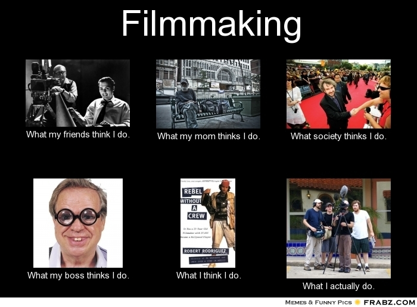
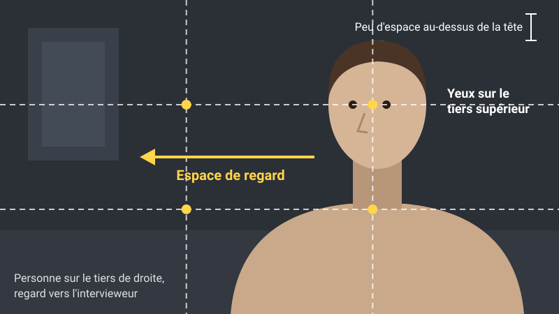
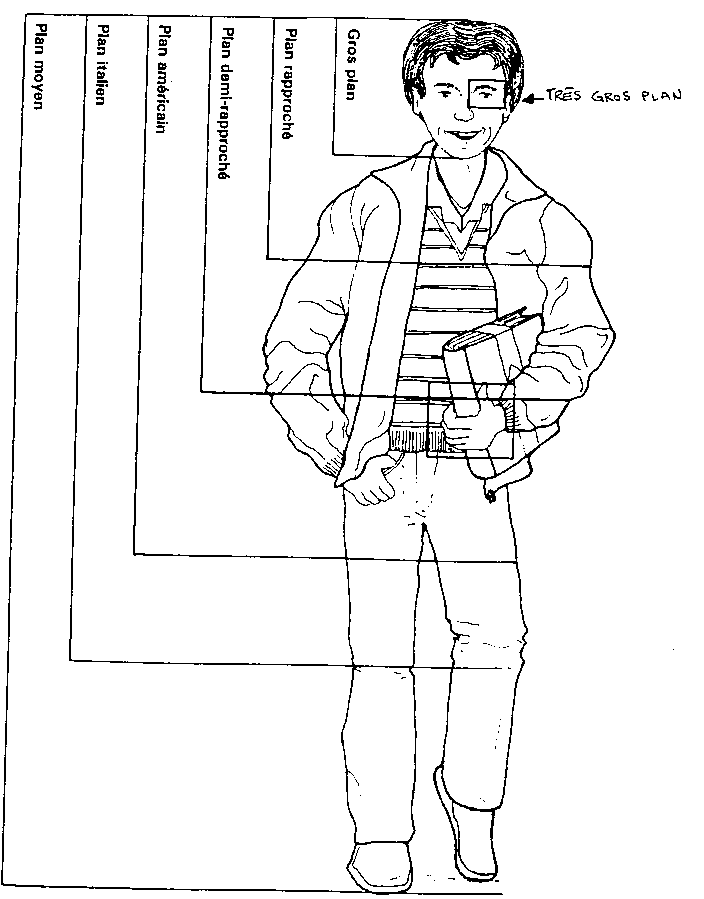
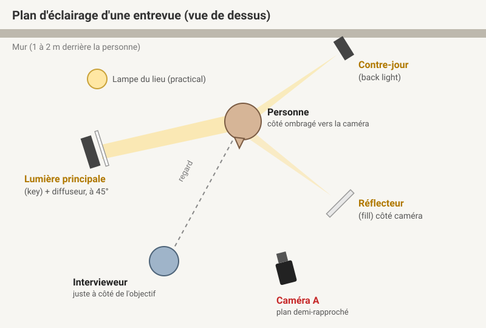

# Cours 6 - Rétroaction et préparation au tournage

## Ordre du jour 

- [Les réglages de caméra](#les-reglages-de-camera)

- [La composition](#la-composition)

- [L'éclairage](#leclairage)

- [Pendant l'entrevue](#pendant-lentrevue)

- [Avant d'appuyer sur REC](#avant-dappuyer-sur-rec)

- [Démonstation au studio](#démonstation-et-atelier-au-studio)

- [Rétroaction sur la préproduction](#retroaction-sur-la-preproduction)

- [Retour sur l'examen de montage (si on a le temps)](#retour-sur-lexamen-de-montage)

<!-- ## Retour sur l'examen de montage 

- Comment avez-vous trouvé l'exercice?

- Voulez-vous regarder les montages?  -->

## Les réglages de caméra

Une entrevue, c'est une personne assise qui parle longtemps. L'objectif est simple : **tout en manuel**, pour que l'image ne change pas toute seule au milieu d'une réponse.

| Réglage | Valeur | Pourquoi |
|---|---|---|
| Mode | Film, exposition manuelle | En automatique, l'exposition et la couleur varient pendant la prise |
| Format | XAVC S HD, 30p 50M | Même cadence que le rendu final (30 fps) |
| Vitesse d'obturation | 1/60 | Le double de la cadence : flou de mouvement naturel |
| Ouverture | f/2.8 à f/4 | Fond flou, mais assez de marge pour garder le focus si la personne bouge |
| ISO | Le plus bas possible | Plus l'ISO est haut, plus il y a de bruit : on ajoute de la lumière avant de monter l'ISO |
| Balance des blancs | Manuelle, en Kelvin (ex. : 3200 K ou 5600 K) | La même valeur que le Lite Panel, jamais en automatique |
| Mise au point | Manuelle, sur l'œil le plus proche de la caméra | On vérifie avec la loupe ou le *peaking* |
| Zebra | 100 % | Aucune zébrure sur le visage, sinon il est surexposé |
| SteadyShot | Off | Inutile sur trépied |

Les menus pour chaque réglage sont dans l'[aide-mémoire de paramétrage](./aide-memoire-parametrage.md). Pour la théorie, voir les [notions de caméra](./notions-camera-video.md).

**Trucs**

- **Réinitialiser la caméra** au début du tournage : les réglages de l'équipe précédente ne vous suivent pas.
- **Deux caméras, mêmes réglages** : même cadence, obturation, balance des blancs et profil d'image. Sinon, la colorisation devient un cauchemar.
- **Carte formatée et batteries pleines**, avec des batteries de rechange.
- **Un clap au début de chaque prise** (taper des mains devant la caméra) pour synchroniser le son au montage.
- **Tourner 10 secondes de test** et les regarder sur le moniteur avant l'arrivée de la personne.

!!! example "Exemple : entrevue dans un salon, le soir, avec un Lite Panel"
    30p · 1/60 · f/2.8 · ISO le plus bas qui donne une bonne exposition · Lite Panel et caméra à 3200 K · mise au point manuelle sur l'œil · zebra à 100 % : on baisse l'intensité du Lite Panel jusqu'à ce que les zébrures disparaissent du visage.

## La composition

- **Règle des tiers** : les yeux sur la ligne du tiers supérieur, la personne sur un des tiers verticaux (pas au centre).

- **Espace de regard** (*look room*) : laisser de l'espace du côté où la personne regarde.

- **Regard hors caméra** : l'intervieweur s'assoit juste à côté de l'objectif, à la hauteur des yeux. La personne le regarde, lui, pas la caméra.

- **Distribuer les éléments du décors** pour créer une balance (pas tous les éléments décoratifs du même côté).

- **Caméra à la hauteur des yeux** : ni plongée ni contre-plongée.

- **Cadrer serré** : peu d'espace au-dessus de la tête. En gros plan, on peut couper le haut du crâne, mais jamais le menton.

- **Au moins 2 échelles** : un plan demi-rapproché et un gros plan, avec 2 caméras ou en changeant de cadrage entre les questions. Au montage, passer d'une échelle à l'autre permet de cacher les coupes.

- **Soigner l'arrière-plan** : éloigner la personne du mur (1 à 2 m) pour la profondeur, ajouter des éléments qui parlent d'elle, jamais de fenêtre derrière, et rien qui « sort » de sa tête (lampe, plante, cadre).

Pour allez plus en profondeur sur la composition, je vous invite à écouter la capsule suivante de [Tomorrow's filmmakers](https://www.youtube.com/watch?v=KVBc2Pg81rw&list=PLb33IpVaF2svVkL4QZz0jDNibrECvYNuh)

## L'éclairage

**L'éclairage 3 points, version simple**

- **Lumière principale** (*key light*) : à environ 45° de la personne, un peu plus haute que les yeux, avec un **diffuseur** (*softbox*, tissu). Une lumière douce est plus flatteuse pour la peau.
- **Lumière d'appoint** (*fill light*) : faible, juste pour déboucher les ombres. Un simple réflecteur fait souvent l'affaire. Garder du contraste donne un look plus cinéma.
- **Contre-jour** (*back light*) : derrière la personne, pour la décoller du fond.

**Trucs**

- **Filmer du côté ombragé du visage** (*short side*) : placer la caméra du côté opposé à la lumière principale. Le visage a plus de relief et l'image est plus riche.
- **Chercher le triangle de lumière** (*Rembrandt*) sur la joue du côté ombragé et le **reflet dans les yeux** (*catchlight*). On déplace la lumière principale jusqu'à voir les deux : un regard sans reflet paraît éteint.
- **Éteindre les plafonniers et les néons** : leur couleur ne correspond pas à celle de vos lumières, et la lumière du dessus creuse les yeux.
- **Une fenêtre est une lumière principale**, jamais un arrière-plan : placez-la sur le côté de la personne.
- **Allumer une lampe du lieu** (*practical*) dans le fond : elle ajoute de la profondeur et de la chaleur.

Pour allez plus en profondeur sur l'éclairage, je vous invite à écouter la capsule suivante de [Tomorrow's filmmakers](https://www.youtube.com/watch?v=0suVZjz3_Uw)

## Pendant l'entrevue

- **Faire une pré-entrevue** (au téléphone, avant le tournage) : connaître l'histoire de la personne et la mettre en confiance, sans lui faire répéter ses réponses (elles perdent leur spontanéité).

- **Faire répéter la question dans la réponse** : la voix de l'intervieweur sera coupée au montage, la réponse doit donc se comprendre seule.

    - Question : « Pourquoi as-tu commencé la céramique? »
    
    - Mauvaise réponse : « Parce que ma grand-mère en faisait. »
    
    - Bonne réponse : « J'ai commencé la céramique parce que ma grand-mère en faisait. »

- **Rester silencieux** : hocher la tête plutôt que dire « hum hum » ou « ouin », sinon ces sons se retrouvent sur la piste.

- **Laisser un silence après la réponse** : la personne ajoute souvent sa meilleure phrase pour combler le vide.

- **Filmer des éléments sur place** (plans de coupe) : les mains, les objets, le lieu, la personne en action. Visez les 20 plans de coupe du TP : ils servent à illustrer le propos et à cacher les coupes.

- **Enregistrer 30 secondes de son ambiant** (*room tone*) : tout le monde se tait, on enregistre la pièce. Ça sert à combler les trous au montage.

## Avant d'appuyer sur REC

- [ ] Caméra réinitialisée, puis réglée en manuel (30p, 1/60)

- [ ] ISO le plus bas possible, ouverture entre f/2.8 et f/4

- [ ] Balance des blancs identique sur les caméras et les lumières

- [ ] Mise au point sur l'œil le plus proche, vérifiée avec la loupe

- [ ] Aucune zébrure sur le visage

- [ ] Yeux sur le tiers supérieur, espace de regard du bon côté

- [ ] Caméra du côté ombragé du visage

- [ ] Triangle de lumière et reflet dans les yeux visibles

- [ ] Plafonniers éteints, aucune fenêtre dans le cadre

- [ ] Son testé au casque

- [ ] Clap au début de la prise

## Démonstation et atelier au studio

Nous allons nous rendre au studio pour une démonstration dans un premier temps (environ une heure) et je vais ensuite vous inviter à faire une simulation pour vous pratiquer (environ 30 minutes par équipe). Pendant ce temps, les autres équipes peuvent avancer leur préproduction. 

## Rétroaction sur la préproduction

Je vais rencontrer chaque équipe (environ 20 minutes) pendant que les autres équipes préparent leur tournage. Je vais vous inviter à remplir votre fichier de préparation au tournage, selon les exigences du [TP1 — Partie 1](./TP1-partie1.md).

<!-- :material-download: [Télécharger le gabarit Word du document de préparation](./assets/tp1/TP1-preparation-tournage.docx){ download="TP1-preparation-tournage.docx" } -->

## 
Commentaires ou questions?
