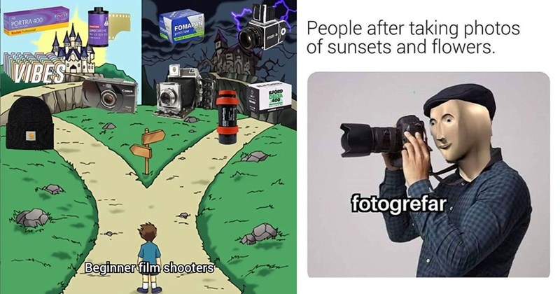

# Notions sur la caméra vidéo

## Retour sur la caméra

Bien que vous avez eu un cours de photographie, il reste idéal de survoler les caractéristiques essentielles d'une caméra. Nous verrons ensuite comment appliquer ses caractéristiques à la vidéo.

- Focale
- Balance des couleurs
- ISO
- Ouverture
- Vitesse d'obturation
- Profondeur de champ

## La longueur focale

Vulgairement, la longueur focale est une mesure en millimètres entre la lentille de l'objectif et le capteur de l'appareil photo.

La longueur focale a donc un impact sur les éléments suivants :

- L'angle périphérique (largeur du cadre)
- Le grossissement de l'image (zoom in/out)
- La compression de l'image
- La profondeur de champ

## Grand angle (10-35mm)

Les grands angles (aussi appelé courte focale) ont les effets suivants :

- Accentuer la perspective
- Agrandir l'espace
- Déformer les sujets proches et les traits horizontaux (fisheye)
- Augmente la profondeur de champ

Ainsi, c'est un type de focale à prioriser pour :

- Architecture
- Paysages panoramiques
- Photos immobilières
- Photographie de groupe
- Plans d'ensemble

## Standard (35-70mm)

Généralement utilisé à 50mm pour répliquer le champ de vision humain, la focale standard possède les effets suivants :

- Perspective naturelle
- Polyvalente

Ainsi, c'est un type de focale à prioriser pour :

- Portraits environnementaux
- Photographie de rue
- Documentaire
- Photos quotidiennes
- Plan moyens

## Téléobjectifs (70mm et plus)

Les grands angles (aussi appelé longue focale) ont les effets suivants :

- Compresse la perspective
- Rapproche les plans
- Isole le sujet
- Réduit la profondeur de champ
- Crée un effet d'arrière-plan flou

Ainsi, c'est un type de focale à prioriser pour :

- Portraits (évite les déformations)
- Sports
- Spectacles
- Animaux sauvages
- Dialogues
- Gros plans/très gros plans

## Balance des blancs

La balance des blancs (ou balance des couleurs) est un réglage de la caméra qui permet d'ajuster la couleur de la lumière d'une image pour qu'elle apparaisse comme naturelle.

En effet, notre cerveau s'adapte automatiquement à la lumière ambiante alors que l'appareil photo enregistre la couleur réelle émise par une source de lumière.

De ce fait, la balance des blancs représente ce processus de compensation en ajustant la teinte de la lumière qu'on appelle : la température de la couleur.

La température se mesure en degrés Kelvin et varie entre des couleurs chaudes (orangé à 2500K) et des couleurs froides (bleu à 9900K)

## Préréglages de balance des blancs

- Lumière du jour 5500K
- Lumière ombragée 7000K
- Lumière nuageuse 6000K
- Incandescent (ampoules) 3200K
- Fluorescent (néon) 4000K

Il est rarement recommandé d'utiliser la balance des blancs automatique. Inversement, il est préférable d'utiliser la balance des blancs personnalisée (en utilisant une image de référence pour calibrer).

## ISO

- Le ISO est une valeur de sensibilité à la lumière.
- Sur une pellicule, c'est la sensibilité du papier et pour un appareil numérique, la sensibilité du capteur.
- Son réglage est essentiel pour adapter l'exposition et contrôler la qualité de l'image.
- En photographie, le ISO est réglé en fonction de l'ouverture et de la vitesse d'obturation.
- En vidéo, notre vitesse d'obturation sera généralement fixe. Donc, le réglage du ISO sera surtout en fonction de l'ouverture.

## Cas d'utilisation du ISO

- 100-200 : lumière naturelle
- 400 : éclairage artificiel élevé
- 800 : éclairage artificiel faible, chandelles
- 1600 : photo de nuit sans lumière

Il est toujours préférable d'utiliser le ISO le plus bas possible pour avoir la qualité la plus élevée et il est rarement acceptable d'utiliser un ISO supérieur à 800 (à moins que cela ne fasse partie de la démarche artistique). En effet, les couleurs perdent leur richesse et le bruit électronique devient visible une fois 800 dépassé (ISO 1600 et plus par exemple).

## La grandeur d'ouverture

- La grandeur d'ouverture ou diaphragme (souvent juste appelé l'ouverture), correspond à la grandeur physique de l'objectif pour contrôler la quantité de lumière qui atteint le capteur.
- Elle est exprimée en fractions (généralement appelé f-stop). Donc, plus le chiffre est petit et plus l'ouverture est grande laissant ainsi plus de lumière entrer.
- Il est donc important de bien gérer l'ouverture afin de ne pas sous-exposer ou sur-exposer l'image.
- L'ouverture exerce également un rôle sur la profondeur de champ. En effet, plus l'ouverture est grande (petit chiffre f) et plus la profondeur est réduite.

## Cas d'utilisation grande ouverture (f/1.4 – f/2.8)

- Scènes avec arrière-plan flou
- Interviews
- Scènes romantiques ou intimes
- Plans serrés sur des personnages
- Vidéos en faible luminosité

## Cas d'utilisation ouverture moyenne (f4 – f/5.6)

- Scènes de dialogue à plusieurs personnages
- Vidéos documentaires
- Plans de situation/narration
- Vidéos corporative
- Reportages événementiels

## Cas d'utilisation petite ouverture (f8 – f/16)

- Scènes avec arrière-plan net
- Paysages
- Plans larges urbains
- Scènes d'action
- Vidéos architecturales
- Time-lapse

## La vitesse d'obturation

En photographie, la vitesse d'obturation détermine le temps que le diaphragme est ouvert. En vidéo, la vitesse d'obturation détermine le temps que chaque image (frame) est exposée.

De ce fait, la vitesse d'obturation est étroitement liée à la cadence (framerate) de l'enregistrement.

La vitesse d'obturation affecte ainsi la netteté ainsi que le rendu des mouvements (naturel ou stylisé/flou) et l'exposition.

## La règle de base

En gros, on règle la vitesse d'obturation au double la cadence :

- Pour 24fps → 1/48 seconde
- Pour 30fps → 1/60 seconde
- Pour 60fps → 1/120 seconde

## Cas d'utilisation d'une vitesse lente (inférieure à la règle)

- Scènes de nuit artistiques
- Effet de traînée lumineuse
- Mouvements abstraits
- Transitions créatives
- Ambiance de rêves ou d'état altéré

## Cas d'utilisation d'une vitesse standard (égale à la règle)

- Mouvements naturels
- Films narratifs
- Documentaires
- Interviews
- Vidéos corpo

## Cas d'utilisation d'une vitesse élevée (supérieure à la règle)

- Sports et action
- Slow motion
- Cascades
- Publicités dynamiques
- Effets spéciaux

## La profondeur de champ

La profondeur de champ correspond à la zone de netteté devant et derrière le sujet. En d'autres termes, c'est l'espace net autour du point de focus.

Ainsi, une petite profondeur de champ a une zone de netteté réduite et à l'inverse une grande profondeur de champ a une grande zone de netteté.

La grandeur de la profondeur de champ dépend essentiellement de trois facteurs (l'ouverture, la focale et la distance avec le sujet).

## Petite profondeur de champ (zone nette réduite)

Pour y arriver :

- Grande ouverture (f/1.4 – f/2.8)
- Longue focale (70mm+)
- Proche du sujet (1-2 mètres)

Cas d'utilisation :

- Interviews intimistes
- Scènes romantiques
- Plans esthétiques
- Effet de distortion

## Moyenne profondeur de champ

Pour y arriver :

- Ouverture moyenne (f/4 – f/5.6)
- Focale standard (50mm)
- Distance moyenne du sujet (3-4 mètres)

Cas d'utilisation :

- Scènes de dialogue
- Documentaires
- Vidéos explicatives
- Séquences de groupe

## Grande profondeur de champ (zone nette étendue)

Pour y arriver :

- Petite ouverture (f/8 +)
- Courte focale standard (10-35mm)
- Grand distance au sujet (5 mètres +)

Cas d'utilisation :

- Paysages
- Plans d'établissement
- Scènes d'action
- Vidéos architecturales
- Films documentaires nature
- Séquences de foule
- Plans larges urbains

## Notions de caméra vidéo

Pour faire suite aux notions sur la caméra, nous allons maintenant nous intéresser aux notions spécifique à la vidéo. Nous allons donc nous intéresser aux éléments suivants :

- La cadence (framerate)
- La résolution
- Les codecs et les formats
- Le focus
- Peaking/Zebra

Nous allons ensuite porter un regard sur notre matériel, les différents mouvements de caméra puis finalement sur l'éclairage.

## La cadence

La cadence (généralement appelé framerate) représente simplement le nombre d'image affichées dans une seconde de vidéo. La cadence détermine ainsi la fluidité des mouvements et affecte directement le rendu visuel (fluide ou saccadé).

Les framerate les plus utilisés sont les suivants :

- 24fps : Cinéma, documentaires, contenu narratif
- 25fps : Standard européen (PAL), broadcast TV
- 30fps : Standard américain (NTSC), web content
- 50/60fps : Sport, gaming, mouvements rapides
- 100/120fps+ : Ralentis, effets spéciaux

## La résolution

La résolution représente quant à elle le nombre de pixels qui composent une seule image vidéo. Exprimée par des unités de hauteur et de largeur, la résolution détermine le niveau de clarté et de détails de l'image vidéo.

Contrairement à la photo, des standards de diffusion sont faits pour uniformiser l'affichage sur des écrans.

Au-delà de la qualité d'image, il faut également considérer les besoins en stockage et en traitement numérique.

Les standards de résolution les plus utilisés sont les suivants :

- 1080p (1920x1080) : contenu web standard, projets à budget limité
- 2K (2048x1080) : production cinéma intermédiaire, publicités, clips musicaux, web premium
- 4K (3840x2160) : cinéma haut de gamme, documentaires nature, publicités luxe
- 8K (7680x4320) : événements spéciaux, VFX, projets expérimentaux

## Codecs

Le codec représente le procédé de compression/décompression des données vidéos. La compression se fait toujours en articulant la taille des fichiers et le niveau de qualité.

De ce fait, un fichier avec un niveau de compression élevé aura une moins bonne qualité et un plus petit volume. Inversement, un fichier avec un niveau de compression faible aura une meilleure qualité, mais un plus gros volume.

Les codecs les plus utilisés sont les suivants :

- H.264/AVC : Streaming et services web, Projets légers
- ProRes : Édition professionnelle, Broadcast TV, Publicités et Post-production avancée
- RAW : Cinéma, VFX, Étalonnage avancé
- HEVC/H.265 : Streaming 4K, HDR, Streaming et services web premium

## Focus, mise-au-point

La mise au point correspond à l'ajustement de l'objectif pour rendre le sujet net. C'est donc la distance à laquelle les éléments apparaissent comme étant détaillés (et la zone de netteté selon la profondeur de champ).

Contrairement à la photographie, en vidéo la mise-au point peut être dynamique. De ce fait, le contrôle de la mise-au point peut être gérer automatiquement (AF) ou manuellement (MF).

De manière générale, il est idéal de zoomer sur le sujet désiré, de faire la mise au point et de placer sa focale ensuite.

Bien qu'il est plus difficile de gérer le focus de manière manuelle, il reste tout de même préférable d'avoir le contrôle total de la mise-au point.

## Quelques points importants pour la mise-au-point

- Tester avant le tournage et pratiquer les mouvements de caméra
- Marquer les points de focus au sol
- Vérifier la profondeur de champ
- Utiliser un moniteur de référence et ne pas se fier à l'écran de la caméra
- Éviter les mouvements brusques
- Toujours vérifier le résultat avant de passer à un autre tournage

## Le rack focus

Le rack focus est une technique de modulation de la mise-au-point qui consiste à changer progressivement le point net de l'image. Ainsi, on guide le regard du spectateur (exemple dans [Casino Royal](https://www.youtube.com/watch?v=r-BCbF55fxo)).

En termes de techniques, il suffit de faire une rotation de la bague de mise au point du premier au deuxième sujet. Bien que cela semble simple à comprendre, ce processus reste complexe à maitriser.

En effet, il faut dans un premier temps configurer la scène et le matériel (ouverture, distance entre les sujets, éclairage, etc.). Ensuite, il est idéal de pratiquer les mouvements avec des mesures et des marqueurs pour finalement faire la prise.

## Peaking

Le peaking est un outil d'assistance à la mise au point des caméras vidéo numériques. Ce système met en surbrillance (dans le cas de nos caméra en rouge) les zones de l'image qui sont nettes.

Ce système facilite la mise au point et peut être particulièrement utile avec une petite profondeur de champ ou des conditions difficiles (éclairage fort/faible, utilisation de l'écran LCD, etc.)

Inversement, ce système peut nuire à la bonne lecture de l'image et reste une mesure imprécise.

Pour activer/désactiver le système, il suffit de se rendre dans les paramètres de configuration de l'appareil et de l'activer/désactiver ([référence](https://www.sony.fr/electronics/support/articles/00342666))

## Zebra

Le Zebra est un outil d'aide à l'exposition qui affiche des rayures zébrés sur les zones de l'image qui atteignent un certain niveau de luminosité.

Le niveau de luminosité est généralement réglable pour déterminer un seuil désiré.

Le Zebra peut donc être utilisé pour éviter la surexposition OU maintenir une exposition cohérente.

Les réglages les plus utilisés sont les suivants :

- 70% correspond approximativement à l'exposition correcte pour la peau
- 100% indique les zones surexposées

Pour activer/désactiver le système, il suffit de se rendre dans les paramètres de configuration de l'appareil et de l'activer/désactiver ([référence](https://helpguide.sony.net/ilc/1640/v1/en/contents/TP0001273775.html))

## La différence entre les niveaux de caméra

[Corridor Crew](https://www.youtube.com/watch?v=dQf9pog-8q0)
