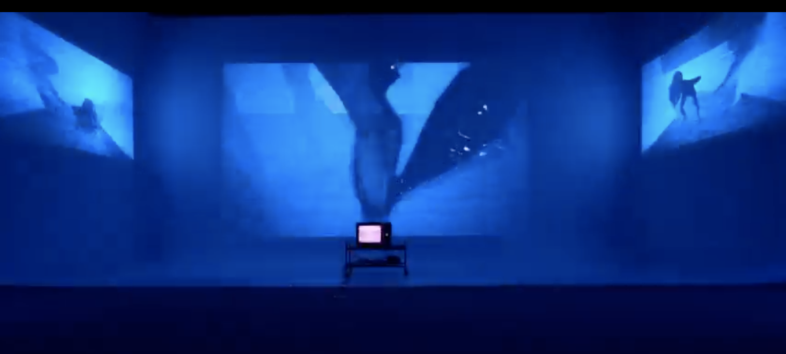

# Projet 2 : Installation Immersive et Vidéo Mosaïque  

## Objectif du projet
Créer une expérience immersive ou une présentation vidéo mosaïque en utilisant des éléments visuels et sonores pour raconter une histoire. Vous devez filmer vos propres séquences et les organiser de manière cohérente en fonction de la version choisie. Tout le vidéo doit être en stop motion. La bande sonore devra être composée exclusivement à partir de sons créés en studio foley. 

Exemples:  
[Projets artistes ](https://cmontmorency365-my.sharepoint.com/:w:/g/personal/flpilote_cmontmorency_qc_ca/EdWLzr5Q0PdOnqxowv9_kBYBJzHbx4gT3zch9B2hIO3jzw?e=84Ld9o)

---

## Versions du projet

### **1. Version Installation Immersive**
Cette version combine trois écrans sur un cyclorama, une télévision au sol, des haut-parleurs et des lumières interactives pour une expérience narrative multisensorielle.

- **Éléments requis :**
  - **Trois écrans sur le cyclorama :**  
    Tournez des séquences originales pour les projeter de manière synchronisée sur les écrans. Intégrez des perspectives variées pour enrichir la narration.
  - **Télévision au sol :**  
    Présentez des vidéos complémentaires aux projections des écrans (gros plans, détails narratifs, angles alternatifs).
  - **Lumières interactives :**  
    Programmez des lumières pour réagir à la bande sonore et aux vidéos, amplifiant les moments clés de votre récit.
  - **Synchronisation audio-vidéo :**  
    Créez une bande sonore originale, composée exclusivement de sons produits en studio foley, et synchronisez-la avec vos séquences vidéo.

- **Critères de réussite pour la version Installation :**
  1. **Cohérence visuelle et sonore :** Tous les éléments (écrans, télévision, lumières, son) doivent fonctionner ensemble pour raconter une histoire immersive.
  2. **Synchronisation précise :** Les vidéos et le son doivent être parfaitement synchronisés pour maximiser l'impact narratif.
  3. **Interaction des lumières :** Les lumières doivent renforcer l’immersion en réagissant de manière cohérente avec les vidéos et le son.
