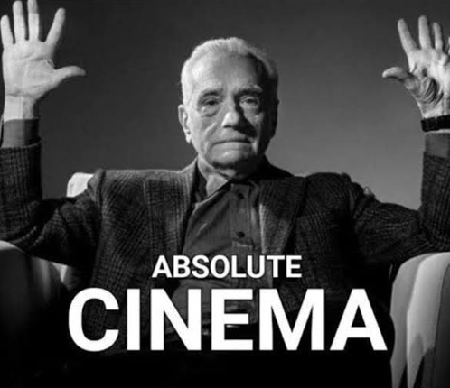
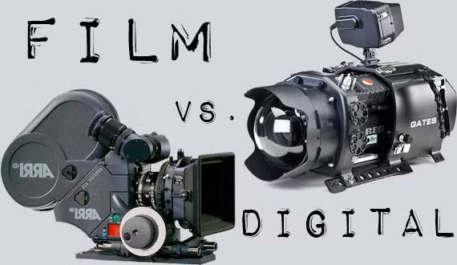
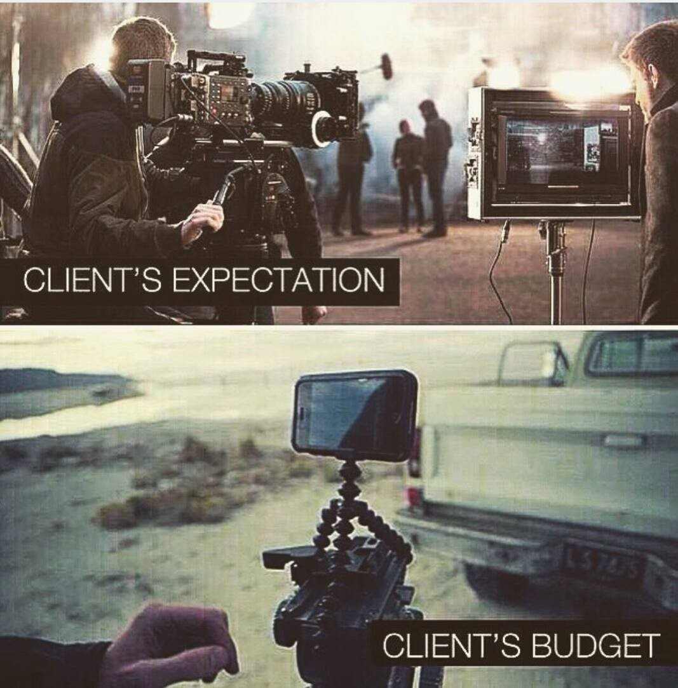
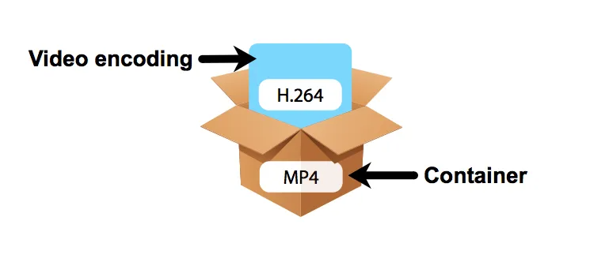
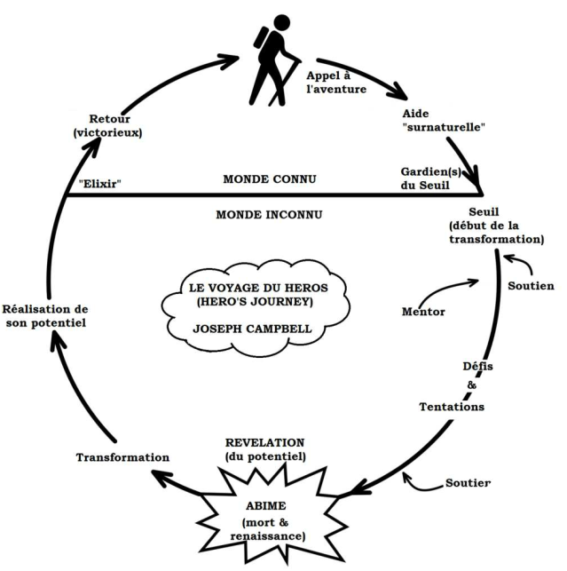

# Cours 1 - Bienvenue!

## Ordre du jour 

- Formation des équipes
- Présentation du cours
- Format du cours
- Planification 
- Introduction à la vidéo
- Atelier et introduction au TP1
- Introduction à la scénarisation
- Atelier et introduction au TP2
- Introduction à la feuille de suivi

## Formation des équipes

Considérant la nature pratique et collaborative du cours, vous serez généralement dans des équipes de travail. Nous vous invitons à former des équipes de 4 avec les collègues de votre choix. Par contre, choisissez bien puisque vous aurez la même équipe de travail tout au long de la session et que tous les projets ont une dimension en équipe.  

## Présentation du cours 

- Monté par Françoise Lavoie-Pilote
- Le cours vise essentiellement à explorer tous les aspects de la production d’une vidéo  

2 compétences essentielles :
- Réaliser un tournage avec des techniques avancées
- Réaliser le montage et la diffusion avec des techniques avancées

## Format du cours 

Il va être impératif de solidifier les bases en vidéo avant d'aller vers les projet avancés. Cela dit, il sera aussi important d'avoir des bons projets à présenter et à mettre dans vos portfolios.  

Pour y arriver, nous allons amorcer le cours avec des ateliers pratiques, mais nous allons également conjointement faire des ateliers d'écriture pour faire en sorte d'éviter le syndrome de la page blanche lorsque nous allons amorcer les projets. 

## Planification 
[📁 Plan de cours](https://cmontmorency365-my.sharepoint.com/:b:/g/personal/dominic_roberts_cmontmorency_qc_ca/IQC3M-UHBqpMSKpo0h5SywmFATJXHgk7OoHtBoQb_500pjY?e=W8n97j){ .md-button }    

## Introduction à la vidéo

Bien qu'il y aurait de nombreuses notions à présenter dans un cours de cinéma (écriture du scénario, pré-production, techniques de caméra/mise-en-scène, éclairage, etc.), nous allons commencer par nous intéresser aux caractéristiques essentielles de la vidéo et aux notions/techniques qui sont lier à la production d'oeuvres audiovisuelles. Nous allons donc investiguer les sujets suivants :

- [Différence entre cinéma et vidéo](#différence-entre-cinéma-et-vidéo)
- [Caractéristiques essentielles de la vidéo](#caractéristiques-essentielles-de-la-vidéo)
- Introduction à la scénarisation 

### Différence entre cinéma et vidéo

La première différence est essentiellement technologique :
- Le cinéma a toujours reposé et repose encore (généralement) aujourd’hui sur la pellicule (papier photosensible).
- Pour ajouter des effets numériques, les photogrammes sont numérisés un-par-un.
- La vidéo repose sur la traduction d’un signal électrique en information numérique (bande magnétique et disque dur).
- La vidéo est donc traitée directement à l’ordinateur.  
- Bien que la pellicule offre une qualité supérieure, on retrouve de plus en plus de caméra numérique dite "cinéma". Pour bien comprendre la différence entre les niveaux de qualité d'une caméra numérique, je vous invite à écouter la vidéo suivante de [Corridor Crew](https://www.youtube.com/watch?v=dQf9pog-8q0).

Le cinéma se distingue également par son approche et son budget : 
- Le cinéma produit généralement des plus grosses productions
- Le cinéma recherche généralement une démarche expressive ou artistique plus forte
- La ligne entre les deux est de plus en plus mince dans la mesure les productions vidéo sont de plus en plus grosses (avec Amazon et Netflix par exemple) et le cinéma indépendant trouve toujours une niche existante.  

### Caractéristiques essentielles de la vidéo

Quelle provienne d’une source analogique ou numérique, l’image en mouvement se distingue par de nombreux paramètres. Nous nous intéresserons principalement à l’image provenant d’une source numérique dont les paramètres dominants sont les suivants (mais ne se limitent à ceux-ci) :

- [La résolution](#la-résolution)
- [La fréquence d’image](#la-fréquence-dimage) 
- [Encodage et format](#encodage-et-format)

#### La résolution

Les vidéos numériques sont composées d’images matricielles séquencées. De ce fait, chacune d’entre elles comportent les mêmes caractéristiques comme la résolution et la profondeur des couleurs par exemple. Contrairement à l’image fixe, les résolutions des vidéos ont été standardisées afin d’accommoder les écrans. Le plus utilisées et connues sont les suivantes :

- 480p – standard définition (SD)
- 720p et 1080p – haute définition (HD et 1080 parfois appelée Full HD)
- 4k et 8k – ultra haute définition (UHD)

En ce qui nous concerne, nous allons essayer de nous tenir à la résolution 1080p

#### La fréquence d’image

Tel que mentionné précédemment, les images doivent être séquencées à une certaine cadence pour donner l’illusion du mouvement. Nous appelons cette cadence la fréquence d’image (framerate) et elle se calcule par un nombre d’image par seconde (frame per second ou fps). Évidement, plus il y a d’image par seconde et plus l’animation est fluide (et plus on peut faire de ralenti) [comme dans cet exemple](https://www.youtube.com/watch?v=_SzGQkI-IwM), mais plus le fichier de travail sera lourd. Les fréquences les plus connues et utilisées sont les suivantes :

- 24 fps : cadence utilisées pour le cinéma sur pellicule
- 25 fps et 50 fps : cadence utilisées par la télévision Européenne
- 30 fps et 60 fps : cadence utilisées par la télévision Américaine et Japonaise
- 120 fps et plus : cadence utilisées par les plateforme de diffusion en ligne (Youtube par exemple)

Au-delà de 60 fps, les fréquences d’images élevées sont généralement générées par des caméras grande vitesse. Le précédent record permettant de voir la lumière se déplacée était à [10 trillion d’image seconde](https://www.youtube.com/watch?v=7Ys_yKGNFRQ&t=652s). Le record actuel est situé à environ 70 trillion d’images seconde et permet d’observer la fusion nucléaire.  

#### Encodage et format 

Le format concerne la méthode de stockage numérique d’une vidéo qui consiste en une combinaison d’un contenant et d’un encodage.  

Le contenant concerne la structure numérique qui contient les éléments de la vidéo (images et sons). Les contenants les plus connus et encore utilisés sont les suivants :

- WebM – contenant optimisé pour le web (manque de compatibilité avec plusieurs appareils mobiles)
- MKV – contenant open-source 
- MOV – contenant conçu par Apple 
- MP4 – contenant MPEG largement utilisé (celui que nous allons utiliser)

L’encodage concerne l’algorithme de compression (sans compression, les fichiers vidéos seraient beaucoup trop volumineux). Ce processus est plus ou moins destructif selon l’algorithme choisi. Les encodages les plus connus et encore utilisés sont les suivants :

- H.264 – Encodage HD (moyen)
- ProRes – Encodage haute qualité (très lourd)
- VP8/VP9 – Encodage optimisé web (léger)

## Atelier et introduction au TP1

Avant de se lancer dans l'expression, il va être important d'ancrer les bases dans un projet. Pour commencer avec une portée moins étendue, nous vous proposer de réaliser une courte entrevue. 

### Présentation du TP1 

[Consignes](./TP1-partie1.md)

### Atelier 

De manière individuelle, prenez 2 minutes pour penser à une personne que vous connaissez à qui vous aimeriez poser une question? Répondez également aux questions suivantes : 
- Qui est-ce?
- Quel est son domaine?
- Quel est votre question? 

Prenez maintenant 10 minutes en équipe pour échangez vos réponses. Pour chaque personne présentée, tous les membres d'équipe devraient réfléchir à une nouvelle questions.   

L'objectif est que chaque étudiant ait au moins un sujet d'entrevue potentiel et plusieurs questions. Nous aurons l'occasion d'y revenir au courant de la session. 

## Introduction à la scénarisation

Le scénario est l'outil par lequel on écrit ce qui sera vu et entendu. Ce n'est pas une oeuvre écrite pour l'imagination comme la littérature, c'est un processus d'instruction pour la réaliser.  

Un exemple concret : en littérature, on écrirait : *Paul pleure*, on s'imagine alors le personnage en train de faire l'action. En scénarisation, on écrit : Paul tend sa main à son visage. Une larme coule sur sa joue. On sait maintenant que sera 2 plans : un rapproché et un gros plan et qu'il y aura une transition sur le mouvement de sa main.  

Ainsi, l'art d'écrire un scénario, c'est non seulement raconter une histoire, mais aussi se donner les moyens de la produire pour l'enregistrer et la diffuser. Cela demande donc de bien connaître syntaxe ou les codes d'écriture, mais aussi de raconter de bonnes histoires. Pour y arriver, nous allons nous intéresser à trois axes principaux : l'intrigue, les personnages et le folklore. 

### L'intrigue 
L’intrigue concerne la suite d’évènements chronologiques. C’est la partie logique de l’écriture qui répond à une ordre précise. 
L’écriture de l’intrigue est une tache complexe, mais il existe de nombreux qui peuvent rendre la tâche plus façile. 
Les structures les plus connues sont le schéma narratif et le schéma actanciel. Toutefois, de nombreuses structures ont vu le jour comme le Monomythe de Joseph Campbell ou encore plus récemment la structure en cercle de Dan Harmon.   
  

Il est important de comprendre qu’il n’y a pas de meilleures structures. Elles sont tout simplement mieux adapter à un média (théâtre, cinéma, télévision, etc.) ou à un style d’écriture.

#### Quelques trucs de storytelling pour un film basé sur l’intrigue.
Mettre l’emphase sur le suspense (faire monter la tension en insistant sur un évènement à venir) ou la surprise (faire intervenir quelque chose d’inatendu). 
Montrer plutôt que dire (l’image est plus forte que les mots).
Faire varier les types de conflits (physiques, psychologiques et moraux).
Ne pas avoir peur de faire des tournures drastiques (plot twist).
Trouver une tournure unique sur une intrigue déjà existante (what if?).
Guider vers de fausses attentes (le faux vilain ou le faux allié).
Conclure les étapes avec du suspense (cliffhanger).  
Avoir quelque chose à dire sur un sujet.

### Les personnages

Les personnages sont les acteurs qui font avancer l’intrigue et transmettent l’émotion au spectateur. 
Il est important que nos personnages possèdent des caractéristiques physiques et psychologiques qui les rendent uniques.
Il est aussi important qu’ils aient tous une motivation (plus profonde pour le personnage principal).
Pour aller plus loin, il est intéressant que nos personnages subissent une évolution psychologique (comment la poursuite de l'objectif change le personnage?) 

#### Comment rendre des personnages intéressants?

Afin que le spectateur s’investisse avec les personnages, ils doivent avoir une certaine complexité (multidimensionnel) et être attachant (ou pas dans le cas d’un antagoniste).
On ne peut pas se permettre d’approfondir tous les personnages (surtout s’il y en a beaucoup). Ils devraient donc toujours avoir une fonction précise. Selon l’importance de la fonction (héros, vilain, marchand, etc.) on peut savoir à quel point le personnage devrait être approfondi.
Les personnages approfondi devraient être clairement définis (origine, motivation, besoin et détermination) et rester cohérents à cette définition pour répondre aux attentes du spectateur (ou pas afin de provoquer une surprise). 
Il est effectivement plus probable de créer de l’attachement si le spectateur arrive à comprendre le point de vue d’un personnage. 
https://www.youtube.com/watch?v=6gAajf_1tw8

### Le folklore (*Lore* ou *Worldbuilding*)

La définition formelle du folklore est « [l’]Ensemble des pratiques culturelles (croyances, rites, contes, légendes, fêtes, cultes, etc.) des sociétés traditionnelles. » (Larousse, 2021).
C’est tout ce qui fait en sorte que l’univers à une histoire et semble vivant. Cela va de la géographie, faune, flore, aux religions, rituels, objets, endroits, environnements et autres variables qui donnent l’impression que l’univers du jeu existe en dehors de la présence du joueur (Extra Credits, 2018).

#### Comment rendre un univers intéressant (*spoiler* : en ajoutant du détails)?

Si l’emphase du film est de faire parti d’un univers vivant plutôt que dans une intrigue singulière, il est important de lui donner l’espace nécessaire pour y arriver.
Donner une vie à un univers ne signifie pas simplement accorder une description à chaque objet et répandre des explications qui raconte son histoire. Il s’agit aussi de faire en sorte que l’univers lui-même puisse le mettre en scène.
Toujours insister sur la direction artistique pour justifier le folklore. Par exemple, les décors d’une ruine devraient raconter son passé ainsi que celui de son peuple.     
Il faut également se méfier des intrigues trop près du folklore. Par exemple, éviter de faire en sorte que la quête principale soit dépendante des connaissances du folklore. Toutefois, de nombreux easter egg peuvent y être lié. 

## Atelier et introduction au TP2

Avant de se lancer dans l'expression, il va être important d'ancrer les bases dans un projet. Pour commencer avec une portée moins étendue, nous vous proposer de réaliser une courte entrevue. 

### Présentation du TP1 

[Consignes](./TP1-partie1.md)

### Atelier 

De manière individuelle, prenez 2 minutes pour penser à une personne que vous connaissez à qui vous aimeriez poser une question? Répondez également aux questions suivantes : 
- Qui est-ce?
- Quel est son domaine?
- Quel est votre question? 

Prenez maintenant 10 minutes en équipe pour échangez vos réponses. Pour chaque personne présentée, tous les membres d'équipe devraient réfléchir à une nouvelle questions.   

L'objectif est que chaque étudiant ait au moins un sujet d'entrevue potentiel et plusieurs questions. Nous aurons l'occasion d'y revenir au courant de la session.

## Présentation des règles du cours
* Remise des travaux.
   * Grilles d’évaluation.
   * Nomenclature.
* Absence à une évaluation, zéro en cas d'absence. 
* Absence à un cours en studio. 
* Retard et départ avant la fin du cours.
* Utilisation du téléphone cellulaire.
* Résolution des conflits.
* Achat de matériel.
    * Obligatoirement avoir votre disque dur avec tous les dossiers de vidéo partagé la dernière session. Si vous n'avez plus le dossier, vous avez la responsabilité de demander à un collège de vous transférer le dossier.
    * Obligatoirement avoir avoir cette SD.

  
## Contact et disponibilité du professeure
* Période de disponibilité : sur rendez-vous uniquement par TEAMS ou en présence les lundis et mardis (Dom) ou les mardis et vendredi (Gab).
* On me contacte uniquement par Teams, je ne vais pas répondre via Col.net.
  
<!-- ## Projet 1 
* Explication du [projet 1](projet_01.md)
* [Formation des équipes](https://cmontmorency365.sharepoint.com/:w:/s/stockageFLPilote/Eanb1Rd6dcZFhLmPFDvnD_YBeqiVc978kvOhiuiebzwmOA?e=J98Iwu)
* Choisir journée de tournage (entre le 8 septembre après votre cours et avant le 30 septembre).
* [Réservation des studios](https://teamup.com/ks5tb2ed4b9yetgo9v)
    * 1 équipe par studio (3, 4 ou 5 par équipe).
    * Plage de tournage (7h00 à 14h00 ou 15h00 à 22h00). -->

<!-- ## L'esthétique visuelle et sonore
* [Le visuel](https://cmontmorency365-my.sharepoint.com/:p:/g/personal/dominic_roberts_cmontmorency_qc_ca/IQBHR16kXidyRI6tGqDnoqZoAZ0ihzJOR0WGv84FpM-GM8o?e=5hfyWF)
* [Le sonore]()

## La caméra
* [Équipe et étapes de production](https://cmontmorency365-my.sharepoint.com/:p:/g/personal/flpilote_cmontmorency_qc_ca/ESxtiN2BY0dJgKzdREJtL-gB4RzfpaeDNt8apqepW6vTXQ?e=hwqIaq)
* [La caméra et les settings](https://cmontmorency365-my.sharepoint.com/:p:/g/personal/flpilote_cmontmorency_qc_ca/ETcDqse5CwlGi2FD-pF9RTUB38DuY9r-ZPDg-AE0bWkw1Q?e=WwcC5d)

## Devoir
* Scénarisation de votre projet
  * Moodboards : un moodboard pour la direction du projet et un moodboard pour la lumière. 
  * Listes des choses que vous allez tourner et enregistrer.
* Réviser [Les bases de la vidéo](https://cmontmorency365-my.sharepoint.com/:f:/g/personal/flpilote_cmontmorency_qc_ca/EsS5H-R9oIZGpS_T2LlU9sgB8p_AnoTlfrmvkf6aAoBrzA?e=cZqVH6)
* Installer la version de [Da Vinci 18.6.6](https://www.blackmagicdesign.com/support/) à la maison.
* Matériel à avoir avec soi en tout temps.
  * Obligatoirement avoir votre disque dur avec tous les dossiers de vidéo partagé la dernière session. Si vous n'avez plus le dossier, vous avez la responsabilité de demander à un collège de vous transférer le dossier.
  * Obligatoirement avoir avoir cette SD. -->

