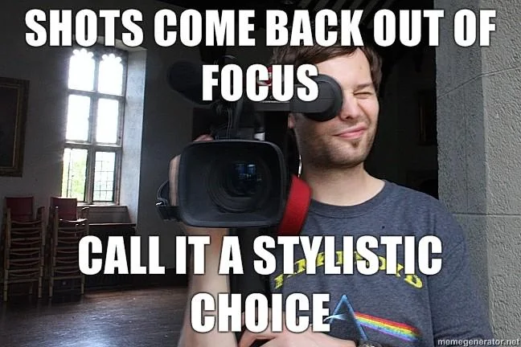
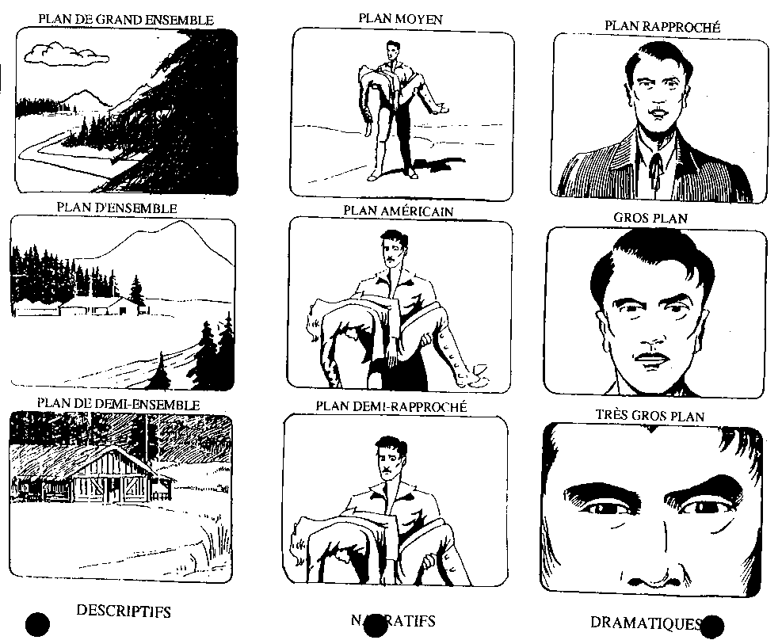
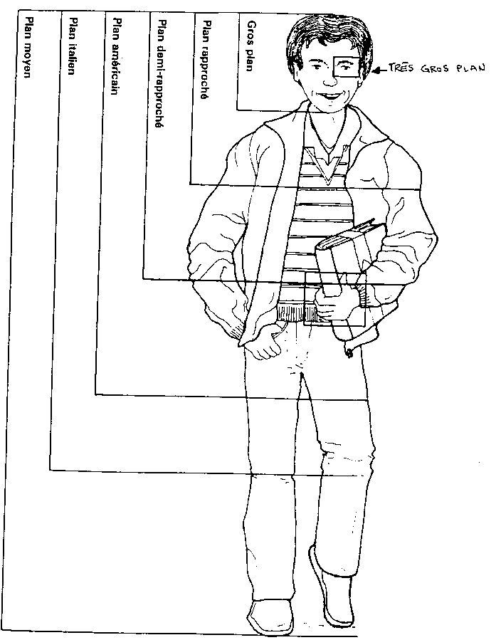
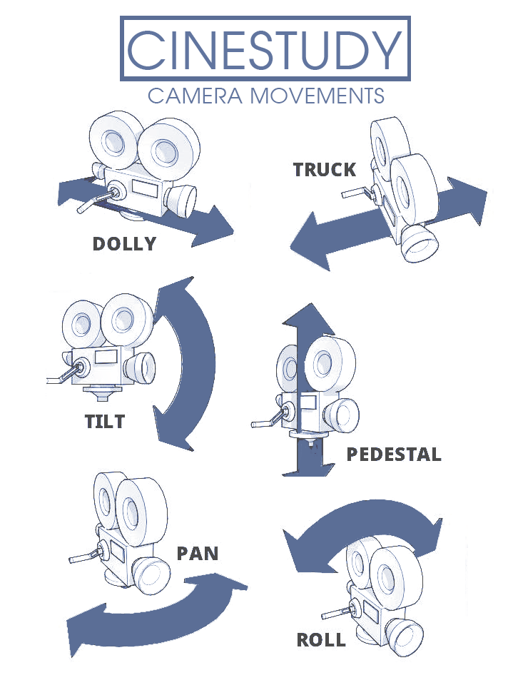
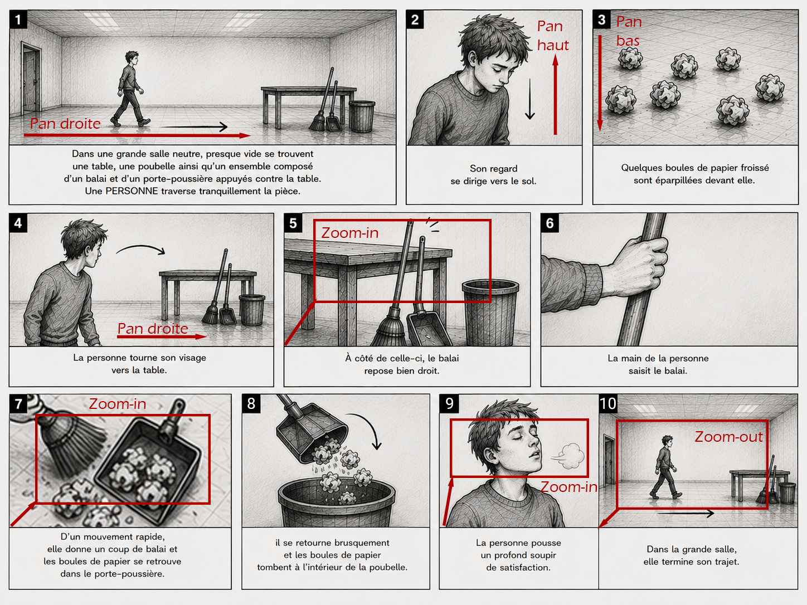

# Cours 1 - Plans, découpage et démonstration de matériel

## Ordre du jour 

En classe : 

- [Présentation de l'examen pratique (caméra)](#présentation-de-lexamen-pratique-caméra)
- [Retour sur la préparation à l'entrevue](#retour-sur-la-preparation-a-lentrevue-15-mins)
- [Rappel des notions de caméra](#rappel-des-notions-de-camera-5-mins)
- [Les unités au cinéma](#les-unites-au-cinema-5-mins)
- [Le découpage de l’espace](#le-decoupage-de-lespace-10-mins)
- [Les mouvements de caméra](#les-mouvements-de-camera-10-mins)
- [Retour sur la scénarisation](#retour-sur-la-scenarisation-10-mins)
- [La pré-production](#la-pre-production-15-mins)

En studio : 

- [Démonstration du matériel](#demonstration-du-materiel)
- [Tournage de l'atelier](#tournage-de-latelier)

## Présentation de l'examen pratique (caméra)

## Retour sur la préparation à l'entrevue (15 mins)

Nous allons aujourd'hui confirmer le choix de votre entrevue pour amorcer les démarches pour valider les disponibilités de votre intervenant(e). Nous allons donc faire un *brainstorming* semblable à celui du dernier cours pour valider l'idée originale ou une nouvelle idée.   

De manière individuelle, prenez 2 minutes pour penser à une personne que vous connaissez à qui vous aimeriez poser une question? Répondez également aux questions suivantes : 

- Qui est-ce?
- Quel est votre question? 

Prenez maintenant 10 minutes en équipe pour échangez vos réponses et faites un choix final.

L'objectif est d'avoir une personne choisie et un lieu de tournage pour l'entrevue et un responsable par équipe devra la contacter pour valider ses disponibilité du 29 sept au 11 octobre. 

## Rappel des notions de caméra (5 mins)

Il est toujours bon de faire un rappel des connaissances en lien avec la caméra, et pour cela, nous avons mis à votre disposition un document.  

Bien que nous ne prendrons pas le temps de passer à travers les notions, nous prendrons un instant rapide pour survoler le contenu :

[Notions de caméra](./notions-camera-video.md)

## Les unités au cinéma (5 mins)

Avant d’amorcer la pré-prod, il sera important d'ajouter de nouvelles notions. Nous allons donc commencer par nous intéresser aux unités :

- Photogramme ou frame : une image seule, la plus petite unité possible
- Plan tourné : ensemble de frame entre le moment ou l’enregistrement commence et termine
- Plan monté : ensemble de frame choisi à partir d’un plan tourné
- Scène : ensemble de plans montés avec une uniformité de lieux, de temps et d’action
- Séquence : Ensemble de scènes pour représenter un acte de l’intrigue
- Plan séquence : long plan tourné sans coupe pour en faire une scène ou séquence

## Le découpage de l’espace (10 mins)

Le découpage de l’espace se fait principalement par la définition de notre rapport au sujet tourner et en termes de distance, nous avons établi une forme de standard nommé l’échelle des plans. 

Pour augmenter le dynamisme, pour soutenir la narration ou pour insister sur un élément, on varie l’échelle. Elle se décline avec la logique suivante :

- **Les plans d'ensemble** servent pour l'établir l'endroit où se situe la narration. Se sont des plans qui inclus l'environnement. 
- **Les plans rapprochés** servent pour décrire la narration. Se sont les plans pour mettre en scène et chorégraphier les sujets.  
- **Les gros plans** servent pour montrer les détails ou les émotions. Se sont des plans d'accentuation.

### L'échelle des plans 

Illustrations tirées de : Ch. Rambaud, Initiation au cinéma, pp. 29-32

### L'échelle des plans détaillée

Illustration tirée de Yveline Baticle, Clés et codes de l'image, p. 229

## Les mouvements de caméra (10 mins)

Nous allons maintenant nous intéresser aux mouvements de caméra. Nous allons d’abord nous intéresser aux supports qui les permettent pour ensuite faire une liste complète des mouvements et finalement les mettre en pratique.  

Lorsqu'on parle de mouvements de caméra on désigne l'ensemble des techniques qui permettent de déplacer le point de vue. Ça peut être pour rendre nos plans dynamiques ou esthétique, mais ça peut aussi servir la narration ou donner un sens et de la profondeur.

Il est aussi important de mentionner que chaque famille de mouvement possède son propre type d’équipement spécifique à sa nature. 

Tel que mentionné, nous allons commencer par définir les supports que nous avons au département :

- Caméra fixe 
- Caméra épaule
- Steadycam 

Pour l'instant, nous allons simplement nous intéresser à la caméra fixe et plus tard dans la session, nous nous intéresserons à la caméra épaule ainsi qu'au Steadycam.  

### Caméra fixe 

Lorsqu’on parle de caméra fixe, on veut généralement signifier sans déplacement (par exemple posée sur un trépied, sur un support fixe ou directement dans le décor), mais pas nécessairement sans mouvements. En effet, il reste possible de faire des pans, des zoom ou encore des tilt. C’est généralement ce qu’on va utiliser.  

Bien que moins dynamique, la caméra fixe permet de minimiser la prise de risque (mieux vaut un plan fixe bien tourné, qu’un mouvement de caméra raté).  

On s’en sert surtout pour les entrevues formelles, les plans contemplatifs ou les plans larges. Autrement, il est important de considérer que la composition de l’image devient super importante, que la stabilité absolue est nécessaire et que l’angle et la hauteur de l’appareil sont définitifs.  

### Caméra épaule

La technique de caméra épaule tient sur le fait que le point de vue repose directement sur un support porté à l’épaule du caméraman. C’est une méthode qui combine la mobilité et une certaine stabilité. Le tout, donnant une impression très naturelle très près du point de vue humain habituel.  

Il existe plusieurs niveaux de support à caméra épaule. Néanmoins au minimum, il est important d’avoir un support ergonomique, des bonnes poignées de maintient et un bon viseur. Autrement, il est possible d’ajouter des accessoires (micro, lumières, etc.) et des contrôleurs (focus, zoom, etc.).  

Ce type de support est idéal pour suivre des personnages, réagir à des situations imprévues, des entrevues dynamiques, des scènes d’actions, la captation live et les couvertures d’évènements.    

## Les mouvements de caméra

Bien que nous pourrions facilement nous étendre sur le sujet, nous allons essentiellement nous en tenir à trois grandes familles de mouvements : les panoramiques, les *travelling* et les *tilts*. 

### Les panoramiques 

Les panoramiques (souvent appelés pan) sont les rotations horizontales de la caméra sur son axe fixe (gauche, droite).  

Ils sont généralement utilisés pour suivre un sujet en mouvement, révéler progressivement un paysage ou créer une transition naturelle. 

### Les *travelling*

Les travellings eux impliquent un déplacement dans l’espace (avant, arrière, latéral). De ce fait les principales considérations sont le trajet, la stabilité et la vitesse.  

Parmi les cas d’utilisation, on retrouve les suivants : 

- Travelling avant : Créer de l'immersion, augmenter la tension
- Travelling arrière : Révéler le contexte, créer de la distance émotionnelle
- Travelling latéral : Accompagner un sujet, présenter un espace

### Les *tilts*

Les tilts quant à eux sont simplement des rotations verticales de la caméra sur son axe fixe (haut, bas). Ils sont surtout utilisés pour révéler la hauteur d'un bâtiment ou suivre un mouvement vertical.  

Pour les deux mouvements, il est important de maintenir une vitesse constante et d’avoir des points de départ et d'arrivée définis pour qu’ils soient bien réalisés

### Représentation

[Illustration tirée de Cinestudy](https://cinestudy.org/2020/06/29/camera-movement/)

## Retour sur la scénarisation (10 mins)

Comme nous l'avons vu au dernier cours, le scénario est un outil de référence pour filmer ce qui sera vu et entendu. Bien qu'il serait idéal de pratiquer l'écriture, nous devons aller de l'avant avec le matériel et le processus de tournage. Nous allons donc utiliser l'exemple suivant.  

### Exemple de scénario 

Dans une grande salle neutre, presque vide se trouvent une table, une poubelle ainsi qu'un ensemble composé d'un balai et d'un porte-poussière appuyés contre la table, une PERSONNE traverse tranquillement la pièce et s'arrête brusquement arrivé au centre de la salle. Son regard se dirige vers le sol. Quelques boules de papier froissé sont éparpillées devant elle. La personne tourne son visage vers la table. À côté de celle-ci, le balai repose bien droit. La main de la personne saisit le balai. D'un mouvement rapide, elle donne un coup de balai et les boules de papier se retrouve dans le porte-poussière. Le porte-poussière est au-dessus de la poubelle, il se retourne brusquement et les boules de papier tombent à l'intérieur de la poubelle. La personne pousse un profond soupir de satisfaction. Dans la grande salle, elle termine son trajet. 

### Atelier 

Prenez 1 minute pour imaginer un nouveau style à ce scénario. Par exemple : Un film noir avec un éclairage monochrome, une trame sonore de saxophone grave, un monologue interne de détective et une instance sur les détails à la manière d'une enquête. 
Faisons un retour rapide en 5 mins en grand groupe. 

## La Pré-production (15 mins)

Une fois le scénario terminé, il est temps de préparer le tournage. Pour y arriver, nous allons nous intéresser aux éléments suivants :

- [La formation de l'équipe](#la-formation-de-lequipe)
- [Le dépouillage](#le-depouillage)
- [Le storyboard](#le-storyboard)
- [Le repérage](#le-reperage)
- [Le casting](#le-casting)
- [L'analyse du matériel nécessaires](#lanalyse-du-materiel-necessaires)
- [La planification du tournage](#la-planification-du-tournage)

### La formation de l'équipe

- Le scénariste : responsable de l’écriture du scénario
- Le réalisateur : responsable de diriger la réalisation du film (passage du scénario au tournage et montage), de la mise-en-scène et de la direction des acteurs. C’est lui qui crie : Action! 
- L’assistant-réalisateur : responsable du bon déroulement de toutes les étapes. 
- Le producteur : responsable du financement, de l’administration et de la gestion du projet. Le producteur guide souvent le réalisateur. 
- Le directeur photographique : responsable du cadrage et de l’éclairage  
- Le directeur artistique : responsable d’établir la direction et réalisation artistique (choix des couleurs, costumes, décors, accessoires, etc.).
- L’ingénieur sonore : responsable de l’organisation de la prise de son.
- Le directeur de post-prod : responsable de la supervision du montage, de l’étalonnage, de la colorisation et des effets spéciaux. 

### Le dépouillage

Le dépouillage représente l’analyse du scénario pour identifier les éléments de tournage. Plus le scénario est écrit de manière détaillée et plus le dépouillage sera facile.

L’important est d’en ressortir les éléments suivants : 

- Les personnages 
- Les costumes
- Les décors
- Les accessoires

#### Exemple (Généré par Claude Code)

- **Personnages**
- **Costumes**
- **Décors**
- **Accessoires**

Dans une grande salle neutre, presque vide se trouvent une table, une poubelle ainsi qu'un ensemble composé d'un balai et d'un porte-poussière appuyés contre la table, une PERSONNE traverse tranquillement la pièce et s'arrête brusquement arrivé au centre de la salle. Son regard se dirige vers le sol. Quelques boules de papier froissé sont éparpillées devant elle. La personne tourne son visage vers la table. À côté de celle-ci, le balai repose bien droit. La main de la personne saisit le balai. D'un mouvement rapide, elle donne un coup de balai et les boules de papier se retrouve dans le porte-poussière. Le porte-poussière est au-dessus de la poubelle, il se retourne brusquement et les boules de papier tombent à l'intérieur de la poubelle. La personne pousse un profond soupir de satisfaction. Dans la grande salle, elle termine son trajet.

On obtient ensuite la liste dépouillée suivante :

**Personnages**

- 1 personne (non genrée, non nommée)

**Costumes**

- Aucun costume spécifique mentionné

**Décors**

- Une grande salle neutre, presque vide

**Accessoires**

- 1 table
- 1 poubelle
- 1 balai
- 1 porte-poussière
- Boules de papier froissé (à prévoir en quantité)

### Le storyboard

Le storyboard ou scénarimage est une représentation plan-par-plan du film. Il sert essentiellement de repère pour chacun des plans. Plus le storyboard est précis et plus il sera facile de planifier le tournage de chaque plan. 

Les éléments importants à inclure dans vos storyboard sont : 

Le numéro des plans
Indiquer les mouvements de caméra
Indiquer la mise en scène (mouvement des personnages par exemple) 
Angle de prise de vue
Échelle des plans
Transitions et raccords entre les plans 

#### Exemple 

Généré par ChatGPT

#### Atelier

Prenez 5 mins en équipe pour réviser le storyboard.  

### Le repérage

À cette étape, on fait la recherche, l’analyse et le choix des lieux. Il est d’abord important d’établir une liste de besoins en fonction du scénario :

- Espace disponible
- Décorations
- Type d’éclairage
- Acoustique 

Ensuite d’établir des besoins en termes du tournage lui-même :

- Accessibilité
- Toilette
- Horaire
- Autorisation

Finalement, il est important de documenter le tout avec les éléments suivants :

- Photos 
- Prise de son
- Plans
- Contact des responsables

Pour notre exemple, le grand studio sera notre espace de tournage. 

### Le casting

Lors du casting on organise la sélection des acteurs. On établi d’abord nos besoins en fonction du scénario, puis on lance ensuite une recherche.  

Dans notre cas, il sera certainement nécessaire de rédiger des annonces au format familier puisque vos acteurs risquent d’être des proches (familles et amis). Par contre, il sera important d’établir des critères strictes pour s’assurer d’avoir un minimum de crédibilité (ex: ne pas faire jouer un garde du corps par un étudiant du collège).  

Il est possible de faire des pré-sélection avec des photos, mais il est idéal de faire une séance de performance avec dialogue et prise de vue avec la caméra. Ainsi, on peut s’assurer que le rôle convient au meilleur acteur. 

Dans le cas de notre exemple, choisissez simplement un membre d'équipe qui est volontaire. 

### L'analyse du matériel nécessaires

L’analyse de matériel dépasse les simples besoins d’accessoires identifier au dépouillage, mais concerne surtout les besoins matériels et humains. En ses termes, il est important de déterminer les éléments suivants : 

- Caméra et accessoires
- Éclairage
- Son
- Trépied et autres supports
- Accessoires de plateau
- Matériel informatique 
- Consommables (nourriture et boisson)

Pour notre exemple, le matériel sera déjà sur place

### La planification du tournage

Cette étape permet d’organiser l'horaire de tournage en termes logiques et manière optimale en considérant les éléments suivants : 

- La disponibilité de l’équipe et des acteurs
- Regroupement des scènes par plans  
- Conditions météo
- La lumière
- L’horaire du lieu de tournage
- La disponibilité du matériel 
- Le temps de tournage prévu

À la fin de cette étape, on devrait avoir un dossier avec le détail du tournage complet.  

#### Exemple 

Horaire planifié par ordre logique 

Installation 1 :

- Master (toute la scène avec le cadre du plan 1 sans mouvement)
- Plan 1
- Plan 10 

Installation 2 :

- Plan 2
- Plan 9 

Installation 3 :

- Plan 4
- Plan 5
- Plan 6

Installation 4 :

- Plan 3
- Plan 7
- Plan 8

## Passage au studio 

## Démonstration du matériel

## Tournage de l'atelier

