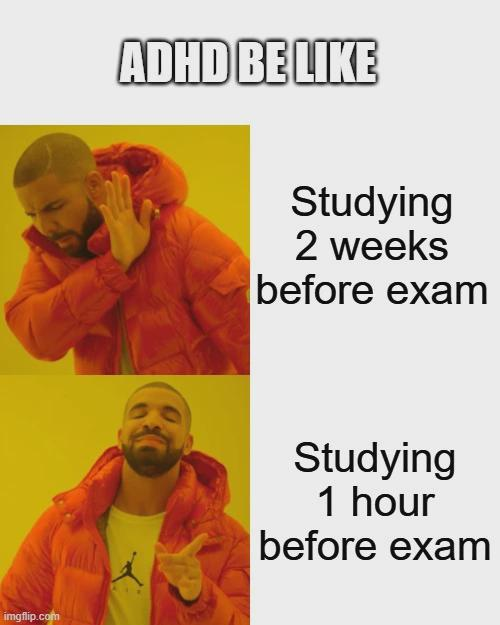

# Cours 4 - Examen 

## Contexte 

L'examen se déroule au grand studio en petits groupes. Pour pallier à l'attente, nous vous invitons à débuter votre préproduction pour l'entrevue. Nous accorderons un plus grand moment aux détails la semaine prochaine. Pour l'instant, l'important est de préparer un premier document pour centraliser les réponses aux questions suivantes : 

- Qui est l'intervenant(e)
- Quelles sont les questions posées (une par membre d'équipe)?
- Où sera le tournage?
- Quelle date sera le tournage? 
- Quelle est la distribution des rôles (caméra, son, éclairage, interviewer(euse))?
- Quelle est la direction artistique (décor, éclairage, accessoires)?
- Quelles sont les références (exemple d'entrevues avec la direction artistique souhaitée)?

Pour l'examen lui-même, vous serez appelés à tour de rôle pour venir dans le grand studio. L'ordre est déjà déterminée : 

### Installation 1
- Berbiche, Wilhene 
- Louis, Jayden 
- Bary, Diouma 
- Lanthier, Zara 
- Gevorgyan, Mariam 
- Perpignand, Raphaël 
- Koffi, Tanya Mariella 
- Arcand, Félix 

### Installation 2 
- Beaulieu, Nanthapricha 
- Gravel, Kellie 
- Lajeunesse, Élodie 
- Elayyan, Mariam Shehadeh Aziz 
- Gutierrez, Gaël 
- Yoou, Noah-Charles 
- Ismail, Hadi 
- Granger, Christophe 

### Installation 3
- Visinand, Yoan 
- Baldassarre, Rosalia 
- Leconte, Olivier Leclerc 
- Emond, Florence 
- Meas-Sop, Aaron Siveesna 
- Figueroa, Sophia 
- Quesnel, Vincent 

