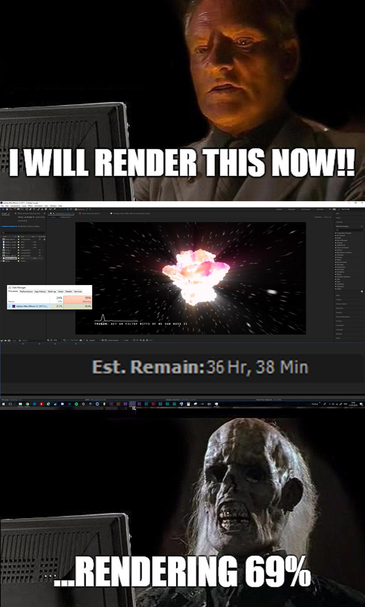
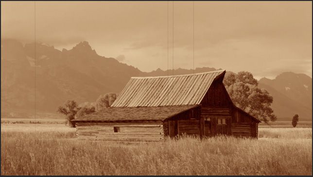
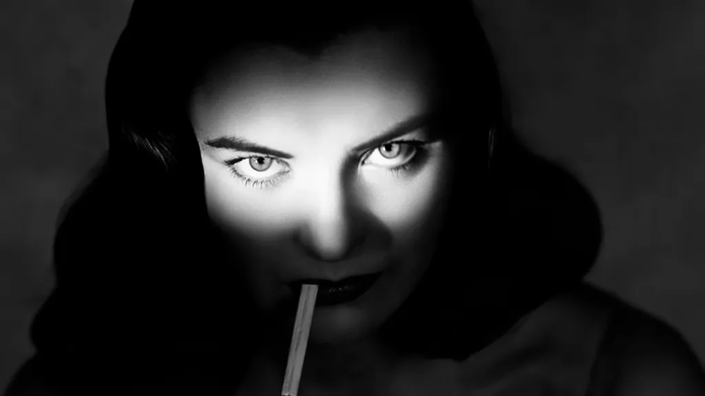
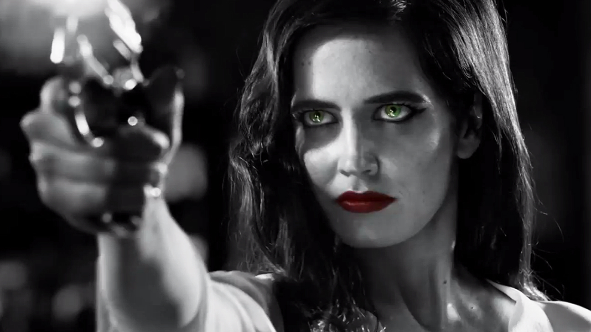
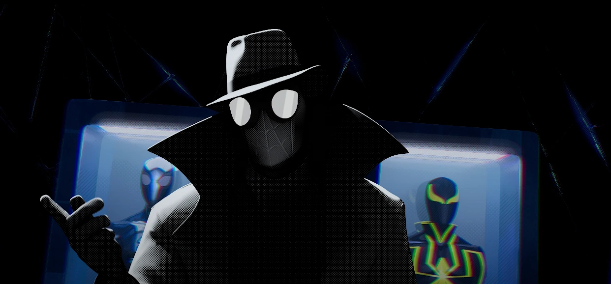
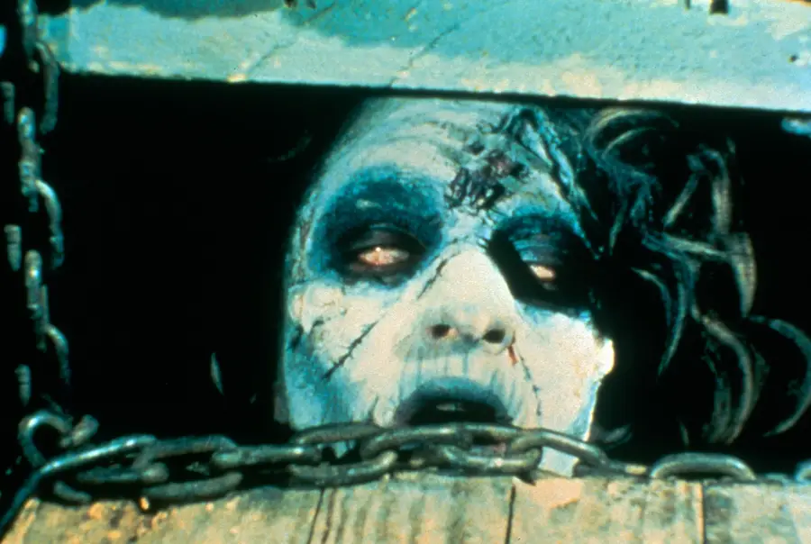
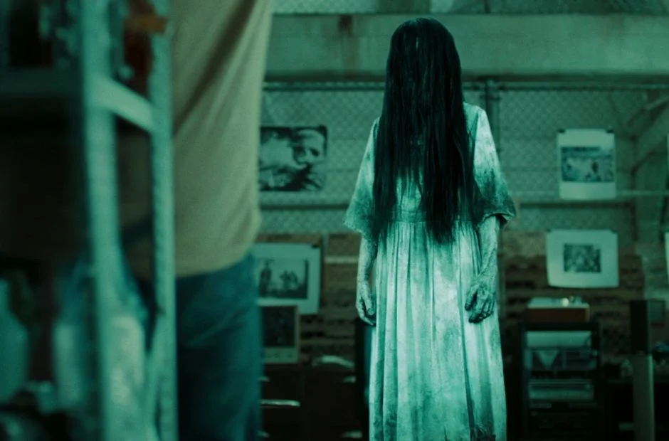
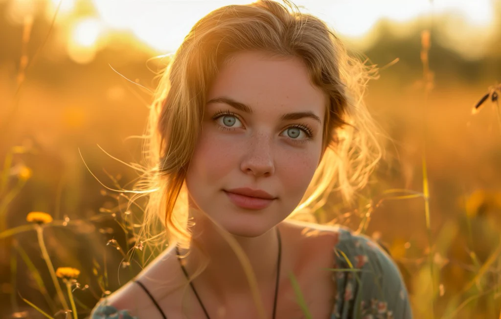
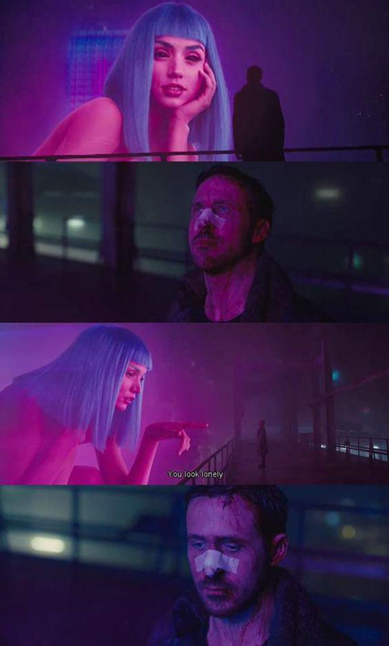

# Cours 5 - Effets, colorisation et rendu  

## Ordre du jour 

- Retour sur l'examen 
- Les effets dans Da Vinci Resolve
- La colorisation dans Da Vinci Resolve
- Les normes de générique au département
- Rappel des capsules d'aide avec Davinci Resolve
- Rendu
- Présentation de l'examen

## Retour sur l'examen

Les commentaires sont disponibles sur Teams et le cumulatif des notes sera sur Col.net. Voici ce que je retiens de la partie captation :

- Bien dans l'ensemble
- Encore de la difficulté avec trouver le milieu entre sous-exposé et sur-exposé
- ISO souvent très haut (max 1600) sinon l'image devient granuleuse (*noisy*)
- Shutter speed = framerate x2 (1/60sec pour 30img/sec et 1/120sec pour 60img/sec)
- Ne pas oublier de régler son fps
- Ne pas oublier de faire le white balance
- Lors des mouvements suivre de façon à ce que le sujet reste toujours à la même place
- Cadrer sur les lignes de tiers et garder du head room

## Les effets dans Da Vinci Resolve

Comme nous l'avons vu, Da Vinci Resolve réunit tous les outils nécessaires à la réalisation d'un film dans un seul programme. En ce qui concerne les effets spéciaux, il est possible de combiner en utilisant le module Fusion. Néanmoins, c'est à partir de la bibliothèque d'effets que nous allons travailler. 

Les effets sont variés, mais puissants. Ainsi, on y retrouve de la 3D, du keying (green screen), du tracking (suivi de position), des particules, des émulations (camera shake, bloom, etc.), des transformations (position, échelle, etc.), des déformations (vague, ondes, etc.) et bien plus encore.

En ce qui nous concerne, nous allons faire un tour d'horizon, mais vous serez invité à explorer pour l'examen de montage.

### Comment ajouter un effet

Tout se passe sur la page **Montage** (*Edit*), à partir de deux panneaux : la **bibliothèque d'effets** (*Effects*, en haut à gauche) et l'**inspecteur** (*Inspector*, en haut à droite).

1. **Ouvrir la bibliothèque d'effets** (*Effects*) et repérer les catégories :
    - **Boîte à outils** (*Toolbox*) : transitions vidéo, transitions audio, titres, générateurs et effets de base
    - **Effets Open FX** (*Open FX*) : les filtres (flou, halo, incrustation, stylisation, etc.)
    - **Effets audio** (*Audio FX*) : les traitements sonores
2. **Appliquer l'effet** en le glissant directement sur le clip visé dans la ligne de temps (*timeline*). Une transition se dépose plutôt sur le point de coupe entre deux clips.
3. **Régler l'effet** dans l'**inspecteur** (*Inspector*), sous l'onglet **Effets** (*Effects*). Chaque effet y apparaît avec ses paramètres.
4. **Animer un paramètre** (facultatif) en cliquant sur le losange à droite de celui-ci pour créer une **image clé** (*keyframe*), puis en déplaçant la **tête de lecture** (*playhead*) avant de modifier la valeur.
5. **Retirer un effet** en le sélectionnant dans l'**inspecteur** et en cliquant sur l'icône de corbeille.

> Pour appliquer un même effet à plusieurs clips d'un coup, utilisez un **plan d'effets** (*Adjustment Clip*, dans **Boîte à outils → Effets**) : déposez-le sur une piste au-dessus de vos clips et appliquez-lui l'effet. Tout ce qui se trouve dessous est affecté.

## La colorisation dans Da Vinci Resolve

Comme nous en avons discuté, au départ Da Vinci Resolve était simplement un outil de correction de couleurs. Bien que son usage soit aujourd'hui étendu, le module de colorisation du logiciel reste inégalé.

La colorisation se fait donc à partir de la page Color qui est organisée avec des outils de mesure (Scopes) et d'ajustement (Color Wheels).

Les Scopes permettent de mesurer la luminosité et l'intensité des couleurs alors que les Color Wheels en permettent l'ajustement.

En ce qui nous concerne, nous allons simplement ajuster les paramètres de contraste, highlight, shadow et saturation.

De manière un peu plus avancée, nous allons nous intéresser à la balance des couleurs en utilisant des courbes selon des mesures dans les scopes.

### Les étapes de base

1. **Ouvrir la page Étalonnage** (*Color*) et sélectionner le clip à traiter dans la barre de vignettes, en haut de l'écran.
2. **Lire les oscilloscopes** (*Scopes*) avant de modifier quoi que ce soit : la forme d'onde (*Waveform*) pour juger l'exposition, la parade RVB (*Parade*) pour juger la balance des couleurs.
3. **Corriger l'exposition** avec les roues chromatiques (*Color Wheels*) : *Lift* pour les ombres, *Gamma* pour les tons moyens, *Gain* pour les hautes lumières.
4. **Ajuster le contraste** pour écarter les noirs et les blancs, sans écraser l'information aux extrémités.
5. **Corriger la balance des couleurs** pour retirer les dominantes (image trop bleue, trop orangée, etc.), en visant un blanc neutre dans la parade RVB.
6. **Ajuster la saturation**, généralement en dernier.
7. **Uniformiser les plans** d'une même scène entre eux (voir la correspondance de plan, plus bas).

> L'ordre compte : sur une première node, on corrige d'abord pour rendre l'image juste et sur une autre node en série, on stylise ensuite pour lui donner un look. Autrement pour donner un look sur l'ensemble du film, on peut aussi utiliser un calque d'effets. 

### La correspondance de plan (*Shot Match to This Clip*)

Resolve peut aligner automatiquement l'étalonnage d'un plan sur celui d'un autre. C'est très pratique pour uniformiser une scène tournée sur plusieurs heures ou avec deux caméras.

1. **Étalonner d'abord un plan de référence**, celui qui représente le mieux le résultat voulu.
2. **Sélectionner le plan à corriger** dans la barre de vignettes : c'est lui qui sera modifié.
3. **Faire un clic droit sur la vignette du plan de référence**, puis choisir **Shot Match to This Clip**.
4. **Vérifier le résultat** dans les oscilloscopes et ajuster à la main au besoin : la correspondance est un point de départ, rarement une finition.

> Attention à ne pas inverser les deux plans : le plan **sélectionné** est celui qui change, alors que le plan sur lequel on fait le **clic droit** sert de référence.

Le résultat est meilleur quand les deux plans ont été tournés dans des conditions semblables (même éclairage, même exposition, même balance des blancs). Des plans trop différents demanderont une correction manuelle.

## Choix de couleurs en vidéo 

En montage vidéo, les filtres appliqués sur un plan aident à guider le *mood* d'une scène simplement par le choix d'une couleur. Sans plus loin dans les détails, voici quelques exemples emblématiques couramment utilisés au cinéma et à la télévision. 

# Nuancier — Six looks cinématographiques

  <!-- Orange & Teal -->
  

    

      
Orange & Teal

      
Action · Cinéma 

    

    

      

#0A1F2E

Noirs

      

#1A3A4A

Ombres

      

#1A9E7D

Teal

      

#5CC4A0

Teal clair

      

#C26030

Orange

      

#E8824A

Hautes lum.

      

#F5C090

Peau

    

  

  <!-- Sépia / Vintage -->
  

    

      
Sépia / Vintage

      
Nostalgie · Mémoire

    

    

      

#1A100A

Noirs

      

#3D2510

Ombres

      

#7A4E28

Bruns

      

#A67040

Médiums

      

#C49A6C

Clairs

      

#DEC090

Lumières

      

#F0E0C0

Blancs

    

  

  <!-- Film noir -->
  

    

      
Film noir

      
Mystère · Fatalisme

    

    

      

#080808

Noirs

      

#181818

Très foncé

      

#383838

Ombres

      

#606060

Médiums

      

#909090

Gris

      

#C0C0C0

Clairs

      

#F0F0F0

Blancs

    

  

  <!-- Horreur froide -->
  

    

      
Horreur froide

      
Malaise · Surnaturel

    

    

      

#040C14

Noirs

      

#0A1520

Ombres

      

#0E2535

Bleu nuit

      

#1A4A30

Vert foncé

      

#2E6848

Vert

      

#608070

Vert pâle

      

#A0C0B0

Lumières

    

  

  <!-- Golden hour -->
  

    

      
Golden hour

      
Romantisme · Espoir

    

    

      

#1A0E06

Noirs

      

#3A1E0A

Ombres

      

#8A4010

Ambré foncé

      

#D06020

Orange

      

#F08830

Or chaud

      

#F5C060

Or

      

#FFF5D0

Blancs

    

  

  <!-- Cyberpunk -->
  

    

      
Cyberpunk

      
Dystopie · Futurisme

    

    

      

#040008

Noirs

      

#0A0018

Fond violet

      

#200040

Violet foncé

      

#800080

Violet néon

      

#FF00AA

Rose néon

      

#00CCAA

Cyan

      

#AAFFEE

Cyan clair

    

  

#### Orange & Teal

Le *look* orange & teal est un des plus dominant au cinéma. En utilisant le contraste entre la teinte de la peau et la complémentarité de l'environnement, les sujets humain ressortent instantanément du décor.

- Émotion : Tension, action, épique
- Harmonie : Complémentaire

#### Sépia / Vintage

Le *look* Sépia / Vintage imite le rendu de la pellicule traditionnelle. La teinte chaude désaturée évoque le passé, le rêve ou la mémoire. 

- Émotion : Nostalgie, mémoire, authenticité
- Harmonie : Monochromatique brun-jaune

#### Film noir

Le *look* Film noir supprime totalement la couleur. Selon le contraste utilisé, l'ombre peut devenir un espace menaçant (avec un contraste fort) ou la lumière peut devenir apaisante (pour un contraste faible). Cet effet peut parfois être amplifié en laissant une seule teinte visible (comme dans *Sin City* par exemple) ou en appliquant le *look* noir sur un seul élément (comme dans *Spider-man into the spider-verse*).  

- Émotion : Nostalgie, mémoire, authenticité
- Harmonie : Monochromatique brun-jaune

#### Horreur froide 

Le *look* horreur froide est typique pour les atmosphères sombres, hostiles ou d'épouvantes. Le mélange du bleu de la nuit avec le vert désaturé donne une teinte qui rappelle un état malade et fait disparaître la chaleur pour rendre les sujets vulnérables.  

- Émotion : Mystère, menace, fatalisme, tragédie
- Harmonie : Teintes analogues (bleu et vert)

#### Golden Hour

Le *look* Golden Hour avec ses teintes de doré qui rappelle la lumière du couché/levé du soleil autant dans les tons clairs qu'obscurs apporte une atmosphère serene et de beauté.  

- Émotion : Romantisme, espoir, plénitude, beauté 
- Harmonie : Teintes analogues (orange-or-jaune)

#### Cyberpunk néon

Le *look* Cyberpunk néon est emblématique des univers de ce nom. Les couleurs saturés qui rappelle l'éclairage au néon évoquent les publicités omniprésentes, les technologies permanentes et les villes nocturnes.   

- Émotion : Futurisme, dystopie, excès, aliénation urbaine
- Harmonie : Triadique saturé (violet-rose-cyan)

## Les normes de générique au département

Au département, nous avons une norme particulière pour le générique. Ce dernier doit être organisé de la manière suivante :

1. Nom des intervenants
2. Sources
3. Encadrement
4. Remerciements
5. Logo TIM

### Options pour le générique au départ

Habituellement, on présente le titre du film, les chefs de département et les acteurs principaux sur des cartons dans le générique de début. Le pré-générique n'est pas obligatoire. Cependant, si vous n'avez pas de générique de début, vous devez inclure les informations nécessaires dans le générique de fin (Lavoie-Pilote, 2023).

Voici les options pour le générique de début :

- **Option 1** : Le film commence sans indication. Les informations du générique se retrouveront à la fin du film.
- **Option 2** : Carton 1 - Titre du film et le reste à la fin.
- **Option 3** : Carton 1 - Titre du film, Carton 2 - Comédiens (par ordre d'apparition), Carton 3 - Réalisateur, Carton 4 - Directeur de la photographie, Carton 5 - Directeur artistique et on répète à la fin.

### Le nom des intervenants dans le générique de fin

Présenter les différents postes sur différents cartons (ne pas présenter s'il n'y avait pas de rôles). Attention, ne pas faire un générique défilant.

- Titre du film (si non mentionné dans le générique de début)
- Comédiens (par ordre d'apparition)
- Scénariste
- Réalisateur
- Assistant réalisateur
- Script (prise de notes lors du tournage)
- Producteur
- Directeur de production
- Directeur de la photographie
- Photographe de plateau
- Assistant de production
- Directeur artistique
- Accessoiriste
- Chef costumier
- Maquilleur / coiffeur
- Preneur de son
- Monteur
- Étalonneur
- Graphiste
- Superviseur des effets visuels
- Compositeur
- Montage sonore

## Rendu 

Le processus de rendu (ou d’exportation) se fait à partir de la page Deliver avec les étapes suivantes :

- Choisir une résolution (1080p, 4k, etc.) 
- Choisir une fréquence d’images (24, 30, 60 fps, etc.)
- Choisir un codecs ou un format préconfigurer (YouTube, Vimeo, H.264, ProRes, etc.).
- Choisir un format audio (AAC est standard, WAV, etc.) et une fréquence d'échantillonnage (48kHz est standard)
- Choisir la plage à exporter (timeline complète ou clips individuels)
- Déterminer un nom et un chemin d’accès
- Ajouter à la file d’attente
- Lancer le rendu et écouter le fichier

## Présentation de l'examen

[Examen de montage](./examen-montage.md)
